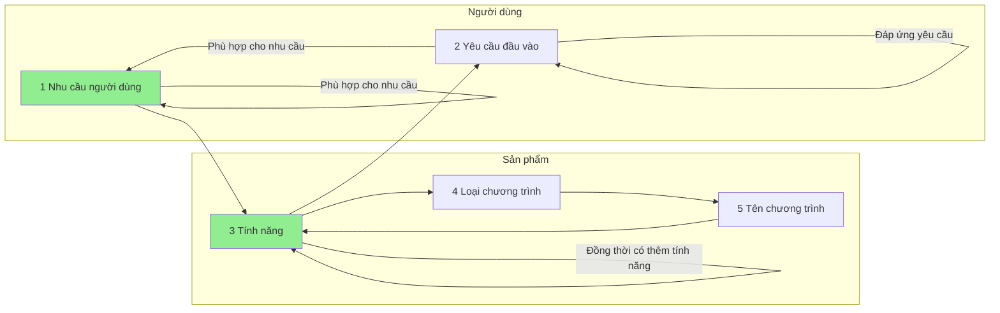

- Nhu cầu người dùng sẽ đòi hỏi tính năng
- Tính năng sẽ đòi hỏi yêu cầu đầu vào 
- Yêu cầu đầu vào đòi hỏi nhu cầu người dùng
 
- Tính năng sẽ quyết định loại chương trình
- Chương trình đáp ứng một tổ hợp các nhu cầu của người dùng bằng một tổ hợp các tính năng 

Khi một "nhu cầu" của người dùng thực ra là do không có nhu cầu thì nó nên là gì
Chương trình không có tính năng
Yêu cầu ngược lại về người dùng
Có những chương trình không biết nên phân loại thế nào. Tốt nhất là liệt kê tính năng của nó

# 
| File                                                                                                                                          | Cách nhập liệu                                                                                                                                                                                                                                                                                                                                                                                                                                                                                                                                                                                                                                                                                                                                                                                                                                                                                                                                                                                                                                      | Cách phân loại                                                                                                                                                                                                                                                                                                                                                      | Chính sách giá                                                                                                                                                                                                                                                                                              | Giao diện                                                                                                                                                                                                                                                                       | Khả năng tích hợp                                                                                                                                                                                                                                                                                                                                                                                                                                                                                                                                                                                                                                                                                                                                                                                                                                                         | Số lượng trường phân loại                                                                                                                                                                                                                                                                                                                                                       | Khác                                                                                                                                                                                                                                                                                                  |
| --------------------------------------------------------------------------------------------------------------------------------------------- | --------------------------------------------------------------------------------------------------------------------------------------------------------------------------------------------------------------------------------------------------------------------------------------------------------------------------------------------------------------------------------------------------------------------------------------------------------------------------------------------------------------------------------------------------------------------------------------------------------------------------------------------------------------------------------------------------------------------------------------------------------------------------------------------------------------------------------------------------------------------------------------------------------------------------------------------------------------------------------------------------------------------------------------------------- | ------------------------------------------------------------------------------------------------------------------------------------------------------------------------------------------------------------------------------------------------------------------------------------------------------------------------------------------------------------------- | ----------------------------------------------------------------------------------------------------------------------------------------------------------------------------------------------------------------------------------------------------------------------------------------------------------- | ------------------------------------------------------------------------------------------------------------------------------------------------------------------------------------------------------------------------------------------------------------------------------- | ------------------------------------------------------------------------------------------------------------------------------------------------------------------------------------------------------------------------------------------------------------------------------------------------------------------------------------------------------------------------------------------------------------------------------------------------------------------------------------------------------------------------------------------------------------------------------------------------------------------------------------------------------------------------------------------------------------------------------------------------------------------------------------------------------------------------------------------------------------------------- | ------------------------------------------------------------------------------------------------------------------------------------------------------------------------------------------------------------------------------------------------------------------------------------------------------------------------------------------------------------------------------- | ----------------------------------------------------------------------------------------------------------------------------------------------------------------------------------------------------------------------------------------------------------------------------------------------------- |
| [App của Huy](./5%20T%C3%AAn%20ch%C6%B0%C6%A1ng%20tr%C3%ACnh/App%20qu%E1%BA%A3n%20l%C3%BD%20chi%20ti%C3%AAu/App%20c%E1%BB%A7a%20Huy.md)     | <ul><li>[Nhập được trên điện thoại](T%C3%A0i%20nguy%C3%AAn%20h%E1%BB%97%20tr%E1%BB%A3/Quang%20c%E1%BA%A3nh%20th%E1%BB%8B%20tr%C6%B0%E1%BB%9Dng/Ch%C6%B0%C6%A1ng%20tr%C3%ACnh%20qu%E1%BA%A3n%20l%C3%BD%20ti%E1%BB%81n/3%20T%C3%ADnh%20n%C4%83ng/C%C3%A1ch%20nh%E1%BA%ADp%20li%E1%BB%87u/Nh%E1%BA%ADp%20%C4%91%C6%B0%E1%BB%A3c%20tr%C3%AAn%20%C4%91i%E1%BB%87n%20tho%E1%BA%A1i.md.md)</li></ul>                                                                                                                                                                                                                                                                                                                                                                                                                                                                                                                                                                                                                                                                                                                                                                                                                                                                         | <ul><li>[Phân loại tự động theo quy luật](T%C3%A0i%20nguy%C3%AAn%20h%E1%BB%97%20tr%E1%BB%A3/Quang%20c%E1%BA%A3nh%20th%E1%BB%8B%20tr%C6%B0%E1%BB%9Dng/Ch%C6%B0%C6%A1ng%20tr%C3%ACnh%20qu%E1%BA%A3n%20l%C3%BD%20ti%E1%BB%81n/3%20T%C3%ADnh%20n%C4%83ng/C%C3%A1ch%20ph%C3%A2n%20lo%E1%BA%A1i/Ph%C3%A2n%20lo%E1%BA%A1i%20t%E1%BB%B1%20%C4%91%E1%BB%99ng%20theo%20quy%20lu%E1%BA%ADt.md.md)</li></ul>                                                                                                                                                                             | <ul></ul>                                                                                                                                                                                                                                                                                                   | <ul><li>[Có GUI](T%C3%A0i%20nguy%C3%AAn%20h%E1%BB%97%20tr%E1%BB%A3/Quang%20c%E1%BA%A3nh%20th%E1%BB%8B%20tr%C6%B0%E1%BB%9Dng/Ch%C6%B0%C6%A1ng%20tr%C3%ACnh%20qu%E1%BA%A3n%20l%C3%BD%20ti%E1%BB%81n/3%20T%C3%ADnh%20n%C4%83ng/Giao%20di%E1%BB%87n/C%C3%B3%20GUI.md.md)</li></ul>                                                                                                                                                | <ul></ul>                                                                                                                                                                                                                                                                                                                                                                                                                                                                                                                                                                                                                                                                                                                                                                                                                                                                 | <ul></ul>                                                                                                                                                                                                                                                                                                                                                                       | <ul></ul>                                                                                                                                                                                                                                                                                             |
| [Maybe finance](./5%20T%C3%AAn%20ch%C6%B0%C6%A1ng%20tr%C3%ACnh/App%20qu%E1%BA%A3n%20l%C3%BD%20chi%20ti%C3%AAu/Maybe%20finance.md) | <ul><li>[Nhập được trên máy tính](T%C3%A0i%20nguy%C3%AAn%20h%E1%BB%97%20tr%E1%BB%A3/Quang%20c%E1%BA%A3nh%20th%E1%BB%8B%20tr%C6%B0%E1%BB%9Dng/Ch%C6%B0%C6%A1ng%20tr%C3%ACnh%20qu%E1%BA%A3n%20l%C3%BD%20ti%E1%BB%81n/3%20T%C3%ADnh%20n%C4%83ng/C%C3%A1ch%20nh%E1%BA%ADp%20li%E1%BB%87u/Nh%E1%BA%ADp%20%C4%91%C6%B0%E1%BB%A3c%20tr%C3%AAn%20m%C3%A1y%20t%C3%ADnh.md.md)</li></ul>                                                                                                                                                                                                                                                                                                                                                                                                                                                                                                                                                                                                                                                                                                                                                                                                                                                                             | <ul></ul>                                                                                                                                                                                                                                                                                                                                                           | <ul></ul>                                                                                                                                                                                                                                                                                                   | <ul><li>[Có GUI](T%C3%A0i%20nguy%C3%AAn%20h%E1%BB%97%20tr%E1%BB%A3/Quang%20c%E1%BA%A3nh%20th%E1%BB%8B%20tr%C6%B0%E1%BB%9Dng/Ch%C6%B0%C6%A1ng%20tr%C3%ACnh%20qu%E1%BA%A3n%20l%C3%BD%20ti%E1%BB%81n/3%20T%C3%ADnh%20n%C4%83ng/Giao%20di%E1%BB%87n/C%C3%B3%20GUI.md.md)</li></ul>                                                                                                                                                | <ul></ul>                                                                                                                                                                                                                                                                                                                                                                                                                                                                                                                                                                                                                                                                                                                                                                                                                                                                 | <ul></ul>                                                                                                                                                                                                                                                                                                                                                                       | <ul><li>[Là phần mềm tự do](T%C3%A0i%20nguy%C3%AAn%20h%E1%BB%97%20tr%E1%BB%A3/Quang%20c%E1%BA%A3nh%20th%E1%BB%8B%20tr%C6%B0%E1%BB%9Dng/Ch%C6%B0%C6%A1ng%20tr%C3%ACnh%20qu%E1%BA%A3n%20l%C3%BD%20ti%E1%BB%81n/3%20T%C3%ADnh%20n%C4%83ng/Kh%C3%A1c/L%C3%A0%20ph%E1%BA%A7n%20m%E1%BB%81m%20t%E1%BB%B1%20do.md.md)</li></ul>                                                                                                                                                     |
| [Momo](./5%20T%C3%AAn%20ch%C6%B0%C6%A1ng%20tr%C3%ACnh/App%20qu%E1%BA%A3n%20l%C3%BD%20chi%20ti%C3%AAu/Momo.md)                   | <ul><li>[Nhập được trên điện thoại](T%C3%A0i%20nguy%C3%AAn%20h%E1%BB%97%20tr%E1%BB%A3/Quang%20c%E1%BA%A3nh%20th%E1%BB%8B%20tr%C6%B0%E1%BB%9Dng/Ch%C6%B0%C6%A1ng%20tr%C3%ACnh%20qu%E1%BA%A3n%20l%C3%BD%20ti%E1%BB%81n/3%20T%C3%ADnh%20n%C4%83ng/C%C3%A1ch%20nh%E1%BA%ADp%20li%E1%BB%87u/Nh%E1%BA%ADp%20%C4%91%C6%B0%E1%BB%A3c%20tr%C3%AAn%20%C4%91i%E1%BB%87n%20tho%E1%BA%A1i.md.md)</li><li>[Tự động lấy thông tin giao dịch ngay lúc quẹt mã](T%C3%A0i%20nguy%C3%AAn%20h%E1%BB%97%20tr%E1%BB%A3/Quang%20c%E1%BA%A3nh%20th%E1%BB%8B%20tr%C6%B0%E1%BB%9Dng/Ch%C6%B0%C6%A1ng%20tr%C3%ACnh%20qu%E1%BA%A3n%20l%C3%BD%20ti%E1%BB%81n/3%20T%C3%ADnh%20n%C4%83ng/C%C3%A1ch%20nh%E1%BA%ADp%20li%E1%BB%87u/T%E1%BB%B1%20%C4%91%E1%BB%99ng%20l%E1%BA%A5y%20th%C3%B4ng%20tin%20giao%20d%E1%BB%8Bch%20ngay%20l%C3%BAc%20qu%E1%BA%B9t%20m%C3%A3.md.md)</li></ul>                                                                                                                                                                                                                                                                                                                                                                                                                                                                                                                                                                                                                                                         | <ul><li>[Phân loại bằng tay](T%C3%A0i%20nguy%C3%AAn%20h%E1%BB%97%20tr%E1%BB%A3/Quang%20c%E1%BA%A3nh%20th%E1%BB%8B%20tr%C6%B0%E1%BB%9Dng/Ch%C6%B0%C6%A1ng%20tr%C3%ACnh%20qu%E1%BA%A3n%20l%C3%BD%20ti%E1%BB%81n/3%20T%C3%ADnh%20n%C4%83ng/C%C3%A1ch%20ph%C3%A2n%20lo%E1%BA%A1i/Ph%C3%A2n%20lo%E1%BA%A1i%20b%E1%BA%B1ng%20tay.md.md)</li><li>[Phân loại tự động theo mô hình ngôn ngữ lớn](T%C3%A0i%20nguy%C3%AAn%20h%E1%BB%97%20tr%E1%BB%A3/Quang%20c%E1%BA%A3nh%20th%E1%BB%8B%20tr%C6%B0%E1%BB%9Dng/Ch%C6%B0%C6%A1ng%20tr%C3%ACnh%20qu%E1%BA%A3n%20l%C3%BD%20ti%E1%BB%81n/3%20T%C3%ADnh%20n%C4%83ng/C%C3%A1ch%20ph%C3%A2n%20lo%E1%BA%A1i/Ph%C3%A2n%20lo%E1%BA%A1i%20t%E1%BB%B1%20%C4%91%E1%BB%99ng%20theo%20m%C3%B4%20h%C3%ACnh%20ng%C3%B4n%20ng%E1%BB%AF%20l%E1%BB%9Bn.md.md)</li></ul> | <ul><li>[Miễn phí](T%C3%A0i%20nguy%C3%AAn%20h%E1%BB%97%20tr%E1%BB%A3/Quang%20c%E1%BA%A3nh%20th%E1%BB%8B%20tr%C6%B0%E1%BB%9Dng/Ch%C6%B0%C6%A1ng%20tr%C3%ACnh%20qu%E1%BA%A3n%20l%C3%BD%20ti%E1%BB%81n/3%20T%C3%ADnh%20n%C4%83ng/Ch%C3%ADnh%20s%C3%A1ch%20gi%C3%A1/Mi%E1%BB%85n%20ph%C3%AD.md.md)</li><li>[Trả tiền để làm phân loại](T%C3%A0i%20nguy%C3%AAn%20h%E1%BB%97%20tr%E1%BB%A3/Quang%20c%E1%BA%A3nh%20th%E1%BB%8B%20tr%C6%B0%E1%BB%9Dng/Ch%C6%B0%C6%A1ng%20tr%C3%ACnh%20qu%E1%BA%A3n%20l%C3%BD%20ti%E1%BB%81n/3%20T%C3%ADnh%20n%C4%83ng/Ch%C3%ADnh%20s%C3%A1ch%20gi%C3%A1/Tr%E1%BA%A3%20ti%E1%BB%81n%20%C4%91%E1%BB%83%20l%C3%A0m%20ph%C3%A2n%20lo%E1%BA%A1i.md.md)</li></ul> | <ul><li>[Có GUI](T%C3%A0i%20nguy%C3%AAn%20h%E1%BB%97%20tr%E1%BB%A3/Quang%20c%E1%BA%A3nh%20th%E1%BB%8B%20tr%C6%B0%E1%BB%9Dng/Ch%C6%B0%C6%A1ng%20tr%C3%ACnh%20qu%E1%BA%A3n%20l%C3%BD%20ti%E1%BB%81n/3%20T%C3%ADnh%20n%C4%83ng/Giao%20di%E1%BB%87n/C%C3%B3%20GUI.md.md)</li></ul>                                                                                                                                                | <ul><li>[Không sao chép được dễ dàng](T%C3%A0i%20nguy%C3%AAn%20h%E1%BB%97%20tr%E1%BB%A3/Quang%20c%E1%BA%A3nh%20th%E1%BB%8B%20tr%C6%B0%E1%BB%9Dng/Ch%C6%B0%C6%A1ng%20tr%C3%ACnh%20qu%E1%BA%A3n%20l%C3%BD%20ti%E1%BB%81n/3%20T%C3%ADnh%20n%C4%83ng/Kh%E1%BA%A3%20n%C4%83ng%20t%C3%ADch%20h%E1%BB%A3p/Kh%C3%B4ng%20sao%20ch%C3%A9p%20%C4%91%C6%B0%E1%BB%A3c%20d%E1%BB%85%20d%C3%A0ng.md.md)</li><li>[Tích hợp được với ngân hàng](T%C3%A0i%20nguy%C3%AAn%20h%E1%BB%97%20tr%E1%BB%A3/Quang%20c%E1%BA%A3nh%20th%E1%BB%8B%20tr%C6%B0%E1%BB%9Dng/Ch%C6%B0%C6%A1ng%20tr%C3%ACnh%20qu%E1%BA%A3n%20l%C3%BD%20ti%E1%BB%81n/3%20T%C3%ADnh%20n%C4%83ng/Kh%E1%BA%A3%20n%C4%83ng%20t%C3%ADch%20h%E1%BB%A3p/T%C3%ADch%20h%E1%BB%A3p%20%C4%91%C6%B0%E1%BB%A3c%20v%E1%BB%9Bi%20ng%C3%A2n%20h%C3%A0ng.md.md)</li></ul>                                                                                                                                                                                                                                                                                                                                                                                                                                                                                                               | <ul><li>[Chỉ có vài trường cơ bản](T%C3%A0i%20nguy%C3%AAn%20h%E1%BB%97%20tr%E1%BB%A3/Quang%20c%E1%BA%A3nh%20th%E1%BB%8B%20tr%C6%B0%E1%BB%9Dng/Ch%C6%B0%C6%A1ng%20tr%C3%ACnh%20qu%E1%BA%A3n%20l%C3%BD%20ti%E1%BB%81n/3%20T%C3%ADnh%20n%C4%83ng/S%E1%BB%91%20l%C6%B0%E1%BB%A3ng%20tr%C6%B0%E1%BB%9Dng%20ph%C3%A2n%20lo%E1%BA%A1i/Ch%E1%BB%89%20c%C3%B3%20v%C3%A0i%20tr%C6%B0%E1%BB%9Dng%20c%C6%A1%20b%E1%BA%A3n.md.md)</li></ul>                                                                                                                                                                                            | <ul></ul>                                                                                                                                                                                                                                                                                             |
| [MoneyLover](./5%20T%C3%AAn%20ch%C6%B0%C6%A1ng%20tr%C3%ACnh/App%20qu%E1%BA%A3n%20l%C3%BD%20chi%20ti%C3%AAu/MoneyLover.md)       | <ul><li>[Nhập được trên điện thoại](T%C3%A0i%20nguy%C3%AAn%20h%E1%BB%97%20tr%E1%BB%A3/Quang%20c%E1%BA%A3nh%20th%E1%BB%8B%20tr%C6%B0%E1%BB%9Dng/Ch%C6%B0%C6%A1ng%20tr%C3%ACnh%20qu%E1%BA%A3n%20l%C3%BD%20ti%E1%BB%81n/3%20T%C3%ADnh%20n%C4%83ng/C%C3%A1ch%20nh%E1%BA%ADp%20li%E1%BB%87u/Nh%E1%BA%ADp%20%C4%91%C6%B0%E1%BB%A3c%20tr%C3%AAn%20%C4%91i%E1%BB%87n%20tho%E1%BA%A1i.md.md)</li></ul>                                                                                                                                                                                                                                                                                                                                                                                                                                                                                                                                                                                                                                                                                                                                                                                                                                                                         | <ul><li>[Phân loại bằng tay](T%C3%A0i%20nguy%C3%AAn%20h%E1%BB%97%20tr%E1%BB%A3/Quang%20c%E1%BA%A3nh%20th%E1%BB%8B%20tr%C6%B0%E1%BB%9Dng/Ch%C6%B0%C6%A1ng%20tr%C3%ACnh%20qu%E1%BA%A3n%20l%C3%BD%20ti%E1%BB%81n/3%20T%C3%ADnh%20n%C4%83ng/C%C3%A1ch%20ph%C3%A2n%20lo%E1%BA%A1i/Ph%C3%A2n%20lo%E1%BA%A1i%20b%E1%BA%B1ng%20tay.md.md)</li></ul>                                                                                                                                                                                                       | <ul><li>[Freemium](T%C3%A0i%20nguy%C3%AAn%20h%E1%BB%97%20tr%E1%BB%A3/Quang%20c%E1%BA%A3nh%20th%E1%BB%8B%20tr%C6%B0%E1%BB%9Dng/Ch%C6%B0%C6%A1ng%20tr%C3%ACnh%20qu%E1%BA%A3n%20l%C3%BD%20ti%E1%BB%81n/3%20T%C3%ADnh%20n%C4%83ng/Ch%C3%ADnh%20s%C3%A1ch%20gi%C3%A1/Freemium.md.md)</li></ul>                                                                                                                                                                   | <ul><li>[Có GUI](T%C3%A0i%20nguy%C3%AAn%20h%E1%BB%97%20tr%E1%BB%A3/Quang%20c%E1%BA%A3nh%20th%E1%BB%8B%20tr%C6%B0%E1%BB%9Dng/Ch%C6%B0%C6%A1ng%20tr%C3%ACnh%20qu%E1%BA%A3n%20l%C3%BD%20ti%E1%BB%81n/3%20T%C3%ADnh%20n%C4%83ng/Giao%20di%E1%BB%87n/C%C3%B3%20GUI.md.md)</li></ul>                                                                                                                                                | <ul><li>[Không sao chép được dễ dàng](T%C3%A0i%20nguy%C3%AAn%20h%E1%BB%97%20tr%E1%BB%A3/Quang%20c%E1%BA%A3nh%20th%E1%BB%8B%20tr%C6%B0%E1%BB%9Dng/Ch%C6%B0%C6%A1ng%20tr%C3%ACnh%20qu%E1%BA%A3n%20l%C3%BD%20ti%E1%BB%81n/3%20T%C3%ADnh%20n%C4%83ng/Kh%E1%BA%A3%20n%C4%83ng%20t%C3%ADch%20h%E1%BB%A3p/Kh%C3%B4ng%20sao%20ch%C3%A9p%20%C4%91%C6%B0%E1%BB%A3c%20d%E1%BB%85%20d%C3%A0ng.md.md)</li><li>[Tích hợp được với ngân hàng](T%C3%A0i%20nguy%C3%AAn%20h%E1%BB%97%20tr%E1%BB%A3/Quang%20c%E1%BA%A3nh%20th%E1%BB%8B%20tr%C6%B0%E1%BB%9Dng/Ch%C6%B0%C6%A1ng%20tr%C3%ACnh%20qu%E1%BA%A3n%20l%C3%BD%20ti%E1%BB%81n/3%20T%C3%ADnh%20n%C4%83ng/Kh%E1%BA%A3%20n%C4%83ng%20t%C3%ADch%20h%E1%BB%A3p/T%C3%ADch%20h%E1%BB%A3p%20%C4%91%C6%B0%E1%BB%A3c%20v%E1%BB%9Bi%20ng%C3%A2n%20h%C3%A0ng.md.md)</li></ul>                                                                                                                                                                                                                                                                                                                                                                                                                                                                                                               | <ul><li>[Chỉ có vài trường cơ bản](T%C3%A0i%20nguy%C3%AAn%20h%E1%BB%97%20tr%E1%BB%A3/Quang%20c%E1%BA%A3nh%20th%E1%BB%8B%20tr%C6%B0%E1%BB%9Dng/Ch%C6%B0%C6%A1ng%20tr%C3%ACnh%20qu%E1%BA%A3n%20l%C3%BD%20ti%E1%BB%81n/3%20T%C3%ADnh%20n%C4%83ng/S%E1%BB%91%20l%C6%B0%E1%BB%A3ng%20tr%C6%B0%E1%BB%9Dng%20ph%C3%A2n%20lo%E1%BA%A1i/Ch%E1%BB%89%20c%C3%B3%20v%C3%A0i%20tr%C6%B0%E1%BB%9Dng%20c%C6%A1%20b%E1%BA%A3n.md.md)</li></ul>                                                                                                                                                                                            | <ul></ul>                                                                                                                                                                                                                                                                                             |
| [PiPu](./5%20T%C3%AAn%20ch%C6%B0%C6%A1ng%20tr%C3%ACnh/App%20qu%E1%BA%A3n%20l%C3%BD%20chi%20ti%C3%AAu/PiPu.md)                   | <ul><li>[Nhập liệu được trên Telegram](T%C3%A0i%20nguy%C3%AAn%20h%E1%BB%97%20tr%E1%BB%A3/Quang%20c%E1%BA%A3nh%20th%E1%BB%8B%20tr%C6%B0%E1%BB%9Dng/Ch%C6%B0%C6%A1ng%20tr%C3%ACnh%20qu%E1%BA%A3n%20l%C3%BD%20ti%E1%BB%81n/3%20T%C3%ADnh%20n%C4%83ng/C%C3%A1ch%20nh%E1%BA%ADp%20li%E1%BB%87u/Nh%E1%BA%ADp%20li%E1%BB%87u%20%C4%91%C6%B0%E1%BB%A3c%20tr%C3%AAn%20Telegram.md.md)</li><li>[Nhập được trên máy tính](T%C3%A0i%20nguy%C3%AAn%20h%E1%BB%97%20tr%E1%BB%A3/Quang%20c%E1%BA%A3nh%20th%E1%BB%8B%20tr%C6%B0%E1%BB%9Dng/Ch%C6%B0%C6%A1ng%20tr%C3%ACnh%20qu%E1%BA%A3n%20l%C3%BD%20ti%E1%BB%81n/3%20T%C3%ADnh%20n%C4%83ng/C%C3%A1ch%20nh%E1%BA%ADp%20li%E1%BB%87u/Nh%E1%BA%ADp%20%C4%91%C6%B0%E1%BB%A3c%20tr%C3%AAn%20m%C3%A1y%20t%C3%ADnh.md.md)</li><li>[Nhập được trên web](T%C3%A0i%20nguy%C3%AAn%20h%E1%BB%97%20tr%E1%BB%A3/Quang%20c%E1%BA%A3nh%20th%E1%BB%8B%20tr%C6%B0%E1%BB%9Dng/Ch%C6%B0%C6%A1ng%20tr%C3%ACnh%20qu%E1%BA%A3n%20l%C3%BD%20ti%E1%BB%81n/3%20T%C3%ADnh%20n%C4%83ng/C%C3%A1ch%20nh%E1%BA%ADp%20li%E1%BB%87u/Nh%E1%BA%ADp%20%C4%91%C6%B0%E1%BB%A3c%20tr%C3%AAn%20web.md.md)</li><li>[Nhập được trên điện thoại](T%C3%A0i%20nguy%C3%AAn%20h%E1%BB%97%20tr%E1%BB%A3/Quang%20c%E1%BA%A3nh%20th%E1%BB%8B%20tr%C6%B0%E1%BB%9Dng/Ch%C6%B0%C6%A1ng%20tr%C3%ACnh%20qu%E1%BA%A3n%20l%C3%BD%20ti%E1%BB%81n/3%20T%C3%ADnh%20n%C4%83ng/C%C3%A1ch%20nh%E1%BA%ADp%20li%E1%BB%87u/Nh%E1%BA%ADp%20%C4%91%C6%B0%E1%BB%A3c%20tr%C3%AAn%20%C4%91i%E1%BB%87n%20tho%E1%BA%A1i.md.md)</li></ul>                                                                                                                                                                                                                                                                                                                                                                               | <ul><li>[Phân loại bằng tay](T%C3%A0i%20nguy%C3%AAn%20h%E1%BB%97%20tr%E1%BB%A3/Quang%20c%E1%BA%A3nh%20th%E1%BB%8B%20tr%C6%B0%E1%BB%9Dng/Ch%C6%B0%C6%A1ng%20tr%C3%ACnh%20qu%E1%BA%A3n%20l%C3%BD%20ti%E1%BB%81n/3%20T%C3%ADnh%20n%C4%83ng/C%C3%A1ch%20ph%C3%A2n%20lo%E1%BA%A1i/Ph%C3%A2n%20lo%E1%BA%A1i%20b%E1%BA%B1ng%20tay.md.md)</li></ul>                                                                                                                                                                                                       | <ul><li>[100k/tháng](T%C3%A0i%20nguy%C3%AAn%20h%E1%BB%97%20tr%E1%BB%A3/Quang%20c%E1%BA%A3nh%20th%E1%BB%8B%20tr%C6%B0%E1%BB%9Dng/Ch%C6%B0%C6%A1ng%20tr%C3%ACnh%20qu%E1%BA%A3n%20l%C3%BD%20ti%E1%BB%81n/3%20T%C3%ADnh%20n%C4%83ng/Ch%C3%ADnh%20s%C3%A1ch%20gi%C3%A1/100k%20m%E1%BB%97i%20th%C3%A1ng.md.md)</li></ul>                                                                                                                                                           | <ul><li>[Có GUI](T%C3%A0i%20nguy%C3%AAn%20h%E1%BB%97%20tr%E1%BB%A3/Quang%20c%E1%BA%A3nh%20th%E1%BB%8B%20tr%C6%B0%E1%BB%9Dng/Ch%C6%B0%C6%A1ng%20tr%C3%ACnh%20qu%E1%BA%A3n%20l%C3%BD%20ti%E1%BB%81n/3%20T%C3%ADnh%20n%C4%83ng/Giao%20di%E1%BB%87n/C%C3%B3%20GUI.md.md)</li></ul>                                                                                                                                                | <ul><li>[Sao chép kết quả sang chương trình khác được](T%C3%A0i%20nguy%C3%AAn%20h%E1%BB%97%20tr%E1%BB%A3/Quang%20c%E1%BA%A3nh%20th%E1%BB%8B%20tr%C6%B0%E1%BB%9Dng/Ch%C6%B0%C6%A1ng%20tr%C3%ACnh%20qu%E1%BA%A3n%20l%C3%BD%20ti%E1%BB%81n/3%20T%C3%ADnh%20n%C4%83ng/Kh%E1%BA%A3%20n%C4%83ng%20t%C3%ADch%20h%E1%BB%A3p/Sao%20ch%C3%A9p%20k%E1%BA%BFt%20qu%E1%BA%A3%20sang%20ch%C6%B0%C6%A1ng%20tr%C3%ACnh%20kh%C3%A1c%20%C4%91%C6%B0%E1%BB%A3c.md.md)</li></ul>                                                                                                                                                                                                                                                                                                                                                                                                                                                                                                                                                                                                                                                      | <ul></ul>                                                                                                                                                                                                                                                                                                                                                                       | <ul><li>[Có người hỗ trợ sâu](T%C3%A0i%20nguy%C3%AAn%20h%E1%BB%97%20tr%E1%BB%A3/Quang%20c%E1%BA%A3nh%20th%E1%BB%8B%20tr%C6%B0%E1%BB%9Dng/Ch%C6%B0%C6%A1ng%20tr%C3%ACnh%20qu%E1%BA%A3n%20l%C3%BD%20ti%E1%BB%81n/3%20T%C3%ADnh%20n%C4%83ng/Kh%C3%A1c/C%C3%B3%20ng%C6%B0%E1%BB%9Di%20h%E1%BB%97%20tr%E1%BB%A3%20s%C3%A2u.md.md)</li></ul>                                                                                                                                                 |
| [Beancount](./5%20T%C3%AAn%20ch%C6%B0%C6%A1ng%20tr%C3%ACnh/K%E1%BA%BF%20to%C3%A1n/Beancount.md)                      | <ul><li>[Nhập liệu được bằng file text](T%C3%A0i%20nguy%C3%AAn%20h%E1%BB%97%20tr%E1%BB%A3/Quang%20c%E1%BA%A3nh%20th%E1%BB%8B%20tr%C6%B0%E1%BB%9Dng/Ch%C6%B0%C6%A1ng%20tr%C3%ACnh%20qu%E1%BA%A3n%20l%C3%BD%20ti%E1%BB%81n/3%20T%C3%ADnh%20n%C4%83ng/C%C3%A1ch%20nh%E1%BA%ADp%20li%E1%BB%87u/Nh%E1%BA%ADp%20li%E1%BB%87u%20%C4%91%C6%B0%E1%BB%A3c%20b%E1%BA%B1ng%20file%20text.md.md)</li><li>[Nhập được trên máy tính](T%C3%A0i%20nguy%C3%AAn%20h%E1%BB%97%20tr%E1%BB%A3/Quang%20c%E1%BA%A3nh%20th%E1%BB%8B%20tr%C6%B0%E1%BB%9Dng/Ch%C6%B0%C6%A1ng%20tr%C3%ACnh%20qu%E1%BA%A3n%20l%C3%BD%20ti%E1%BB%81n/3%20T%C3%ADnh%20n%C4%83ng/C%C3%A1ch%20nh%E1%BA%ADp%20li%E1%BB%87u/Nh%E1%BA%ADp%20%C4%91%C6%B0%E1%BB%A3c%20tr%C3%AAn%20m%C3%A1y%20t%C3%ADnh.md.md)</li><li>[Điều khiển dễ dàng bằng bàn phím](T%C3%A0i%20nguy%C3%AAn%20h%E1%BB%97%20tr%E1%BB%A3/Quang%20c%E1%BA%A3nh%20th%E1%BB%8B%20tr%C6%B0%E1%BB%9Dng/Ch%C6%B0%C6%A1ng%20tr%C3%ACnh%20qu%E1%BA%A3n%20l%C3%BD%20ti%E1%BB%81n/3%20T%C3%ADnh%20n%C4%83ng/C%C3%A1ch%20nh%E1%BA%ADp%20li%E1%BB%87u/%C4%90i%E1%BB%81u%20khi%E1%BB%83n%20d%E1%BB%85%20d%C3%A0ng%20b%E1%BA%B1ng%20b%C3%A0n%20ph%C3%ADm.md.md)</li></ul>                                                                                                                                                                                                                                                                                                                                                                                                                                                                                                                   | <ul><li>[Phân loại bằng tay](T%C3%A0i%20nguy%C3%AAn%20h%E1%BB%97%20tr%E1%BB%A3/Quang%20c%E1%BA%A3nh%20th%E1%BB%8B%20tr%C6%B0%E1%BB%9Dng/Ch%C6%B0%C6%A1ng%20tr%C3%ACnh%20qu%E1%BA%A3n%20l%C3%BD%20ti%E1%BB%81n/3%20T%C3%ADnh%20n%C4%83ng/C%C3%A1ch%20ph%C3%A2n%20lo%E1%BA%A1i/Ph%C3%A2n%20lo%E1%BA%A1i%20b%E1%BA%B1ng%20tay.md.md)</li></ul>                                                                                                                                                                                                       | <ul></ul>                                                                                                                                                                                                                                                                                                   | <ul><li>[Dùng được trên CLI](T%C3%A0i%20nguy%C3%AAn%20h%E1%BB%97%20tr%E1%BB%A3/Quang%20c%E1%BA%A3nh%20th%E1%BB%8B%20tr%C6%B0%E1%BB%9Dng/Ch%C6%B0%C6%A1ng%20tr%C3%ACnh%20qu%E1%BA%A3n%20l%C3%BD%20ti%E1%BB%81n/3%20T%C3%ADnh%20n%C4%83ng/Giao%20di%E1%BB%87n/D%C3%B9ng%20%C4%91%C6%B0%E1%BB%A3c%20tr%C3%AAn%20CLI.md.md)</li></ul>                                                                                                                        | <ul><li>[Dễ dàng thiết lập việc tự động truyền dữ liệu sang các phần mềm khác](T%C3%A0i%20nguy%C3%AAn%20h%E1%BB%97%20tr%E1%BB%A3/Quang%20c%E1%BA%A3nh%20th%E1%BB%8B%20tr%C6%B0%E1%BB%9Dng/Ch%C6%B0%C6%A1ng%20tr%C3%ACnh%20qu%E1%BA%A3n%20l%C3%BD%20ti%E1%BB%81n/3%20T%C3%ADnh%20n%C4%83ng/Kh%E1%BA%A3%20n%C4%83ng%20t%C3%ADch%20h%E1%BB%A3p/D%E1%BB%85%20d%C3%A0ng%20thi%E1%BA%BFt%20l%E1%BA%ADp%20vi%E1%BB%87c%20t%E1%BB%B1%20%C4%91%E1%BB%99ng%20truy%E1%BB%81n%20d%E1%BB%AF%20li%E1%BB%87u%20sang%20c%C3%A1c%20ph%E1%BA%A7n%20m%E1%BB%81m%20kh%C3%A1c.md.md)</li><li>[Sao chép kết quả sang chương trình khác được](T%C3%A0i%20nguy%C3%AAn%20h%E1%BB%97%20tr%E1%BB%A3/Quang%20c%E1%BA%A3nh%20th%E1%BB%8B%20tr%C6%B0%E1%BB%9Dng/Ch%C6%B0%C6%A1ng%20tr%C3%ACnh%20qu%E1%BA%A3n%20l%C3%BD%20ti%E1%BB%81n/3%20T%C3%ADnh%20n%C4%83ng/Kh%E1%BA%A3%20n%C4%83ng%20t%C3%ADch%20h%E1%BB%A3p/Sao%20ch%C3%A9p%20k%E1%BA%BFt%20qu%E1%BA%A3%20sang%20ch%C6%B0%C6%A1ng%20tr%C3%ACnh%20kh%C3%A1c%20%C4%91%C6%B0%E1%BB%A3c.md.md)</li><li>[Dữ liệu chương trình lưu dưới dạng tập tin](T%C3%A0i%20nguy%C3%AAn%20h%E1%BB%97%20tr%E1%BB%A3/Quang%20c%E1%BA%A3nh%20th%E1%BB%8B%20tr%C6%B0%E1%BB%9Dng/Ch%C6%B0%C6%A1ng%20tr%C3%ACnh%20qu%E1%BA%A3n%20l%C3%BD%20ti%E1%BB%81n/3%20T%C3%ADnh%20n%C4%83ng/Kh%E1%BA%A3%20n%C4%83ng%20t%C3%ADch%20h%E1%BB%A3p/D%E1%BB%AF%20li%E1%BB%87u%20ch%C6%B0%C6%A1ng%20tr%C3%ACnh%20l%C6%B0u%20d%C6%B0%E1%BB%9Bi%20d%E1%BA%A1ng%20t%E1%BA%ADp%20tin.md.md)</li></ul>                                                                                                                                                                                    | <ul><li>[Thêm được nhiều trường phân loại](T%C3%A0i%20nguy%C3%AAn%20h%E1%BB%97%20tr%E1%BB%A3/Quang%20c%E1%BA%A3nh%20th%E1%BB%8B%20tr%C6%B0%E1%BB%9Dng/Ch%C6%B0%C6%A1ng%20tr%C3%ACnh%20qu%E1%BA%A3n%20l%C3%BD%20ti%E1%BB%81n/3%20T%C3%ADnh%20n%C4%83ng/S%E1%BB%91%20l%C6%B0%E1%BB%A3ng%20tr%C6%B0%E1%BB%9Dng%20ph%C3%A2n%20lo%E1%BA%A1i/Th%C3%AAm%20%C4%91%C6%B0%E1%BB%A3c%20nhi%E1%BB%81u%20tr%C6%B0%E1%BB%9Dng%20ph%C3%A2n%20lo%E1%BA%A1i.md.md)</li></ul>                                                                                                                                                                            | <ul><li>[Tạo query phức tạp được](T%C3%A0i%20nguy%C3%AAn%20h%E1%BB%97%20tr%E1%BB%A3/Quang%20c%E1%BA%A3nh%20th%E1%BB%8B%20tr%C6%B0%E1%BB%9Dng/Ch%C6%B0%C6%A1ng%20tr%C3%ACnh%20qu%E1%BA%A3n%20l%C3%BD%20ti%E1%BB%81n/3%20T%C3%ADnh%20n%C4%83ng/Kh%C3%A1c/T%E1%BA%A1o%20query%20ph%E1%BB%A9c%20t%E1%BA%A1p%20%C4%91%C6%B0%E1%BB%A3c.md.md)</li><li>[Là phần mềm tự do](T%C3%A0i%20nguy%C3%AAn%20h%E1%BB%97%20tr%E1%BB%A3/Quang%20c%E1%BA%A3nh%20th%E1%BB%8B%20tr%C6%B0%E1%BB%9Dng/Ch%C6%B0%C6%A1ng%20tr%C3%ACnh%20qu%E1%BA%A3n%20l%C3%BD%20ti%E1%BB%81n/3%20T%C3%ADnh%20n%C4%83ng/Kh%C3%A1c/L%C3%A0%20ph%E1%BA%A7n%20m%E1%BB%81m%20t%E1%BB%B1%20do.md.md)</li></ul> |
| [Misa](./5%20T%C3%AAn%20ch%C6%B0%C6%A1ng%20tr%C3%ACnh/K%E1%BA%BF%20to%C3%A1n/Misa.md)                                | <ul><li>[Nhập được trên máy tính](T%C3%A0i%20nguy%C3%AAn%20h%E1%BB%97%20tr%E1%BB%A3/Quang%20c%E1%BA%A3nh%20th%E1%BB%8B%20tr%C6%B0%E1%BB%9Dng/Ch%C6%B0%C6%A1ng%20tr%C3%ACnh%20qu%E1%BA%A3n%20l%C3%BD%20ti%E1%BB%81n/3%20T%C3%ADnh%20n%C4%83ng/C%C3%A1ch%20nh%E1%BA%ADp%20li%E1%BB%87u/Nh%E1%BA%ADp%20%C4%91%C6%B0%E1%BB%A3c%20tr%C3%AAn%20m%C3%A1y%20t%C3%ADnh.md.md)</li><li>[Nhập được bằng tập tin bảng tính](T%C3%A0i%20nguy%C3%AAn%20h%E1%BB%97%20tr%E1%BB%A3/Quang%20c%E1%BA%A3nh%20th%E1%BB%8B%20tr%C6%B0%E1%BB%9Dng/Ch%C6%B0%C6%A1ng%20tr%C3%ACnh%20qu%E1%BA%A3n%20l%C3%BD%20ti%E1%BB%81n/3%20T%C3%ADnh%20n%C4%83ng/C%C3%A1ch%20nh%E1%BA%ADp%20li%E1%BB%87u/Nh%E1%BA%ADp%20%C4%91%C6%B0%E1%BB%A3c%20b%E1%BA%B1ng%20t%E1%BA%ADp%20tin%20b%E1%BA%A3ng%20t%C3%ADnh.md.md)</li></ul>                                                                                                                                                                                                                                                                                                                                                                                                                                                                                                                                                                                                                                                                                             | <ul><li>[Phân loại bằng tay](T%C3%A0i%20nguy%C3%AAn%20h%E1%BB%97%20tr%E1%BB%A3/Quang%20c%E1%BA%A3nh%20th%E1%BB%8B%20tr%C6%B0%E1%BB%9Dng/Ch%C6%B0%C6%A1ng%20tr%C3%ACnh%20qu%E1%BA%A3n%20l%C3%BD%20ti%E1%BB%81n/3%20T%C3%ADnh%20n%C4%83ng/C%C3%A1ch%20ph%C3%A2n%20lo%E1%BA%A1i/Ph%C3%A2n%20lo%E1%BA%A1i%20b%E1%BA%B1ng%20tay.md.md)</li><li>[Phân loại tự động theo mô hình ngôn ngữ lớn](T%C3%A0i%20nguy%C3%AAn%20h%E1%BB%97%20tr%E1%BB%A3/Quang%20c%E1%BA%A3nh%20th%E1%BB%8B%20tr%C6%B0%E1%BB%9Dng/Ch%C6%B0%C6%A1ng%20tr%C3%ACnh%20qu%E1%BA%A3n%20l%C3%BD%20ti%E1%BB%81n/3%20T%C3%ADnh%20n%C4%83ng/C%C3%A1ch%20ph%C3%A2n%20lo%E1%BA%A1i/Ph%C3%A2n%20lo%E1%BA%A1i%20t%E1%BB%B1%20%C4%91%E1%BB%99ng%20theo%20m%C3%B4%20h%C3%ACnh%20ng%C3%B4n%20ng%E1%BB%AF%20l%E1%BB%9Bn.md.md)</li></ul> | <ul><li>[500k/tháng](T%C3%A0i%20nguy%C3%AAn%20h%E1%BB%97%20tr%E1%BB%A3/Quang%20c%E1%BA%A3nh%20th%E1%BB%8B%20tr%C6%B0%E1%BB%9Dng/Ch%C6%B0%C6%A1ng%20tr%C3%ACnh%20qu%E1%BA%A3n%20l%C3%BD%20ti%E1%BB%81n/3%20T%C3%ADnh%20n%C4%83ng/Ch%C3%ADnh%20s%C3%A1ch%20gi%C3%A1/500k%20m%E1%BB%97i%20th%C3%A1ng.md.md)</li></ul>                                                                                                                                                           | <ul></ul>                                                                                                                                                                                                                                                                       | <ul><li>[Sao chép kết quả sang chương trình khác được](T%C3%A0i%20nguy%C3%AAn%20h%E1%BB%97%20tr%E1%BB%A3/Quang%20c%E1%BA%A3nh%20th%E1%BB%8B%20tr%C6%B0%E1%BB%9Dng/Ch%C6%B0%C6%A1ng%20tr%C3%ACnh%20qu%E1%BA%A3n%20l%C3%BD%20ti%E1%BB%81n/3%20T%C3%ADnh%20n%C4%83ng/Kh%E1%BA%A3%20n%C4%83ng%20t%C3%ADch%20h%E1%BB%A3p/Sao%20ch%C3%A9p%20k%E1%BA%BFt%20qu%E1%BA%A3%20sang%20ch%C6%B0%C6%A1ng%20tr%C3%ACnh%20kh%C3%A1c%20%C4%91%C6%B0%E1%BB%A3c.md.md)</li><li>[Xuất được kết quả ra dạng bảng tính](T%C3%A0i%20nguy%C3%AAn%20h%E1%BB%97%20tr%E1%BB%A3/Quang%20c%E1%BA%A3nh%20th%E1%BB%8B%20tr%C6%B0%E1%BB%9Dng/Ch%C6%B0%C6%A1ng%20tr%C3%ACnh%20qu%E1%BA%A3n%20l%C3%BD%20ti%E1%BB%81n/3%20T%C3%ADnh%20n%C4%83ng/Kh%E1%BA%A3%20n%C4%83ng%20t%C3%ADch%20h%E1%BB%A3p/Xu%E1%BA%A5t%20%C4%91%C6%B0%E1%BB%A3c%20k%E1%BA%BFt%20qu%E1%BA%A3%20ra%20d%E1%BA%A1ng%20b%E1%BA%A3ng%20t%C3%ADnh.md.md)</li></ul>                                                                                                                                                                                                                                                                                                                                                                                                                                                             | <ul></ul>                                                                                                                                                                                                                                                                                                                                                                       | <ul><li>[Có người hỗ trợ sâu](T%C3%A0i%20nguy%C3%AAn%20h%E1%BB%97%20tr%E1%BB%A3/Quang%20c%E1%BA%A3nh%20th%E1%BB%8B%20tr%C6%B0%E1%BB%9Dng/Ch%C6%B0%C6%A1ng%20tr%C3%ACnh%20qu%E1%BA%A3n%20l%C3%BD%20ti%E1%BB%81n/3%20T%C3%ADnh%20n%C4%83ng/Kh%C3%A1c/C%C3%B3%20ng%C6%B0%E1%BB%9Di%20h%E1%BB%97%20tr%E1%BB%A3%20s%C3%A2u.md.md)</li></ul>                                                                                                                                                 |
| [SaveDi](./5%20T%C3%AAn%20ch%C6%B0%C6%A1ng%20tr%C3%ACnh/SaveDi.md)                                    | <ul><li>[Nhập được trên máy tính](T%C3%A0i%20nguy%C3%AAn%20h%E1%BB%97%20tr%E1%BB%A3/Quang%20c%E1%BA%A3nh%20th%E1%BB%8B%20tr%C6%B0%E1%BB%9Dng/Ch%C6%B0%C6%A1ng%20tr%C3%ACnh%20qu%E1%BA%A3n%20l%C3%BD%20ti%E1%BB%81n/3%20T%C3%ADnh%20n%C4%83ng/C%C3%A1ch%20nh%E1%BA%ADp%20li%E1%BB%87u/Nh%E1%BA%ADp%20%C4%91%C6%B0%E1%BB%A3c%20tr%C3%AAn%20m%C3%A1y%20t%C3%ADnh.md.md)</li></ul>                                                                                                                                                                                                                                                                                                                                                                                                                                                                                                                                                                                                                                                                                                                                                                                                                                                                             | <ul><li>[Phân loại bằng tay](T%C3%A0i%20nguy%C3%AAn%20h%E1%BB%97%20tr%E1%BB%A3/Quang%20c%E1%BA%A3nh%20th%E1%BB%8B%20tr%C6%B0%E1%BB%9Dng/Ch%C6%B0%C6%A1ng%20tr%C3%ACnh%20qu%E1%BA%A3n%20l%C3%BD%20ti%E1%BB%81n/3%20T%C3%ADnh%20n%C4%83ng/C%C3%A1ch%20ph%C3%A2n%20lo%E1%BA%A1i/Ph%C3%A2n%20lo%E1%BA%A1i%20b%E1%BA%B1ng%20tay.md.md)</li></ul>                                                                                                                                                                                                       | <ul><li>[Freemium](T%C3%A0i%20nguy%C3%AAn%20h%E1%BB%97%20tr%E1%BB%A3/Quang%20c%E1%BA%A3nh%20th%E1%BB%8B%20tr%C6%B0%E1%BB%9Dng/Ch%C6%B0%C6%A1ng%20tr%C3%ACnh%20qu%E1%BA%A3n%20l%C3%BD%20ti%E1%BB%81n/3%20T%C3%ADnh%20n%C4%83ng/Ch%C3%ADnh%20s%C3%A1ch%20gi%C3%A1/Freemium.md.md)</li></ul>                                                                                                                                                                   | <ul><li>[Có GUI](T%C3%A0i%20nguy%C3%AAn%20h%E1%BB%97%20tr%E1%BB%A3/Quang%20c%E1%BA%A3nh%20th%E1%BB%8B%20tr%C6%B0%E1%BB%9Dng/Ch%C6%B0%C6%A1ng%20tr%C3%ACnh%20qu%E1%BA%A3n%20l%C3%BD%20ti%E1%BB%81n/3%20T%C3%ADnh%20n%C4%83ng/Giao%20di%E1%BB%87n/C%C3%B3%20GUI.md.md)</li></ul>                                                                                                                                                | <ul><li>[Sao chép kết quả sang chương trình khác được](T%C3%A0i%20nguy%C3%AAn%20h%E1%BB%97%20tr%E1%BB%A3/Quang%20c%E1%BA%A3nh%20th%E1%BB%8B%20tr%C6%B0%E1%BB%9Dng/Ch%C6%B0%C6%A1ng%20tr%C3%ACnh%20qu%E1%BA%A3n%20l%C3%BD%20ti%E1%BB%81n/3%20T%C3%ADnh%20n%C4%83ng/Kh%E1%BA%A3%20n%C4%83ng%20t%C3%ADch%20h%E1%BB%A3p/Sao%20ch%C3%A9p%20k%E1%BA%BFt%20qu%E1%BA%A3%20sang%20ch%C6%B0%C6%A1ng%20tr%C3%ACnh%20kh%C3%A1c%20%C4%91%C6%B0%E1%BB%A3c.md.md)</li><li>[Xuất được kết quả ra dạng bảng tính](T%C3%A0i%20nguy%C3%AAn%20h%E1%BB%97%20tr%E1%BB%A3/Quang%20c%E1%BA%A3nh%20th%E1%BB%8B%20tr%C6%B0%E1%BB%9Dng/Ch%C6%B0%C6%A1ng%20tr%C3%ACnh%20qu%E1%BA%A3n%20l%C3%BD%20ti%E1%BB%81n/3%20T%C3%ADnh%20n%C4%83ng/Kh%E1%BA%A3%20n%C4%83ng%20t%C3%ADch%20h%E1%BB%A3p/Xu%E1%BA%A5t%20%C4%91%C6%B0%E1%BB%A3c%20k%E1%BA%BFt%20qu%E1%BA%A3%20ra%20d%E1%BA%A1ng%20b%E1%BA%A3ng%20t%C3%ADnh.md.md)</li></ul>                                                                                                                                                                                                                                                                                                                                                                                                                                                             | <ul><li>[Chỉ có vài trường cơ bản](T%C3%A0i%20nguy%C3%AAn%20h%E1%BB%97%20tr%E1%BB%A3/Quang%20c%E1%BA%A3nh%20th%E1%BB%8B%20tr%C6%B0%E1%BB%9Dng/Ch%C6%B0%C6%A1ng%20tr%C3%ACnh%20qu%E1%BA%A3n%20l%C3%BD%20ti%E1%BB%81n/3%20T%C3%ADnh%20n%C4%83ng/S%E1%BB%91%20l%C6%B0%E1%BB%A3ng%20tr%C6%B0%E1%BB%9Dng%20ph%C3%A2n%20lo%E1%BA%A1i/Ch%E1%BB%89%20c%C3%B3%20v%C3%A0i%20tr%C6%B0%E1%BB%9Dng%20c%C6%A1%20b%E1%BA%A3n.md.md)</li><li>[Thêm được nhiều trường phân loại](T%C3%A0i%20nguy%C3%AAn%20h%E1%BB%97%20tr%E1%BB%A3/Quang%20c%E1%BA%A3nh%20th%E1%BB%8B%20tr%C6%B0%E1%BB%9Dng/Ch%C6%B0%C6%A1ng%20tr%C3%ACnh%20qu%E1%BA%A3n%20l%C3%BD%20ti%E1%BB%81n/3%20T%C3%ADnh%20n%C4%83ng/S%E1%BB%91%20l%C6%B0%E1%BB%A3ng%20tr%C6%B0%E1%BB%9Dng%20ph%C3%A2n%20lo%E1%BA%A1i/Th%C3%AAm%20%C4%91%C6%B0%E1%BB%A3c%20nhi%E1%BB%81u%20tr%C6%B0%E1%BB%9Dng%20ph%C3%A2n%20lo%E1%BA%A1i.md.md)</li></ul> | <ul></ul>                                                                                                                                                                                                                                                                                             |
| [Trấn Kỳ (lõi)](./5%20T%C3%AAn%20ch%C6%B0%C6%A1ng%20tr%C3%ACnh/Tr%E1%BA%A5n%20K%E1%BB%B3%20(l%C3%B5i).md)                      | <ul><li>[Nhập liệu được trên Google Keep](T%C3%A0i%20nguy%C3%AAn%20h%E1%BB%97%20tr%E1%BB%A3/Quang%20c%E1%BA%A3nh%20th%E1%BB%8B%20tr%C6%B0%E1%BB%9Dng/Ch%C6%B0%C6%A1ng%20tr%C3%ACnh%20qu%E1%BA%A3n%20l%C3%BD%20ti%E1%BB%81n/3%20T%C3%ADnh%20n%C4%83ng/C%C3%A1ch%20nh%E1%BA%ADp%20li%E1%BB%87u/Nh%E1%BA%ADp%20li%E1%BB%87u%20%C4%91%C6%B0%E1%BB%A3c%20tr%C3%AAn%20Google%20Keep.md.md)</li><li>[Nhập liệu được bằng file text](T%C3%A0i%20nguy%C3%AAn%20h%E1%BB%97%20tr%E1%BB%A3/Quang%20c%E1%BA%A3nh%20th%E1%BB%8B%20tr%C6%B0%E1%BB%9Dng/Ch%C6%B0%C6%A1ng%20tr%C3%ACnh%20qu%E1%BA%A3n%20l%C3%BD%20ti%E1%BB%81n/3%20T%C3%ADnh%20n%C4%83ng/C%C3%A1ch%20nh%E1%BA%ADp%20li%E1%BB%87u/Nh%E1%BA%ADp%20li%E1%BB%87u%20%C4%91%C6%B0%E1%BB%A3c%20b%E1%BA%B1ng%20file%20text.md.md)</li><li>[Nhập được trên máy tính](T%C3%A0i%20nguy%C3%AAn%20h%E1%BB%97%20tr%E1%BB%A3/Quang%20c%E1%BA%A3nh%20th%E1%BB%8B%20tr%C6%B0%E1%BB%9Dng/Ch%C6%B0%C6%A1ng%20tr%C3%ACnh%20qu%E1%BA%A3n%20l%C3%BD%20ti%E1%BB%81n/3%20T%C3%ADnh%20n%C4%83ng/C%C3%A1ch%20nh%E1%BA%ADp%20li%E1%BB%87u/Nh%E1%BA%ADp%20%C4%91%C6%B0%E1%BB%A3c%20tr%C3%AAn%20m%C3%A1y%20t%C3%ADnh.md.md)</li><li>[Nhập được trên web](T%C3%A0i%20nguy%C3%AAn%20h%E1%BB%97%20tr%E1%BB%A3/Quang%20c%E1%BA%A3nh%20th%E1%BB%8B%20tr%C6%B0%E1%BB%9Dng/Ch%C6%B0%C6%A1ng%20tr%C3%ACnh%20qu%E1%BA%A3n%20l%C3%BD%20ti%E1%BB%81n/3%20T%C3%ADnh%20n%C4%83ng/C%C3%A1ch%20nh%E1%BA%ADp%20li%E1%BB%87u/Nh%E1%BA%ADp%20%C4%91%C6%B0%E1%BB%A3c%20tr%C3%AAn%20web.md.md)</li><li>[Điều khiển dễ dàng bằng bàn phím](T%C3%A0i%20nguy%C3%AAn%20h%E1%BB%97%20tr%E1%BB%A3/Quang%20c%E1%BA%A3nh%20th%E1%BB%8B%20tr%C6%B0%E1%BB%9Dng/Ch%C6%B0%C6%A1ng%20tr%C3%ACnh%20qu%E1%BA%A3n%20l%C3%BD%20ti%E1%BB%81n/3%20T%C3%ADnh%20n%C4%83ng/C%C3%A1ch%20nh%E1%BA%ADp%20li%E1%BB%87u/%C4%90i%E1%BB%81u%20khi%E1%BB%83n%20d%E1%BB%85%20d%C3%A0ng%20b%E1%BA%B1ng%20b%C3%A0n%20ph%C3%ADm.md.md)</li><li>[Nhập được bằng tập tin bảng tính](T%C3%A0i%20nguy%C3%AAn%20h%E1%BB%97%20tr%E1%BB%A3/Quang%20c%E1%BA%A3nh%20th%E1%BB%8B%20tr%C6%B0%E1%BB%9Dng/Ch%C6%B0%C6%A1ng%20tr%C3%ACnh%20qu%E1%BA%A3n%20l%C3%BD%20ti%E1%BB%81n/3%20T%C3%ADnh%20n%C4%83ng/C%C3%A1ch%20nh%E1%BA%ADp%20li%E1%BB%87u/Nh%E1%BA%ADp%20%C4%91%C6%B0%E1%BB%A3c%20b%E1%BA%B1ng%20t%E1%BA%ADp%20tin%20b%E1%BA%A3ng%20t%C3%ADnh.md.md)</li></ul> | <ul><li>[Phân loại bằng tay](T%C3%A0i%20nguy%C3%AAn%20h%E1%BB%97%20tr%E1%BB%A3/Quang%20c%E1%BA%A3nh%20th%E1%BB%8B%20tr%C6%B0%E1%BB%9Dng/Ch%C6%B0%C6%A1ng%20tr%C3%ACnh%20qu%E1%BA%A3n%20l%C3%BD%20ti%E1%BB%81n/3%20T%C3%ADnh%20n%C4%83ng/C%C3%A1ch%20ph%C3%A2n%20lo%E1%BA%A1i/Ph%C3%A2n%20lo%E1%BA%A1i%20b%E1%BA%B1ng%20tay.md.md)</li><li>[Phân loại tự động theo quy luật](T%C3%A0i%20nguy%C3%AAn%20h%E1%BB%97%20tr%E1%BB%A3/Quang%20c%E1%BA%A3nh%20th%E1%BB%8B%20tr%C6%B0%E1%BB%9Dng/Ch%C6%B0%C6%A1ng%20tr%C3%ACnh%20qu%E1%BA%A3n%20l%C3%BD%20ti%E1%BB%81n/3%20T%C3%ADnh%20n%C4%83ng/C%C3%A1ch%20ph%C3%A2n%20lo%E1%BA%A1i/Ph%C3%A2n%20lo%E1%BA%A1i%20t%E1%BB%B1%20%C4%91%E1%BB%99ng%20theo%20quy%20lu%E1%BA%ADt.md.md)</li></ul>                         | <ul><li>[Miễn phí](T%C3%A0i%20nguy%C3%AAn%20h%E1%BB%97%20tr%E1%BB%A3/Quang%20c%E1%BA%A3nh%20th%E1%BB%8B%20tr%C6%B0%E1%BB%9Dng/Ch%C6%B0%C6%A1ng%20tr%C3%ACnh%20qu%E1%BA%A3n%20l%C3%BD%20ti%E1%BB%81n/3%20T%C3%ADnh%20n%C4%83ng/Ch%C3%ADnh%20s%C3%A1ch%20gi%C3%A1/Mi%E1%BB%85n%20ph%C3%AD.md.md)</li></ul>                                                                                                                                                                   | <ul><li>[Dùng được trên CLI](T%C3%A0i%20nguy%C3%AAn%20h%E1%BB%97%20tr%E1%BB%A3/Quang%20c%E1%BA%A3nh%20th%E1%BB%8B%20tr%C6%B0%E1%BB%9Dng/Ch%C6%B0%C6%A1ng%20tr%C3%ACnh%20qu%E1%BA%A3n%20l%C3%BD%20ti%E1%BB%81n/3%20T%C3%ADnh%20n%C4%83ng/Giao%20di%E1%BB%87n/D%C3%B9ng%20%C4%91%C6%B0%E1%BB%A3c%20tr%C3%AAn%20CLI.md.md)</li><li>[Có GUI](T%C3%A0i%20nguy%C3%AAn%20h%E1%BB%97%20tr%E1%BB%A3/Quang%20c%E1%BA%A3nh%20th%E1%BB%8B%20tr%C6%B0%E1%BB%9Dng/Ch%C6%B0%C6%A1ng%20tr%C3%ACnh%20qu%E1%BA%A3n%20l%C3%BD%20ti%E1%BB%81n/3%20T%C3%ADnh%20n%C4%83ng/Giao%20di%E1%BB%87n/C%C3%B3%20GUI.md.md)</li></ul> | <ul><li>[Dễ dàng thiết lập việc tự động truyền dữ liệu sang các phần mềm khác](T%C3%A0i%20nguy%C3%AAn%20h%E1%BB%97%20tr%E1%BB%A3/Quang%20c%E1%BA%A3nh%20th%E1%BB%8B%20tr%C6%B0%E1%BB%9Dng/Ch%C6%B0%C6%A1ng%20tr%C3%ACnh%20qu%E1%BA%A3n%20l%C3%BD%20ti%E1%BB%81n/3%20T%C3%ADnh%20n%C4%83ng/Kh%E1%BA%A3%20n%C4%83ng%20t%C3%ADch%20h%E1%BB%A3p/D%E1%BB%85%20d%C3%A0ng%20thi%E1%BA%BFt%20l%E1%BA%ADp%20vi%E1%BB%87c%20t%E1%BB%B1%20%C4%91%E1%BB%99ng%20truy%E1%BB%81n%20d%E1%BB%AF%20li%E1%BB%87u%20sang%20c%C3%A1c%20ph%E1%BA%A7n%20m%E1%BB%81m%20kh%C3%A1c.md.md)</li><li>[Sao chép kết quả sang chương trình khác được](T%C3%A0i%20nguy%C3%AAn%20h%E1%BB%97%20tr%E1%BB%A3/Quang%20c%E1%BA%A3nh%20th%E1%BB%8B%20tr%C6%B0%E1%BB%9Dng/Ch%C6%B0%C6%A1ng%20tr%C3%ACnh%20qu%E1%BA%A3n%20l%C3%BD%20ti%E1%BB%81n/3%20T%C3%ADnh%20n%C4%83ng/Kh%E1%BA%A3%20n%C4%83ng%20t%C3%ADch%20h%E1%BB%A3p/Sao%20ch%C3%A9p%20k%E1%BA%BFt%20qu%E1%BA%A3%20sang%20ch%C6%B0%C6%A1ng%20tr%C3%ACnh%20kh%C3%A1c%20%C4%91%C6%B0%E1%BB%A3c.md.md)</li><li>[Xuất được kết quả ra dạng bảng tính](T%C3%A0i%20nguy%C3%AAn%20h%E1%BB%97%20tr%E1%BB%A3/Quang%20c%E1%BA%A3nh%20th%E1%BB%8B%20tr%C6%B0%E1%BB%9Dng/Ch%C6%B0%C6%A1ng%20tr%C3%ACnh%20qu%E1%BA%A3n%20l%C3%BD%20ti%E1%BB%81n/3%20T%C3%ADnh%20n%C4%83ng/Kh%E1%BA%A3%20n%C4%83ng%20t%C3%ADch%20h%E1%BB%A3p/Xu%E1%BA%A5t%20%C4%91%C6%B0%E1%BB%A3c%20k%E1%BA%BFt%20qu%E1%BA%A3%20ra%20d%E1%BA%A1ng%20b%E1%BA%A3ng%20t%C3%ADnh.md.md)</li><li>[Xuất được kết quả ra dạng văn bản thuần](T%C3%A0i%20nguy%C3%AAn%20h%E1%BB%97%20tr%E1%BB%A3/Quang%20c%E1%BA%A3nh%20th%E1%BB%8B%20tr%C6%B0%E1%BB%9Dng/Ch%C6%B0%C6%A1ng%20tr%C3%ACnh%20qu%E1%BA%A3n%20l%C3%BD%20ti%E1%BB%81n/3%20T%C3%ADnh%20n%C4%83ng/Kh%E1%BA%A3%20n%C4%83ng%20t%C3%ADch%20h%E1%BB%A3p/Xu%E1%BA%A5t%20%C4%91%C6%B0%E1%BB%A3c%20k%E1%BA%BFt%20qu%E1%BA%A3%20ra%20d%E1%BA%A1ng%20v%C4%83n%20b%E1%BA%A3n%20thu%E1%BA%A7n.md.md)</li></ul> | <ul><li>[Thêm được nhiều trường phân loại](T%C3%A0i%20nguy%C3%AAn%20h%E1%BB%97%20tr%E1%BB%A3/Quang%20c%E1%BA%A3nh%20th%E1%BB%8B%20tr%C6%B0%E1%BB%9Dng/Ch%C6%B0%C6%A1ng%20tr%C3%ACnh%20qu%E1%BA%A3n%20l%C3%BD%20ti%E1%BB%81n/3%20T%C3%ADnh%20n%C4%83ng/S%E1%BB%91%20l%C6%B0%E1%BB%A3ng%20tr%C6%B0%E1%BB%9Dng%20ph%C3%A2n%20lo%E1%BA%A1i/Th%C3%AAm%20%C4%91%C6%B0%E1%BB%A3c%20nhi%E1%BB%81u%20tr%C6%B0%E1%BB%9Dng%20ph%C3%A2n%20lo%E1%BA%A1i.md.md)</li></ul>                                                                                                                                                                            | <ul><li>[Tạo query phức tạp được](T%C3%A0i%20nguy%C3%AAn%20h%E1%BB%97%20tr%E1%BB%A3/Quang%20c%E1%BA%A3nh%20th%E1%BB%8B%20tr%C6%B0%E1%BB%9Dng/Ch%C6%B0%C6%A1ng%20tr%C3%ACnh%20qu%E1%BA%A3n%20l%C3%BD%20ti%E1%BB%81n/3%20T%C3%ADnh%20n%C4%83ng/Kh%C3%A1c/T%E1%BA%A1o%20query%20ph%E1%BB%A9c%20t%E1%BA%A1p%20%C4%91%C6%B0%E1%BB%A3c.md.md)</li><li>[Là phần mềm tự do](T%C3%A0i%20nguy%C3%AAn%20h%E1%BB%97%20tr%E1%BB%A3/Quang%20c%E1%BA%A3nh%20th%E1%BB%8B%20tr%C6%B0%E1%BB%9Dng/Ch%C6%B0%C6%A1ng%20tr%C3%ACnh%20qu%E1%BA%A3n%20l%C3%BD%20ti%E1%BB%81n/3%20T%C3%ADnh%20n%C4%83ng/Kh%C3%A1c/L%C3%A0%20ph%E1%BA%A7n%20m%E1%BB%81m%20t%E1%BB%B1%20do.md.md)</li></ul> |

Ở đây bọn mình đã cố gắng vét cạn những đặc điểm của chúng. Tất nhiên, vì bọn mình là tác giả của Trấn Kỳ nên chắc chắn sẽ có phiến diện. Nhưng bọn mình cũng đã cố gắng khách quan nhất có thể. Nếu còn thiếu cái gì các bạn hãy nói cho mình biết nhé.
