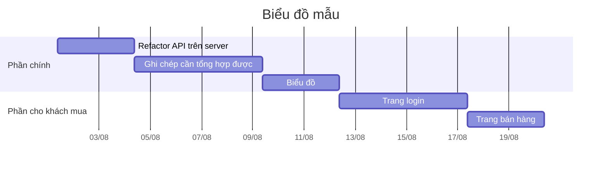

## Mô tả chung
Nhu cầu: thử nghiệm thị trường cho [Chương trình quản lý chi tiêu cá nhân từ Trấn Kỳ](../../../%F0%9F%93%9CT%C3%A0i%20nguy%C3%AAn/Quang%20c%E1%BA%A3nh%20th%E1%BB%8B%20tr%C6%B0%E1%BB%9Dng/Ch%C6%B0%C6%A1ng%20tr%C3%ACnh%20qu%E1%BA%A3n%20l%C3%BD%20ti%E1%BB%81n/5%20T%C3%AAn%20ch%C6%B0%C6%A1ng%20tr%C3%ACnh/App%20qu%E1%BA%A3n%20l%C3%BD%20chi%20ti%C3%AAu/Ch%C6%B0%C6%A1ng%20tr%C3%ACnh%20qu%E1%BA%A3n%20l%C3%BD%20chi%20ti%C3%AAu%20c%C3%A1%20nh%C3%A2n%20t%E1%BB%AB%20Tr%E1%BA%A5n%20K%E1%BB%B3.md)
Giải pháp: tạo webapp 

Sau khi xong sẽ marketing, để cho người dùng dùng thử. Huy sẽ thử với cộng đồng của mình trước. Nếu có phản hồi tốt sẽ mở ra các gói dùng thử.

## Yêu cầu
### Yêu cầu chức năng
- ❓Ghi chép cần tổng hợp được
- Cho dùng thử không cần login
- Login cho người dùng trả phí
- ❓Biểu đồ flow ko gãy

### Yêu cầu giao diện 

### Yêu cầu phi chức năng
- Refactor API trên server
- Thời gian khởi động dưới 5s

## Thời gian hoàn thành và giá

Thời gian hoàn thành dự kiến (giả sử ngày làm 10 tiếng): 
- Cho từng chức năng (bottom-up): 1 tuần nếu chưa có sẵn kiến thức về chức năng đó, 2 ngày nếu đã có sẵn kiến thức
- Cho toàn bộ dự án (top-down): 20 ngày

Lưu ý:
- [90% lượng code ban đầu tốn 90% thời gian lập trình. 10% lượng code còn lại tốn thêm 90% thời gian lập trình](90%25%20l%C6%B0%E1%BB%A3ng%20code%20ban%20%C4%91%E1%BA%A7u%20t%E1%BB%91n%2090%25%20th%E1%BB%9Di%20gian%20l%E1%BA%ADp%20tr%C3%ACnh.%2010%25%20l%C6%B0%E1%BB%A3ng%20code%20c%C3%B2n%20l%E1%BA%A1i%20t%E1%BB%91n%20th%C3%AAm%2090%25%20th%E1%BB%9Di%20gian%20l%E1%BA%ADp%20tr%C3%ACnh.md)
- [Nếu bạn nghĩ rằng bạn có thể hoàn thành đúng kế hoạch, có thể bạn đang ngộ nhận](N%E1%BA%BFu%20b%E1%BA%A1n%20ngh%C4%A9%20r%E1%BA%B1ng%20b%E1%BA%A1n%20c%C3%B3%20th%E1%BB%83%20ho%C3%A0n%20th%C3%A0nh%20%C4%91%C3%BAng%20k%E1%BA%BF%20ho%E1%BA%A1ch,%20c%C3%B3%20th%E1%BB%83%20b%E1%BA%A1n%20%C4%91ang%20ng%E1%BB%99%20nh%E1%BA%ADn.md)

## Giá
Nếu chỉ trả tiền không thôi thì giá là 200k/giờ.

Thay vì là tiền thì đáp ứng các mục tiêu của [Nhật](../C%C5%A9/4%20Th%C3%A0nh%20ph%E1%BA%A9m/%C4%90%E1%BB%99i%20ng%C5%A9/Nh%E1%BA%ADt.md), [Trí](../../Gi%C3%BAp%20nhau%20tho%C3%A1t%20n%E1%BB%A3/Kendy/Kendy%20c%E1%BA%A7n%20g%C3%AC.md) và [Thịnh](../C%C5%A9/4%20Th%C3%A0nh%20ph%E1%BA%A9m/%C4%90%E1%BB%99i%20ng%C5%A9/Th%E1%BB%8Bnh.md) là được
Xem thêm:: [Lý do viết Trấn Kỳ](../C%C5%A9/9%20Blog/L%C3%BD%20do%20vi%E1%BA%BFt%20Tr%E1%BA%A5n%20K%E1%BB%B3.md)

## Nền tảng cần dùng
- **Máy chủ:** Deno Deploy
- **Cơ sở dữ liệu:** Deno KV
- **Ngôn ngữ, framework:** Ngôn ngữ TypeScript với runtime Deno là thích hợp nhất cho những app còn nhỏ

Nếu viết app mobile thì có thể dùng framework Capacitor để có thể viết một lần mà có cả app Android và iOS, nhưng như vậy thì có thể sẽ phải đổi runtime sang Node. 

## Thời hạn bảo hành phần mềm
Tuỳ vào loại vấn đề mà sẽ xem xét nó có phải là lỗi hay không. Nếu nó không phải là yêu cầu đã được thống nhất trước mà là tính năng mới thì tính phí theo giờ như bình thường.
- Nếu lúc còn ít người dùng thì app không có vấn đề gì mà đến lúc người dùng tăng cao thì có vấn đề thì sẽ xét là một tính năng