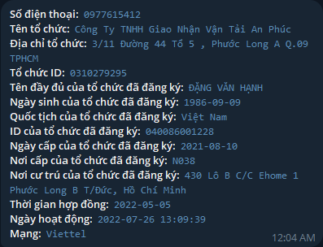
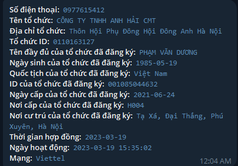

Đầu năm 2024 có một con bot Telegram [App](https://voz.vn/t/gia-cong-an-phuong-goi-lua-cap-nhat-can-cuoc-cong-dan.910543/). Nó cho ra toàn bộ thông tin của bạn từ CMND đến CCCD đã cập nhật. Facebook, email trả ra luôn. Không chỉ là số của một nhà mạng mà nhiều nhà mạng luôn.

2 số điện thoại này là 2 số dùng để lừa đảo người khác.

Về mặt kỹ thuật, nó cập nhật liên tục như vậy nghĩa là phải cắm qua API chứ không phải là xuất Excel như đa số mọi người quen thuộc. Nghĩa là cái này bắt buộc phải có dân kỹ thuật tham gia. Thì hoặc là người ăn ngầm, hoặc là nhận chỉ đạo từ cấp trên.

Anh có nghĩ là một thằng nào đó cấp rất cao trong nhà mạng đã tuồng thông tin ra cho tụi nước ngoài để rồi nó bán ở trên telegram như thế này không

bọn nó lời đc gì từ việc này?

Có gì mà nó không lời?

cái thằng viết cái bot này nó phải trả bao nhiêu để có dữ liệu?

việc bán thế này nó làm nó lời ko?

Bán thấp lắm là 500k

có 3 đô thôi mà?

Tính đi, lần tra 70k, 1 user tra ít lắm 10 lần, cá biệt có thể 100-1000, lúc e vào nó có 11k member, giờ là 14k

ủa em bảo nó chết rồi mà?

Thì nó chết rồi, vậy tính từ lần cuối đi, 13,5k

Nghĩ lại có thể 500k$ hơi cao, em tính tầm 200k$ (5 tỷ) chắc là vừa rồi

Nói chung là k biét rõ

Có thể giá sẽ cao hơn

Có thể thấp hơn

Tùy vào bên mua là ai

Suy nghĩ một hồi thì thấy khá là thú vị

cứ cho là 1/3 đứa là thực sự làm đi, và mỗi đứa 10 lần. Thì sẽ là 40000 lần. Nhân với 70k thì là gần 3 tỉ

Ví dụ về chính trị đi những thông tin này vào tay phe đối địch thì có phải là bên kia sẽ nắm hết toàn bộ thông tin cá nhân dữ liệu người dùng của toàn bộ dân Việt Nam?

Có thể đây là một cái lợi khác mà nó muốn lấy

Anh đừng quên những trường hợp cá biệt có thể mua với số lượng 1000 để tra cứu về thông tin doanh nghiệp hoặc là về thông tin về những người trong chung cư hoặc khu nào đó để bán một mặt hàng nào đó của họ

thì nó cũng cân bằng với những người chỉ muốn tra một vài người thôi

Thì những kẻ muốn làm big data thì sao dạng như một chủ doanh nghiệp lớn thực sự đang làm áp bài bạc Casino đang nuôi 1000 nhân viên để lừa 10000 đến 100.000 dân Việt Nam chẳng hạn

Và những trường hợp như thế này nữa

Nói chung là đết thể nào lỗ được khi anh nắm cái số lượng lớn đó trong tay

Không lời Cái này thì cũng lời cái khác

Như một cái app nào đó thiết kế nằm trong cái kính của bọn Mỹ mỗi khi nó nhìn thấy ai đó tự động tìm được data người đó là ai

Này thì tra cứu nên á như vậy chỉ còn khuôn mặt nữa là xong

mà cái này là tự bán, chứ nếu mà tính đến lỗ hổng bảo mật thì còn kinh hơn 
[An ninh mạng ở Việt Nam rất tệ](./An%20ninh%20m%E1%BA%A1ng%20%E1%BB%9F%20Vi%E1%BB%87t%20Nam%20r%E1%BA%A5t%20t%E1%BB%87.md)
[❓App đen có người trong các công ty viễn thông nên biết được sim đã xài trong bao lâu](../../../T%E1%BB%95%20ch%E1%BB%A9c%20t%C3%A0i%20ch%C3%ADnh/T%E1%BB%95%20ch%E1%BB%A9c%20t%C3%ADn%20d%E1%BB%A5ng/T%E1%BB%95%20ch%E1%BB%A9c%20t%C3%ADn%20d%E1%BB%A5ng%20phi%20ng%C3%A2n%20h%C3%A0ng/Vay%20n%C3%B3ng/App%20%C4%91en/%E2%9D%93App%20%C4%91en%20c%C3%B3%20ng%C6%B0%E1%BB%9Di%20trong%20c%C3%A1c%20c%C3%B4ng%20ty%20vi%E1%BB%85n%20th%C3%B4ng%20n%C3%AAn%20bi%E1%BA%BFt%20%C4%91%C6%B0%E1%BB%A3c%20sim%20%C4%91%C3%A3%20x%C3%A0i%20trong%20bao%20l%C3%A2u.md)
[Rất nhiều các công ty tài chính tiêu dùng lấy dữ liệu từ Viettel](../../../../%F0%9F%93%9CT%C3%A0i%20nguy%C3%AAn/T%C3%ACnh%20h%C3%ACnh%20%E1%BB%9F%20Vi%E1%BB%87t%20Nam/L%C4%A9nh%20v%E1%BB%B1c%20c%E1%BB%A5%20th%E1%BB%83/T%C3%A0i%20ch%C3%ADnh/T%E1%BB%95%20ch%E1%BB%A9c%20t%C3%ADn%20d%E1%BB%A5ng/T%E1%BB%95%20ch%E1%BB%A9c%20t%C3%ADn%20d%E1%BB%A5ng%20phi%20ng%C3%A2n%20h%C3%A0ng/C%C3%B4ng%20ty%20t%C3%A0i%20ch%C3%ADnh%20ti%C3%AAu%20d%C3%B9ng/R%E1%BA%A5t%20nhi%E1%BB%81u%20c%C3%A1c%20c%C3%B4ng%20ty%20t%C3%A0i%20ch%C3%ADnh%20ti%C3%AAu%20d%C3%B9ng%20l%E1%BA%A5y%20d%E1%BB%AF%20li%E1%BB%87u%20t%E1%BB%AB%20Viettel.md)
