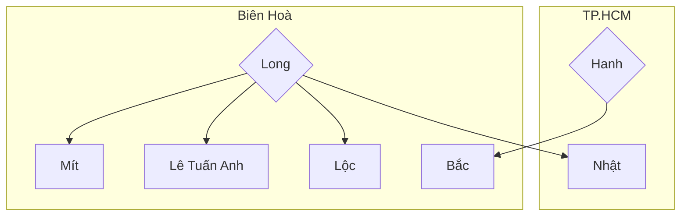

Khái niệm:: 

## Tiến
Luôn muốn làm khó kể cả khi có hoàn thành mục tiêu đề ra cỡ nào đi nữa

## Long
Áy náy khi cấp dưới không có lương
[Trần Kiệt](https://www.facebook.com/james001107?__tn__=-]C-R)
Lúc nào thì thấy là việc ưu ái sắp hết? 
## Cạnh tranh trong văn phòng

Công ty không cử người trực văn phòng, nên các nhân viên thị trường phải thay nhau trực. 

Quy định là các trưởng nhóm phải trực văn phòng. Do Mít với Tuấn Anh đều là nhân viên ảo của Long, nên việc trực văn phòng rốt cuộc là do Long làm. Nhưng chính vì vậy, Nhật với Lộc có thể lật lại và nói là sao tụi em phải đi khi mà những trưởng nhóm khác không đi.

Bắc là một trưởng nhóm sống ở Biên Hoà, nhưng không thuộc nhánh của Long. Theo lời Long kể thì Bắc không chịu lên trực, nói lên thì cứ kiếm cớ bảo là bận. Nên khi nhân viên lên mượn phòng thì không hỗ trợ gì cả. 
>  Mình phải thương yêu đội nhóm của mình, nhưng tàn ác với đội khác. Đó là quy luật kinh tế

> Cứ theo phương châm ấy mà làm

Lộc không muốn Long biết là Nhật làm cho Lộc, vì biết thì ổng sẽ bắt đầu ép

Công ty trừ 10%, chứ không giữ lại tiền

Chuyện họp ảo:
> **Nhật:** Thấy ngoài chuyện họp định kỳ thì cũng nghe lời hết mà. Bọn nv cũng đi họp đều. Mà ổng thì cũng tự đưa ra lý do là tối anh phải thức để xây dựng cộng đồng để kiếm khách. Thì anh nghĩ cũng đủ để du di cho anh ko họp chứ?
> **Lộc:** Chính vì vậy nên sự cố gắng có họp khi ổng hỏi thì vẫn mệt mỏi trả lời "có anh ơi" khi ổng biết anh thức khuya quá mà vẫn dậy sớm cái đó nó mới hiệu quả

[06-06-2025](06-06-2025.md) 
Long dạo này hay ép mua các đơn mà công ty ko khuyến khích. Có thể là vì công ty hay giao chỉ tiêu cho Long
Lộc phải miễn cưỡng chạy 63 đơn. Kết quả là bị giam 21tr
Sau đó thì phốt nổ ra