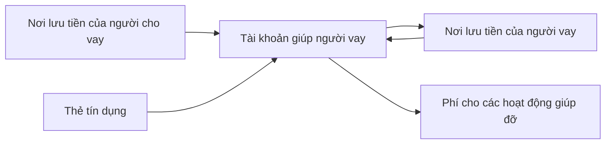
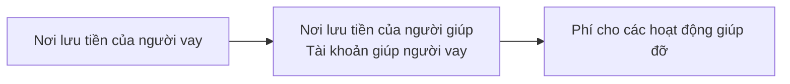
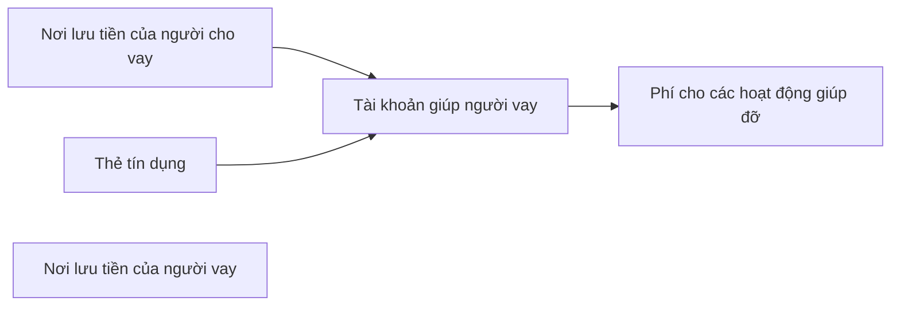
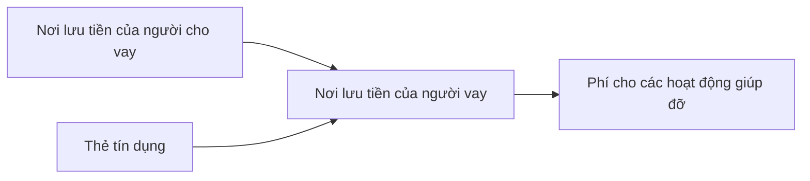
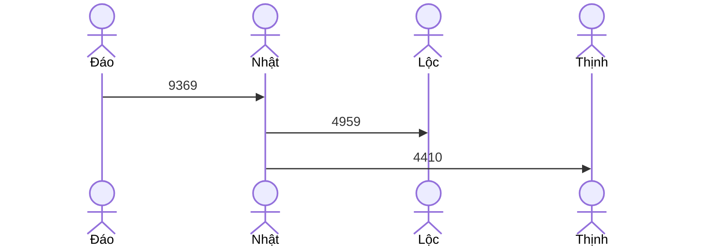

Đây là danh mục tài khoản và ý nghĩa bảng cân đối của [Ngân hàng mini và mạng lưới cho vay ngang hàng](./Ng%C3%A2n%20h%C3%A0ng%20mini%20v%C3%A0%20m%E1%BA%A1ng%20l%C6%B0%E1%BB%9Bi%20cho%20vay%20ngang%20h%C3%A0ng.md). Yêu cầu của hệ thống là phù hợp cho người muốn giúp đỡ nhưng chỉ có một mình. Ban đầu hệ thống cũng đơn giản, nhưng sau đó phức tạp lên, đặc biệt khi bạn đứng tên dùm và cho nhiều người mượn.
đứng tên sổ tiết kiệm dùm, đi đáo dùm

Nên hệ thống cần phù hợp cho hệ thống có sự chuyển đổi qua nhiều giai đoạn. PTA. Khi tra bên này bên kia thì cần plaintext

 [Tài khoản có thể được phân loại theo người sở hữu, nơi lưu tiền, mục đích sử dụng](../../../%E2%9A%A1Hi%E1%BB%83u%20bi%E1%BA%BFt%20s%C3%A2u/Ng%C3%A0nh%20ngh%E1%BB%81%20c%E1%BB%A5%20th%E1%BB%83/K%E1%BA%BF%20to%C3%A1n/B%E1%BA%A3n%20ch%E1%BA%A5t%20to%C3%A1n%20h%E1%BB%8Dc,%20h%E1%BB%87%20th%E1%BB%91ng%20th%C3%B4ng%20tin/T%C3%A0i%20kho%E1%BA%A3n%20c%C3%B3%20th%E1%BB%83%20%C4%91%C6%B0%E1%BB%A3c%20ph%C3%A2n%20lo%E1%BA%A1i%20theo%20ng%C6%B0%E1%BB%9Di%20s%E1%BB%9F%20h%E1%BB%AFu,%20n%C6%A1i%20l%C6%B0u%20ti%E1%BB%81n,%20m%E1%BB%A5c%20%C4%91%C3%ADch%20s%E1%BB%AD%20d%E1%BB%A5ng.md). Ban đầu cách tiếp cận egocentricism là thuận tiện, khi mà:
- Các nơi lưu tiền đứng tên mình có thể được liệt kê ra, còn tất cả những nơi lưu tiền của  người khác thì gom chung vào một nơi lưu tiền cũng được
- Có thể đảm bảo mỗi một nơi lưu tiền chỉ được dùng cho một mục đích
- Có thể đảm bảo mỗi một mục đích chỉ được dùng cho một nơi lưu tiền

Tuy nhiên khi các giao dịch càng ngày càng nhiều, các điều kiện trên khó mà đảm bảo trong thực tế:
- Dùng một nơi lưu tiền cho nhiều mục đích khác nhau đem lại một số lợi ích: 
	- Dùng một app ngân hàng để bớt phải đi đăng ký, bớt phải chờ đăng nhập
	- Rút một lần cho nhiều người mượn và cho bản thân mình xài
	- Đi rút tiền giùm cho nhiều người. Bên rút chuyển một lần cho mình, tính một lần phí
	- Nhiều giao dịch được chuyển cùng một lần
- Một mục đích có nhiều nơi lưu tiền:
	- Khi đi rút tiền để cho mượn thì lấy kèm tiền trong bóp để đỡ phải mất phí rút
- Chuyển luôn từ người gửi cho người nhận chứ không qua cái của mình

Đánh đổi cái nhức đầu trong tương lai cho cái tiện hiện tại. [Về mặt nhận thức, con người tương lai của chính mình không liên quan gì đến mình](../../../%E2%9A%A1Hi%E1%BB%83u%20bi%E1%BA%BFt%20s%C3%A2u/T%C3%A2m%20l%C3%BD%20h%E1%BB%8Dc%20qu%E1%BA%A3n%20l%C3%BD%20v%C3%A0%20lao%20%C4%91%E1%BB%99ng/S%E1%BA%AFp%20x%E1%BA%BFp%20%C4%91%E1%BB%99%20%C6%B0u%20ti%C3%AAn/S%E1%BB%B1%20tr%C3%AC%20ho%C3%A3n/V%E1%BB%81%20m%E1%BA%B7t%20nh%E1%BA%ADn%20th%E1%BB%A9c,%20con%20ng%C6%B0%E1%BB%9Di%20t%C6%B0%C6%A1ng%20lai%20c%E1%BB%A7a%20ch%C3%ADnh%20m%C3%ACnh%20kh%C3%B4ng%20li%C3%AAn%20quan%20g%C3%AC%20%C4%91%E1%BA%BFn%20m%C3%ACnh.md). Cho đến khi lý tưởng trở thành thực tế, thì còn nhức đầu 

Để cho tiện, trong bài này "tài khoản" sẽ dùng để gọi cho các tài khoản thuộc loại mục đích sử dụng. Còn các tài khoản thuộc loại nơi lưu tiền sẽ được gọi là "nơi lưu tiền". 
- Tài khoản: `Giúp:Lộc`. Các cấp độ đều là mục đích
- Nơi lưu tiền: `thẻ Vietcombank`, `MSB`. Cấp cao là người sở hữu, cấp thấp là nơi lưu tiền

Đặc điểm của nơi lưu tiền chính xác từng đồng lẻ và có thể assert được. Còn tài khoản cho mục đích sử dụng thì toàn làm tròn và không assert được. Nó cũng không tham gia vào bút toán kép được, nên chỉ có thể để dưới dạng virtual posting. Nhưng lúc giao dịch thì lại muốn dùng chính xác

Xem thêm:: [Danh mục tài khoản của Nhật](../Ng%C6%B0%E1%BB%9Di%20th%E1%BB%A5%20h%C6%B0%E1%BB%9Fng/L%C3%BD%20Minh%20Nh%E1%BA%ADt/Danh%20m%E1%BB%A5c%20t%C3%A0i%20kho%E1%BA%A3n%20c%E1%BB%A7a%20Nh%E1%BA%ADt.md)

### Chi phí cho việc giúp
Danh mục các khoản tiền liên quan tới thẻ:

|                              | Nơi chi                     | Bên thu   | Chu kỳ chi    |
| ---------------------------- | --------------------------- | --------- | ------------- |
| Phí mở thẻ                   | Nơi lưu tiền của người giúp | Dịch vụ   | Một lần       |
| Phí đáo, rút                 | Nơi lưu tiền của người giúp | Dịch vụ   | Hàng tháng    |
| Tiền ăn uống, cà phê, đi lại | Nơi lưu tiền của người giúp | Dịch vụ   | Không định kỳ |
| Phí thường niên              | Thẻ                         | Ngân hàng | Hàng năm      |
| Lãi                          | Thẻ                         | Ngân hàng | Không định kỳ |
| Thanh toán tối thiểu         | Nơi lưu tiền của người giúp | Ngân hàng | Hàng tháng    |
| Phí đóng thẻ                 | Nơi lưu tiền của người giúp | Ngân hàng | Một lần       |

|                  | Nơi nhận                    | Bên chi   | Chu kỳ nhận   |
| ---------------- | --------------------------- | --------- | ------------- |
| Tiền hoàn        | Nơi lưu tiền của người giúp | Ngân hàng | Không định kỳ |
| Lãi sổ tiết kiệm | Nơi lưu tiền của người giúp | Ngân hàng | Không định kỳ |
| Lãi không kỳ hạn | Nơi lưu tiền của người giúp | Ngân hàng | Không định kỳ |
| Khuyến mãi       | Nơi lưu tiền của người giúp | Ngân hàng | Không định kỳ |

Những cái ở trên thì người vay phải tự bỏ, nên không khác gì chuyển tiền giùm. Cái ở dưới thì chẳng đáng bao nhiêu nên người vay cũng chẳng để ý, mình ko thấy đáng để chuyển giùm.

Thẻ là tài sản của quỹ cho cá nhân mượn dùng. Thế nên các loại chi phí nên do người mượn trả, tuy nhiên khi lập danh mục thì nên nằm trong quỹ, không phải của người vay. (Nếu người vay phải bỏ ra phí mở thẻ, thì quỹ chỉ được thu hồi khi trả lại phí này). Phí mở thẻ, phí đáo rút không phải là phí chính thức của ngân hàng, còn phí thường niên, lãi là phí chính thức và bị trừ thẳng, nên không nên để các phí này là tài khoản con của tài khoản thẻ. Nó lại được trả bởi người vay, nên để là một phần của người vay thì cũng tiện.

### Tài khoản giúp người vay
```
2025-08-29 | Rút tiền mẹ lần 2
    Cá nhân:Mẹ:Thẻ:HSBC           -22134
    Chi tiêu:Tài chính:Thẻ:Phí rút:HSBC mẹ  332
    Nơi lưu tiền:TKTT:TPBank              21140
    (Giúp:Lộc)                   -30001
    Chi tiêu:Không rõ nguồn gốc   338
```
Dấu của giao dịch:
- Âm:
	- Tiền mình cho mượn
	- Tiền mình đứng ra mượn giùm 
	- Chi phí cho việc giúp khi họ chưa trả
- 0:
	- Mình trả nợ giùm (nợ của họ với người khác thành nợ của họ với mình)
	- Mình chuyển tiền giùm, và mục đích của việc chuyển không phải là để trả nợ. VD: [Nhận tiền hộ](../../../%F0%9F%93%9CT%C3%A0i%20nguy%C3%AAn/%C3%9D%20t%C6%B0%E1%BB%9Fng%20ki%E1%BA%BFm%20ti%E1%BB%81n/%C3%9D%20t%C6%B0%E1%BB%9Fng/C%C3%B4ng%20vi%E1%BB%87c%20th%E1%BB%9Di%20v%E1%BB%A5,%20c%E1%BB%99ng%20t%C3%A1c%20vi%C3%AAn/Nh%C3%B3m%20ch%E1%BA%A1y%20ch%E1%BB%89%20ti%C3%AAu/S%C3%A0n%20th%C6%B0%C6%A1ng%20m%E1%BA%A1i%20%C4%91i%E1%BB%87n%20t%E1%BB%AD/Gi%E1%BB%AF%20ti%E1%BB%81n%20h%E1%BB%99.md)
	- Chi phí cho việc giúp và họ trả tại chỗ
- Dương:
	- Tiền ủng hộ của mọi người
	- Lãi sổ tiết kiệm
	- Tiền họ đóng vào để đắp chi phí
	- Chi phí cho việc giúp khi họ trả
	- Tiền trả nợ của họ

[Âm hay dương trong giao dịch là tiền ra hay tiền vào. Âm dương trong cân đối là tiền nợ hay tiền có](../Ng%C6%B0%E1%BB%9Di%20th%E1%BB%A5%20h%C6%B0%E1%BB%9Fng/L%C3%BD%20Minh%20Nh%E1%BA%ADt/%C3%82m%20hay%20d%C6%B0%C6%A1ng%20trong%20giao%20d%E1%BB%8Bch%20l%C3%A0%20ti%E1%BB%81n%20ra%20hay%20ti%E1%BB%81n%20v%C3%A0o.%20%C3%82m%20d%C6%B0%C6%A1ng%20trong%20c%C3%A2n%20%C4%91%E1%BB%91i%20l%C3%A0%20ti%E1%BB%81n%20n%E1%BB%A3%20hay%20ti%E1%BB%81n%20c%C3%B3.md). [Số âm hay dương có ý nghĩa khác nhau tuỳ vào góc nhìn chuyển tiền hay người thực hiện giao dịch](../../../%E2%9A%A1Hi%E1%BB%83u%20bi%E1%BA%BFt%20s%C3%A2u/Ng%C3%A0nh%20ngh%E1%BB%81%20c%E1%BB%A5%20th%E1%BB%83/K%E1%BA%BF%20to%C3%A1n/B%E1%BA%A3n%20ch%E1%BA%A5t%20to%C3%A1n%20h%E1%BB%8Dc,%20h%E1%BB%87%20th%E1%BB%91ng%20th%C3%B4ng%20tin/S%E1%BB%91%20%C3%A2m%20hay%20d%C6%B0%C6%A1ng%20c%C3%B3%20%C3%BD%20ngh%C4%A9a%20kh%C3%A1c%20nhau%20tu%E1%BB%B3%20v%C3%A0o%20g%C3%B3c%20nh%C3%ACn%20chuy%E1%BB%83n%20ti%E1%BB%81n%20hay%20ng%C6%B0%E1%BB%9Di%20th%E1%BB%B1c%20hi%E1%BB%87n%20giao%20d%E1%BB%8Bch.md)

## Mô hình biểu diễn dữ liệu (ontology)
### Mô hình 1: Ghi người cho vay chuyển qua người vay thông qua quỹ giúp người vay

```hledger
2025-06-01 | Bắt đầu Thịnh
    Cá nhân:Hương:TKTT        -4000 kđ
    Cá nhân:Quân:TKTT         -2040 kđ
    Cá nhân:Linh:TKTT          -500 kđ
    Quỹ:Giúp Thịnh                0 kđ
    Cá nhân:Thịnh              6540 kđ
```
Đặc điểm: 
	- Các mối quan hệ được tường minh
	- Có thể làm assertion
	- Khi viết giao dịch thì phải luôn có posting, không 
	- Không tự nhiên trong lúc làm. Phải làm thêm thao tác khi nhập liệu
	- Phí cho các hoạt động giúp đỡ 
	- Nơi lưu tiền của người vay có thể dùng cho các mục đích khác, nhưng việc assert không đảm bảo. Nên tạo thêm một tài khoản chỉ cho việc nợ với người vay

|                                          | Loại | Âm                              | 0                          | Dương                              |
| ---------------------------------------- | ---- | ------------------------------- | -------------------------- | ---------------------------------- |
| Tài khoản giúp người vay                 | C    | Người vay còn nợ                | Người vay đã trả nợ đầy đủ | Còn khoản chưa chuyển              |
| Nơi lưu tiền của người vay               | C    | Không xảy ra                    |                            | Số tiền mình đã thực chuyển cho họ |
| Nơi lưu tiền của người cho vay (coi lại) | L    | ☹️Số tiền mình còn đang nợ họ   | Mình đã trả nợ đầy đủ      | Mình trả thừa                      |
| Thẻ tín dụng                   (coi lại) | L    | ☹️Số tiền mình còn nợ ngân hàng | Không có nợ                | Ít khi xảy ra                      |

Khi cho mượn, thì tài khoản là tính tổng, xem như là rút từ đó đưa cho họ. 
Khi họ chuyển vào mà không ghi lại nơi nhận ở đâu thì không phải dạng ảo nữa

| ---------------- | ---   |
| ---------------- | ----- |
| Chuyển tiền giùm | 0     |
| Vay giùm         | Âm    |
| Trả giùm         | Dương | 
```
2025-07-14 Cửa cuốn thông minh | Rút tiền seabank
    Nơi lưu tiền:Thẻ:SeABank Nhật      -4500 kđ
    Chi tiêu:Tài chính:Thẻ:Phí rút:SeABank Nhật  90
    (Giúp:Thịnh)  -4410
    Cá nhân:Thịnh                 4410 kđ

2025-07-14 | Phí đáo tháng 8
    Cá nhân:Thịnh:VĐT:Momo       -550 kđ
    Giúp:Thịnh  550
```
## Khi người vay trả tiền/đóng phí

Đây là điều diễn ra trên thực tế. Nếu như chuyển hết thì không phải ghi nơi lưu tiền của người giúp. Nhưng việc lưu sẽ giúp dễ kiểm tra lại hơn:
```hledger
2025-07-14  | Phí đáo   
    Quỹ:Giúp:Thịnh    0
    Cá nhân:Thịnh:VĐT:Momo        -550 kđ
    Quỹ:Quả Cầu:TTD:SeABank:Phí đáo
```
Tuy nhiên, đôi lúc không chuyển hết được

### Mô hình 2: Ghi người cho vay chuyển vào quỹ giúp người vay. Không ghi quỹ giúp người vay chuyển vào người vay

Đặc điểm:
- Phần còn lại của tài khoản giúp người vay chính là số tiền đã chuyển cho người vay
- Ưu điểm:
	- Làm giảm một đoạn nhập liệu, tự nhiên trong lúc làm
	- Phí cho các hoạt động giúp đỡ 
- Nhược điểm:
	- Không thể làm assertion

|                                | Loại | Âm           | 0                          | Dương                   |
| ------------------------------ | ---- | ------------ | -------------------------- | ----------------------- |
| Tài khoản giúp người vay       | C    | Không xảy ra | Người vay đã trả nợ đầy đủ | Số tiền họ đang nợ mình |
| Nơi lưu tiền của người cho vay | C    |              |                            |                         |
| Nơi lưu tiền của người vay     | L    | Không xảy ra | Họ đã trả nợ đầy đủ        | Tài sản của họ          |

### Mô hình 3: Ghi người cho vay chuyển trực tiếp cho người vay

- Ưu điểm:
	- Làm giảm một đoạn nhập liệu
	- Có thể làm assertion
	- Phù hợp cho những người bạn
- Nhược điểm:
	- Phí cho các hoạt động giúp đỡ tính vào chi phí chung 
	- Đánh dấu qua tag
	- Nơi lưu tiền của người vay chỉ có thể dùng cho các mục đích vay

|                            | Âm            | 0                          | Dương                 |
| -------------------------- | ------------- | -------------------------- | --------------------- |
| Tài khoản giúp người vay   | Không xảy ra | Người vay đã trả nợ đầy đủ | ☹️Họ còn đang nợ mình |
| Nơi lưu tiền của người vay | Không xảy ra | Họ đã trả nợ đầy đủ        | Tài sản của họ        |


### Mô hình 4: Ghi người cho vay chuyển trực tiếp cho người vay, sau đó chuyển lại cho quỹ giúp người vay
```hledger
2025-10-05 | Cường trả nợ  ; Giúp:Cường
    Quỹ:Quả Cầu:VĐT:Momo          250 kđ
    Quỹ:Quả Cầu:VĐT:Momo         -250 kđ
    Quỹ:Quả Cầu:Giúp:Cường                         250 kđ
    Cá nhân:Cường:VĐT:Momo                 -250 kđ
```
## Xem thêm
[Kinh nghiệm dùng hledger](../../../%F0%9F%93%9CT%C3%A0i%20nguy%C3%AAn/Ch%E1%BB%8Dn%20s%E1%BA%A3n%20ph%E1%BA%A9m%20ph%C3%B9%20h%E1%BB%A3p/Ch%C6%B0%C6%A1ng%20tr%C3%ACnh%20qu%E1%BA%A3n%20l%C3%BD%20ti%E1%BB%81n/Kinh%20nghi%E1%BB%87m%20d%C3%B9ng%20hledger.md)


