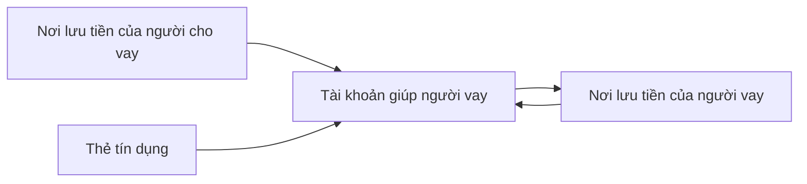

Nhật là người nắm giữ tiền và trực tiếp chi tiêu cho các nhu cầu của Nhật. Một trong các nhu cầu đó là giúp mọi người và lập quỹ chung. Các giao dịch có sự có mặt của Nhật sẽ phải được xem dưới góc độ nào đây?
- **Chi phí cho cuộc sống của Nhật là của Nhật**: Phân biệt thu nhập, chi tiêu cho mọi người. 
- **Chi phí cho cuộc sống của Nhật là một phần chi phí của mạng lưới các cá nhân**: Tất cả các nơi lưu tiền của mọi người đều được xem là tài sản. Chỉ là sự chuyển tiền giữa các tài khoản với nhau, dù đó là giữa nhiều người. Bán hàng thì cũng thế
- **Chi phí cho cuộc sống của Nhật là một phần chi phí của quỹ**: Chỉ những người mình xem là trong quỹ thì mới là tài sản

mặt khác vẫn muốn giữ đúng nguyên tắc

| Loại tài khoản                                               | Ví dụ               | Khi xét mình là sở hữu | Khi xét là quỹ | Khi xét là một phần cộng đồng |
| ------------------------------------------------------------ | ------------------- | ---------------------- | -------------- | ----------------------------- |
| Đồ Nhật đang sử dụng                                         | Laptop, điện thoại  | Tài sản                | Tài sản        | Tài sản                       |
| Chi tiêu cá nhân Nhật                                        | Vé xe, Hội thảo     | Chi phí                | Chi phí        | Chi phí                       |
| Chi tiêu cho mọi người                                       | Vé xe               | Chi phí                | Chi phí        | Chi phí                       |
| Tài khoản Nhật và dùng cá nhân                               |                     | Tài sản                | Tài sản        | Tài sản                       |
| Tài khoản Nhật và dùng cho quỹ                               | vcb, vietin         | Tài sản                | Tài sản        | Tài sản                       |
| Tiền mẹ cho                                                  |                     | Doanh thu              | Doanh thu      | Tài sản                       |
| Tài khoản người khác đứng tên và cho Nhật mượn               | Hương, Quân         | Nợ                     | Nợ             | Tài sản                       |
| Tài khoản người khác đứng tên và Nhật cho mượn               | Trí, Thịnh          | Tài sản                |                | Tài sản                       |
| Tiền được trả cho Nhật cho những thứ phát sinh khi Nhật giúp | Lộc                 | Doanh thu              |                | Tài sản                       |
| Tiền Nhật trả cho những thứ phát sinh khi Nhật giúp          | Phí đáo thẻ seabank | Chi phí                | Chi phí               | Chi phí                       |
| Cà phê thảo luận                                             |                     | Chi phí                | Chi phí        | Chi phí                       |
| Chuyển tiền giùm                                             |                     |                        |                |                               |

Phí đáo thẻ seabank nên vào mục giúp thịnh hay vào mục seabank? Nếu là vào seabank thì nó vẫn ko phải là phí chính thức của ngân hàng, nên không nên để tiền ngân hàng vào nhóm chung?

sườn, be, cơm chả cá có khai báo không?
Lúc thì tên doanh nghiệp là tên tài khoản (Vietinbank), lúc thì không (be) 

Nếu xem Nhật giúp quỹ, thì Nhật âm tiền, quỹ dương. Nếu xem Nhật với quỹ là một, thì việc ghi nhận là Nhật chuyển tiền vào gây hiểu nhầm
[Số âm hay dương có ý nghĩa khác nhau tuỳ vào góc nhìn chuyển tiền hay người thực hiện giao dịch](../../../%E2%9A%A1Hi%E1%BB%83u%20bi%E1%BA%BFt%20s%C3%A2u/N%E1%BB%81n%20kinh%20t%E1%BA%BF%20h%C3%A0ng%20ho%C3%A1/K%E1%BA%BF%20to%C3%A1n/K%E1%BA%BF%20ho%E1%BA%A1ch%20t%C3%A0i%20ch%C3%ADnh/S%E1%BB%91%20%C3%A2m%20hay%20d%C6%B0%C6%A1ng%20c%C3%B3%20%C3%BD%20ngh%C4%A9a%20kh%C3%A1c%20nhau%20tu%E1%BB%B3%20v%C3%A0o%20g%C3%B3c%20nh%C3%ACn%20chuy%E1%BB%83n%20ti%E1%BB%81n%20hay%20ng%C6%B0%E1%BB%9Di%20th%E1%BB%B1c%20hi%E1%BB%87n%20giao%20d%E1%BB%8Bch.md). Hơn nữa mọi người cũng không có cách nghĩ như vậy

## Ý nghĩa bảng cân đối cho dự án [Giúp nhau thoát nợ](./Ng%C3%A2n%20h%C3%A0ng%20mini%20v%C3%A0%20m%E1%BA%A1ng%20l%C6%B0%E1%BB%9Bi%20cho%20vay%20ngang%20h%C3%A0ng.md)
[Âm hay dương trong giao dịch là tiền ra hay tiền vào. Âm dương trong cân đối là tiền nợ hay tiền có](../Ng%C6%B0%E1%BB%9Di%20th%E1%BB%A5%20h%C6%B0%E1%BB%9Fng/L%C3%BD%20Minh%20Nh%E1%BA%ADt/%C3%82m%20hay%20d%C6%B0%C6%A1ng%20trong%20giao%20d%E1%BB%8Bch%20l%C3%A0%20ti%E1%BB%81n%20ra%20hay%20ti%E1%BB%81n%20v%C3%A0o.%20%C3%82m%20d%C6%B0%C6%A1ng%20trong%20c%C3%A2n%20%C4%91%E1%BB%91i%20l%C3%A0%20ti%E1%BB%81n%20n%E1%BB%A3%20hay%20ti%E1%BB%81n%20c%C3%B3.md). [Số âm hay dương có ý nghĩa khác nhau tuỳ vào góc nhìn chuyển tiền hay người thực hiện giao dịch](../../../%E2%9A%A1Hi%E1%BB%83u%20bi%E1%BA%BFt%20s%C3%A2u/N%E1%BB%81n%20kinh%20t%E1%BA%BF%20h%C3%A0ng%20ho%C3%A1/K%E1%BA%BF%20to%C3%A1n/K%E1%BA%BF%20ho%E1%BA%A1ch%20t%C3%A0i%20ch%C3%ADnh/S%E1%BB%91%20%C3%A2m%20hay%20d%C6%B0%C6%A1ng%20c%C3%B3%20%C3%BD%20ngh%C4%A9a%20kh%C3%A1c%20nhau%20tu%E1%BB%B3%20v%C3%A0o%20g%C3%B3c%20nh%C3%ACn%20chuy%E1%BB%83n%20ti%E1%BB%81n%20hay%20ng%C6%B0%E1%BB%9Di%20th%E1%BB%B1c%20hi%E1%BB%87n%20giao%20d%E1%BB%8Bch.md)

### Mô hình 1: Có ghi chuyển qua người mượn nợ
Ưu điểm: thấy hiển nhiên
Nhược điểm: phải làm thêm thao tác khi nhập liệu. Nếu người vay dùng nơi lưu tiền để xử lý việc khác thì khó, nên cần tạo thêm một tài khoản chỉ cho việc nợ với người vay

|                                | Âm                               | 0                          | Dương                                      |
| ------------------------------ | -------------------------------- | -------------------------- | ------------------------------------------ |
| Tài khoản giúp người vay       | Mình tính sai                    | Phải luôn bằng 0           | Còn khoản chưa chuyển                      |
| Nơi lưu tiền của người vay     | Mình tính sai                    | Người vay đã trả nợ đầy đủ | ☹️Người vay còn đang nợ mình               |
| Nơi lưu tiền của người cho vay | ☹️Mình đang còn nợ người cho vay | Mình đã trả nợ đầy đủ      | Mình trả thừa                              |
| Thẻ tín dụng                   | ☹️Đang nợ ngân hàng              | Không có nợ                | Ngân hàng hoàn tiền khi mình đang không nợ |

### Mô hình 2: Không ghi chuyển qua người mượn nợ
Ưu điểm: Làm giảm một đoạn nhập liệu

|                            | Âm            | 0                          | Dương                 |
| -------------------------- | ------------- | -------------------------- | --------------------- |
| Tài khoản giúp người vay   | Mình tính sai | Người vay đã trả nợ đầy đủ | ☹️Họ còn đang nợ mình |
| Nơi lưu tiền của người vay | Mình tính sai | Họ đã trả nợ đầy đủ        | Tài sản của họ        |

---

|                    | Dương                                                         | Âm                                                            |
| ------------------ | ------------------------------------------------------------- | ------------------------------------------------------------- |
| `Quỹ:Quả Cầu:Giúp` | Mình tăng nợ với người cho mượn. Người mượn đang tăng nợ mình | Mình giảm nợ với người cho mượn. Người mượn đang giảm nợ mình |
| Thẻ tín dụng       |                                                               |                                                               |

|                 | Dương              | Âm                      |
| --------------- | ------------------ | ----------------------- |
| `Cá nhân:[Tên]` | Người mượn giảm nợ | Người mượn đang tăng nợ |
| Thẻ tín dụng    |                    |                         |

[Kinh nghiệm dùng hledger](../../../%F0%9F%93%9CT%C3%A0i%20nguy%C3%AAn/Ch%E1%BB%8Dn%20s%E1%BA%A3n%20ph%E1%BA%A9m%20ph%C3%B9%20h%E1%BB%A3p/Ch%C6%B0%C6%A1ng%20tr%C3%ACnh%20qu%E1%BA%A3n%20l%C3%BD%20ti%E1%BB%81n/Kinh%20nghi%E1%BB%87m%20d%C3%B9ng%20hledger.md)

| Ví dụ                      | Mô tả                      | Tài khoản                                | Tag                                      | Chú thích |
| -------------------------- | -------------------------- | ---------------------------------------- | ---------------------------------------- | --------- |
| đồ ăn mẹ                   | Coopmart                   | Đồ ăn                                    | Giúp:Mẹ                                  |           |
| sách Ruột ơi là ruột       | Nhã Nam \| Ruột ơi là ruột | Chi phí:Giáo dục, văn hoá, giải trí:Sách | Kiến-thức,-giao-lưu:Truyện tranh kế toán |           |
| Bắt grab lên nhà dì ăn giỗ | Grab \| Từ nhà lên nhà dì  | Chi phí:Đi lại:Dịch vụ:Grab              | Kiến-thức,-giao-lưu:Giỗ                  |           |

## Tag
- Kiến-thức,-giao-lưu
- Giúp:[Tên cá nhân]

## Tài khoản
### Chi phí
- Giao thông
	- Xăng/Gửi xe/Metro
	- Xe buýt:Vé lượt/Vé tập
- Y tế:Bảo hiểm y tế/Tạm ứng/Hoàn trả/Xét nghiệm/Thuốc/Dụng cụ y tế
- Giáo dục, văn hoá, giải trí: Hội thảo/Khoá học/Phim/Sách/Cà phê trò chuyện
- Tài chính: Bảo hiểm xã hội/Đáo, rút
- Khác:Vệ sinh công cộng

Khi đi chợ thì hay chia ra thịt, cá, tinh bột
Ăn sáng, ăn trưa, cũng có thể là cơm quán
Chợ, siêu thị thì thường là thực phẩm, nhưng cũng có thể là đồ gia dụng
Không trong ăn chính thì có thể là ăn xế, ăn vặt
### Tài sản
- Tiền mặt:Bóp 1/Bóp 2
- Tài khoản thanh toán:[Tên ngân hàng]

### Cộng đồng
- Cá nhân:[Tên cá nhân]:Tiền mặt/Chuyển khoản/[Tên ngân hàng]
- Quỹ:[Tên tổ chức]:
	- Tài khoản thanh toán/Thẻ tín dụng/Ví trả sau
	- Giúp:[Tên cá nhân]

### Thu nhập
Hiểu theo nghĩa là người ta phải có trách nhiệm đưa tiền cho mình, không phải từ sự tương hỗ