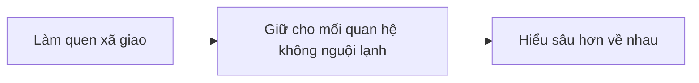

## Vấn đề
[Muốn bán hàng tốt cần có mối quan hệ](../../%E2%9A%A1Hi%E1%BB%83u%20bi%E1%BA%BFt%20s%C3%A2u/Ki%E1%BA%BFm%20ti%E1%BB%81n/L%C3%A0m%20thu%C3%AA/B%C3%A1n%20h%C3%A0ng/Mu%E1%BB%91n%20b%C3%A1n%20h%C3%A0ng%20t%E1%BB%91t%20c%E1%BA%A7n%20c%C3%B3%20m%E1%BB%91i%20quan%20h%E1%BB%87.md). Đây là các giai đoạn của việc thiết lập mối quan hệ:

Do [Các công ty ép chỉ tiêu khiến cho việc đi chào hàng không giúp phát triển một mối quan hệ chất lượng](../../%E2%9A%A1Hi%E1%BB%83u%20bi%E1%BA%BFt%20s%C3%A2u/Ki%E1%BA%BFm%20ti%E1%BB%81n/L%C3%A0m%20thu%C3%AA/B%C3%A1n%20h%C3%A0ng/C%C3%A1c%20c%C3%B4ng%20ty%20%C3%A9p%20ch%E1%BB%89%20ti%C3%AAu%20khi%E1%BA%BFn%20cho%20vi%E1%BB%87c%20%C4%91i%20ch%C3%A0o%20h%C3%A0ng%20kh%C3%B4ng%20gi%C3%BAp%20ph%C3%A1t%20tri%E1%BB%83n%20m%E1%BB%99t%20m%E1%BB%91i%20quan%20h%E1%BB%87%20ch%E1%BA%A5t%20l%C6%B0%E1%BB%A3ng.md), nên những người bán hàng cần phải có một cách thức để tăng số lượng mối quan hệ mà không tốn quá nhiều thời gian. Mặt khác, các công ty cũng không hỗ trợ nhân viên xây dựng thương hiệu, dù nó có lợi cho chính công ty 
Sự hỗ trợ của các công ty chính là việc [tổ chức các buổi OPP](../../%E2%9A%A1Hi%E1%BB%83u%20bi%E1%BA%BFt%20s%C3%A2u/T%E1%BB%95%20ch%E1%BB%A9c%20t%C3%A0i%20ch%C3%ADnh/B%E1%BA%A3o%20hi%E1%BB%83m/Chi%E1%BA%BFn%20l%C6%B0%E1%BB%A3c%20ph%C3%A1t%20tri%E1%BB%83n%20th%E1%BB%8B%20tr%C6%B0%E1%BB%9Dng/C%C3%A1c%20bu%E1%BB%95i%20s%E1%BB%B1%20ki%E1%BB%87n%20m%E1%BB%9Di%20kh%C3%A1ch%20c%C3%B4ng%20ty%20(OPP)%20kh%C3%B4ng%20ch%E1%BB%89%20%C4%91%E1%BB%83%20d%E1%BB%85%20ch%E1%BB%91t%20h%E1%BB%A3p%20%C4%91%E1%BB%93ng,%20m%C3%A0%20c%C3%B2n%20%C4%91%E1%BB%83%20%C4%91%C3%A1nh%20gi%C3%A1%20%C4%91%E1%BA%A1i%20l%C3%BD%20v%C3%A0%20t%E1%BA%ADp%20cho%20h%E1%BB%8D%20kh%E1%BA%A3%20n%C4%83ng%20t%E1%BB%B1%20t%E1%BB%95%20ch%E1%BB%A9c%20c%C3%A1c%20bu%E1%BB%95i%20c%E1%BB%A7a%20ri%C3%AAng%20m%C3%ACnh.md), nhưng không phải lúc nào cũng đủ. Còn việc xây dựng hệ thống như thế này thì họ xem đây là lợi thế cạnh tranh của mỗi người, nên mỗi người cần tự lo cho mình

Đã có một bài viết riêng cho giai đoạn [làm quen xã giao](../../%F0%9F%93%9CT%C3%A0i%20nguy%C3%AAn/M%E1%BB%9F%20r%E1%BB%99ng%20m%E1%BB%91i%20quan%20h%E1%BB%87/index.md). Ở bài này sẽ giả định rằng bạn đã có một lượng người theo dõi mạng xã hội của bạn rồi, và công việc của chúng ta là giữ các liên kết đó không bị nguội lạnh, để khi họ có nhu cầu tới sản phẩm thì sẽ nhớ tới mình đầu tiên.

Một trong những cách đó là tự động hoá việc hiện diện trên tường của những người theo dõi càng nhiều càng tốt.
Mục tiêu của những bài đăng này là

**Họ muốn xem hành trình của bạn ở công việc này**. Hành trình của một người xa lạ thì không đáng quan tâm, nhưng với một người họ đã bắt đầu có sự quan tâm thì sẽ không quá phiền để đọc. Họ sẽ thấy đây là một người có thực trong cuộc sống của họ. Và khi họ có nhu cầu sản phẩm thì họ sẽ nghĩ tới mình đầu tiên. Thương hiệu cá nhân lúc này không quá nhấn mạnh vào việc "Tôi là một chuyên gia trong lĩnh vực này", mà chủ yếu là "Tôi là một người có thực trong cuộc sống của bạn". Độ tin tưởng vào cái sau có khi cũng cao không kém vào cái trước.

**Việc họ thấy được mình nhiều lần quan trọng hơn việc mình là ai.** Tức là tần suất xuất hiện quan trọng hơn nội dung. Để được các mạng xã hội đẩy bài lên tường thì ngoài chuyện viết đều thì nắm bắt được xu hướng cũng là một lợi thế.
 để người ta biết rằng mình vẫn còn đang làm công việc này
Người ta muốn xem hành trình ở công việc này, để biết rằng mình vẫn còn đang làm công việc này
Hành trình cá nhân

> [!Summary] SWOT
> - **Điểm mạnh** là có kiến thức về sản phẩm, nhưng lại gặp **thách thức** là [thiếu mối quan hệ](../../%E2%9A%A1Hi%E1%BB%83u%20bi%E1%BA%BFt%20s%C3%A2u/Ki%E1%BA%BFm%20ti%E1%BB%81n/L%C3%A0m%20thu%C3%AA/B%C3%A1n%20h%C3%A0ng/Mu%E1%BB%91n%20b%C3%A1n%20h%C3%A0ng%20t%E1%BB%91t%20c%E1%BA%A7n%20c%C3%B3%20m%E1%BB%91i%20quan%20h%E1%BB%87.md)
> - **Cơ hội** là người ta muốn xem hành trình của mình ở công việc này, và tần suất xuất hiện quan trọng hơn nội dung, nhưng lại gặp **điểm yếu** là cần phải tự làm tất cả một mình, không có đội ngũ 

| Tại sao không...                         | Câu trả lời        |
| ---------------------------------------- | ------------------ |
| ...đặt quảng cáo?                        | Không có tiền      |
| ...tập trung vào việc tìm người cần mình | Không có thời gian |
| ...tham gia sinh hoạt trong các CLB      | Không có thời gian |
| ...tự tổ chức các buổi OPP               | Không có thời gian |

Và kể cả khi có đủ tiền, đủ thời gian thì cũng không có lý do gì mà không làm cái này

### Tại sao không đặt quảng cáo?
Nếu chấp nhận việc tốn tiền thì cũng không vấn đề gì. Nhưng đó không phải là đi con đường xây dựng mối quan hệ trên MXH.

### Tại sao không tập trung tìm người cần mình mà lại phải cố xây dựng thương hiệu làm gì? 
Vẫn có tham gia vào các CLB hoặc tự tổ chức OPP chứ. Chỉ là làm cái này song song, vừa chạy tự động vừa tạo ảnh hưởng một cách "hữu cơ" (organic) 
Do [Các công ty ép chỉ tiêu khiến cho việc đi chào hàng không giúp phát triển một mối quan hệ chất lượng](../../%E2%9A%A1Hi%E1%BB%83u%20bi%E1%BA%BFt%20s%C3%A2u/Ki%E1%BA%BFm%20ti%E1%BB%81n/L%C3%A0m%20thu%C3%AA/B%C3%A1n%20h%C3%A0ng/C%C3%A1c%20c%C3%B4ng%20ty%20%C3%A9p%20ch%E1%BB%89%20ti%C3%AAu%20khi%E1%BA%BFn%20cho%20vi%E1%BB%87c%20%C4%91i%20ch%C3%A0o%20h%C3%A0ng%20kh%C3%B4ng%20gi%C3%BAp%20ph%C3%A1t%20tri%E1%BB%83n%20m%E1%BB%99t%20m%E1%BB%91i%20quan%20h%E1%BB%87%20ch%E1%BA%A5t%20l%C6%B0%E1%BB%A3ng.md). Nên những người bán hàng cần phải có một cách thức để tăng số lượng mối quan hệ mà không tốn quá nhiều thời gian. 

### Cái này thì khác gì xả rác?
Cứ chấp nhận nó là rác, thì nó vẫn còn hiền hơn so với các [content farm](https://en.wikipedia.org/wiki/Content_farm) và các kỹ thuật thao túng đám đông khác. [Việc khai thác điểm yếu của con người đem lại lợi nhuận](../../%E2%9A%A1Hi%E1%BB%83u%20bi%E1%BA%BFt%20s%C3%A2u/%C4%90%E1%BA%A1o%20%C4%91%E1%BB%A9c,%20ph%C3%A1p%20lu%E1%BA%ADt.%20Kinh%20t%E1%BA%BF%20ch%C3%ADnh%20tr%E1%BB%8B/Ch%E1%BB%A7%20ngh%C4%A9a%20t%C6%B0%20b%E1%BA%A3n,%20t%C3%A2n%20t%E1%BB%B1%20do/Vi%E1%BB%87c%20khai%20th%C3%A1c%20%C4%91i%E1%BB%83m%20y%E1%BA%BFu%20c%E1%BB%A7a%20con%20ng%C6%B0%E1%BB%9Di%20%C4%91em%20l%E1%BA%A1i%20l%E1%BB%A3i%20nhu%E1%BA%ADn.md). [Thuyết rừng âm u trên internet](https://obsidian.quảcầu.cc/⚡Hiểu%20biết%20sâu/Công%20nghệ%20thông%20tin/Nhân%20học/Những%20nơi%20khó%20chỉ%20mục%20được%20là%20những%20nơi%20gặp%20được%20nhiều%20cuộc%20trò%20chuyện%20lành%20mạnh?utm_source=Vault+B+Tồn+tại+trong+thế+giới+tư+bản+(Dự+án)&utm_medium=Vault&utm_campaign=C1&utm_content=📐Dự+án%2FTự+động+hoá%2FXây+dựng+thương+hiệu+trên+MXH.md&utm_term=) đang dần trở thành hiện thực.
Có lẽ đây là quá trình không thể đảo ngược,mình chỉ đang thu lợi trước khi trễ thôi

Những người làm công việc này không phải không biết đây là rác, nhưng giữa một bên là bị công ty ép số, và một bên là gánh nặng mưu sinh thì mình thấy cũng không có giải pháp ngắn hạn nào hơn. Nó là câu chuyện "tôi muốn làm người lương thiện. Ai cho tôi lương thiện". Bạn chỉ trích việc này là xả rác là đúng, nhưng nếu vậy thì cũng hãy thừa thắng xông lên, chỉ trích luôn tư bản bóc lột người lao động cho nhất quán và triệt để, đồng thời cũng hãy cung cấp các công việc sạch sẽ hơn công việc này mà vẫn đảm bảo được các nhu cầu sống của họ.

Người dùng có thể sử dụng các công cụ [giảm rác trên mạng xã hội](https://obsidian.quảcầu.cc/📜Tài%20nguyên/Nhu%20cầu%20công%20nghệ/Loại%20bỏ%20phiền%20nhiễu,%20vượt%20rào%20cản/Web/Giảm%20rác%20trên%20mạng%20xã%20hội?utm_source=Vault+B+Tồn+tại+trong+thế+giới+tư+bản+(Dự+án)&utm_medium=Vault&utm_campaign=C1&utm_content=📐Dự+án%2FTự+động+hoá%2FXây+dựng+thương+hiệu+trên+MXH.md&utm_term=), hoặc bỏ Facebook, qua Mastodon luôn.

### Nếu để mã nguồn mở thì sẽ bị sử dụng

### Có cách nào tốt hơn không?
- Không đi bán hàng nữa. Lúc đó sẽ không cần phải làm mọi người biết đến mình bằng mọi giá như thế này nữa
- Xây dựng đội ngũ hỗ trợ mình, để bạn chỉ tập trung vào việc viết bài có chất lượng, hoặc có người viết bài chất lượng nhưng do bạn đứng tên làm tác giả (ghostwriting) 
- Tự động hoá những thứ nhiều người quan tâm
- Tham gia xây dựng [Mạng kết nối nhu cầu](../M%E1%BA%A1ng%20k%E1%BA%BFt%20n%E1%BB%91i%20nhu%20c%E1%BA%A7u/index.md)

## Giải pháp
Kết hợp giữa nắm bắt trào lưu đang có trên mạng và một chút suy nghĩ cá nhân.

### B1. Tạo thông điệp muốn khách hàng tiềm năng tiếp nhận
Một số thông điệp ví dụ:
- Cảm nghĩ trong cuộc sống. VD: vợ chồng bất hoà, nuôi dạy con cái
- Hành trình cá nhân trong công việc. VD: gặp được một người khách thú vị
- Giá trị của sản phẩm. VD: bảo vệ tài sản

Ví dụ:
> Nhân dịp ngày thương binh liệt sĩ, tôi muốn nói về ông tôi, một người lính...
> Làm trong [tên công ty] 3 năm, xích mích với đồng nghiệp là chuyện cơm bữa...
> Gần đây xảy ra vụ cháy xưởng lớn, thật may là chủ xưởng có mua bảo hiểm cháy nổ, nhưng tổn thất về tinh thần cũng vô cùng lớn...

Bài viết phải đảm bảo được 2 điều:
- Đọc lướt thì không thấy giống bán hàng  
- Đọc lướt thì thấy có vẻ viết từ suy nghĩ, cảm nhận **rất cá nhân** của mình, nếu kèm được với ảnh thì càng tốt

Thường những thứ này khó mà viết được bằng LLM. Hơn nữa, một khi người đọc đã cho rằng một bài viết được viết bởi LLM, có khả năng là họ sẽ không coi trọng các bài viết tiếp theo. [Việc có được khách hàng mới có thể tốn kém hơn từ 5 đến 25 lần so với việc giữ chân một khách hàng hiện có](../../%E2%9A%A1Hi%E1%BB%83u%20bi%E1%BA%BFt%20s%C3%A2u/Ki%E1%BA%BFm%20ti%E1%BB%81n/T%E1%BB%B1%20%C4%91%E1%BA%A7u%20t%C6%B0/Vi%E1%BB%87c%20c%C3%B3%20%C4%91%C6%B0%E1%BB%A3c%20kh%C3%A1ch%20h%C3%A0ng%20m%E1%BB%9Bi%20c%C3%B3%20th%E1%BB%83%20t%E1%BB%91n%20k%C3%A9m%20h%C6%A1n%20t%E1%BB%AB%205%20%C4%91%E1%BA%BFn%2025%20l%E1%BA%A7n%20so%20v%E1%BB%9Bi%20vi%E1%BB%87c%20gi%E1%BB%AF%20ch%C3%A2n%20m%E1%BB%99t%20kh%C3%A1ch%20h%C3%A0ng%20hi%E1%BB%87n%20c%C3%B3.md)

### B2. Nắm bắt trào lưu
- Bài chi tiết: [Tổng hợp nội dung, tin tức, sự kiện từ các website](https://obsidian.quảcầu.cc/📜Tài%20nguyên/Nhu%20cầu%20công%20nghệ/Hệ%20thống%20thông%20tin/Web/Tổng%20hợp%20nội%20dung,%20tin%20tức,%20sự%20kiện%20từ%20các%20website?utm_source=Vault+B+Tồn+tại+trong+thế+giới+tư+bản+(Dự+án)&utm_medium=Vault&utm_campaign=C1&utm_content=📐Dự+án%2FTự+động+hoá%2FXây+dựng+thương+hiệu+trên+MXH.md&utm_term=)
- Mã nguồn: [GitHub - QuaCau-TheSphere/CA-cao-su-kien](https://doi-thoai.deno.dev/zk.5-.1)

### B3. Liên kết trào lưu tới thông điệp và hẹn ngày đăng

### B3. Tự động đăng bài
- Facebook cá nhân, nhóm Facebook
- LinkedIn,
- Instagram,
- Zalo,
- Website cá nhân

[J2TEAM Community \| Hiện tại mình đang xây dựng một chương trình giúp người dùng xây dựng thương hiệu cá nhân trên mạng xã hội \| Facebook](https://www.facebook.com/share/p/1Fcu6LirhJ/)