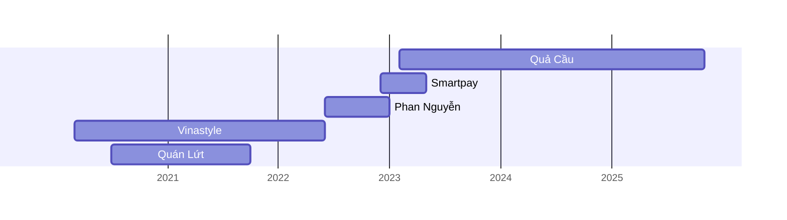

# Nguyễn Hữu Lộc
## Thông tin cơ bản
````columns
id: b52707b0-ce15-6458-825d-32615b4b7h85
===
- **SĐT:** 0783865410
- **Địa chỉ:** 990/18 Quốc lộ 13, Hiệp Bình Phước, Thủ Đức, TP.HCM
- **Ngày sinh:** 25/6/1999
- **Email:** michaelloc@hps.edu.vn
===
- **CCCD:** 074099001797
- **Ngày cấp:** 7/4/2024
- **Tài khoản ngân hàng:** Vietcombank 0281000543621
````

## Giáo dục
**Trường Quân Sự Quân Đoàn 4, 05/2018 – 12/2018**
- **Ngành:** Thông tin vô tuyến điện tử
- **Khoa:** Tiểu Đội Trưởng Thông Tin Vô Tuyến Điện
- **Danh hiệu:** Trung Sĩ Thông Tin Vô Tuyến Điện
- **Xếp loại:** Khá

## Kinh nghiệm làm việc 

### 02/2023 – hiện tại: Quả Cầu
- **Vị trí:** Quản lý
- **Mô tả công việc:** quản lý dự án, nhân sự, mạng lưới

### 12/2022 – 05/2023: Smartpay
- **Vị trí:** nhân viên bán hàng
- **Mô tả công việc:** phát triển thị trường

### 06/2022 – 01/2023: Công ty cổ phần xây dựng địa ốc Phan Nguyễn
- **Vị trí:** chuyên viên tư vấn
- **Mô tả công việc:** tìm kiếm, tiếp cận, trao đổi, tư vấn, thuyết phục, phối hợp cùng các bộ phận khác, hỗ trợ khách hàng làm thủ tục, chăm sóc khách hàng

### 03/2020 – 06/2022: Công ty TNHH Vinastyle
- **Vị trí:** chuyên viên thiết kế
- **Mô tả công việc:** thi công, trang trí, thiết kế nội thất

### 07/2020 – 10/2021: Công ty TNHH Quán Lứt
- **Vị trí:** lễ tân
- **Mô tả công việc:** cung cấp dịch vụ ăn uống theo hợp đồng với khách hàng nhân sự kiện như phục vụ tiệc, hội nghị đám cưới và các sự kiện tương tự

## Kỹ năng

