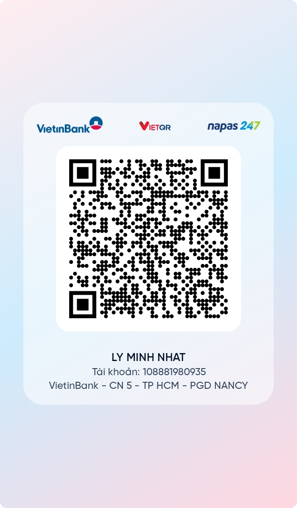

## Chuyển tiền dưới 1tr

|                        | STK           | QR                        | Tên đăng nhập | SĐT        | Email                     |
| ---------------------- | ------------- | ------------------------- | ------------- | ---------- | ------------------------- |
| [HDBank](../../../%F0%9F%A7%91%E2%80%8D%F0%9F%8C%BENg%C3%A0nh%20ngh%E1%BB%81%20c%E1%BB%A5%20th%E1%BB%83/T%C3%A0i%20ch%C3%ADnh/T%C3%ADn%20d%E1%BB%A5ng/T%C3%ADn%20d%E1%BB%A5ng%20t%C6%B0%20b%E1%BA%A3n/T%E1%BB%95%20ch%E1%BB%A9c%20c%E1%BB%A5%20th%E1%BB%83/Ng%C3%A2n%20h%C3%A0ng/Danh%20s%C3%A1ch%20ng%C3%A2n%20h%C3%A0ng/HDBank.md)             |               |                           | 0912214006    | 0335470414 | sphaera.kyuutai@gmail.com |
| NCB                    |               |                           |               | 0335470414 | sphaera.kyuutai@gmail.com |
| [MSB](../../../%F0%9F%A7%91%E2%80%8D%F0%9F%8C%BENg%C3%A0nh%20ngh%E1%BB%81%20c%E1%BB%A5%20th%E1%BB%83/T%C3%A0i%20ch%C3%ADnh/T%C3%ADn%20d%E1%BB%A5ng/T%C3%ADn%20d%E1%BB%A5ng%20t%C6%B0%20b%E1%BA%A3n/T%E1%BB%95%20ch%E1%BB%A9c%20c%E1%BB%A5%20th%E1%BB%83/Ng%C3%A2n%20h%C3%A0ng/Danh%20s%C3%A1ch%20ng%C3%A2n%20h%C3%A0ng/MSB.md)                |               |          | 079092007133  |            |                           |
| [Shinhanbank](../../../%F0%9F%A7%91%E2%80%8D%F0%9F%8C%BENg%C3%A0nh%20ngh%E1%BB%81%20c%E1%BB%A5%20th%E1%BB%83/T%C3%A0i%20ch%C3%ADnh/T%C3%ADn%20d%E1%BB%A5ng/T%C3%ADn%20d%E1%BB%A5ng%20t%C6%B0%20b%E1%BA%A3n/T%E1%BB%95%20ch%E1%BB%A9c%20c%E1%BB%A5%20th%E1%BB%83/Ng%C3%A2n%20h%C3%A0ng/Danh%20s%C3%A1ch%20ng%C3%A2n%20h%C3%A0ng/SHBVN.md) |               |      | LYMINHNHAT    |            |                           |
| [Sacombank](../../../%F0%9F%A7%91%E2%80%8D%F0%9F%8C%BENg%C3%A0nh%20ngh%E1%BB%81%20c%E1%BB%A5%20th%E1%BB%83/T%C3%A0i%20ch%C3%ADnh/T%C3%ADn%20d%E1%BB%A5ng/T%C3%ADn%20d%E1%BB%A5ng%20t%C6%B0%20b%E1%BA%A3n/T%E1%BB%95%20ch%E1%BB%A9c%20c%E1%BB%A5%20th%E1%BB%83/Ng%C3%A2n%20h%C3%A0ng/Danh%20s%C3%A1ch%20ng%C3%A2n%20h%C3%A0ng/Sacombank.md)          |               |    |               |            |                           |
| [Vietcombank](../../../%F0%9F%A7%91%E2%80%8D%F0%9F%8C%BENg%C3%A0nh%20ngh%E1%BB%81%20c%E1%BB%A5%20th%E1%BB%83/T%C3%A0i%20ch%C3%ADnh/T%C3%ADn%20d%E1%BB%A5ng/T%C3%ADn%20d%E1%BB%A5ng%20t%C6%B0%20b%E1%BA%A3n/T%E1%BB%95%20ch%E1%BB%A9c%20c%E1%BB%A5%20th%E1%BB%83/Ng%C3%A2n%20h%C3%A0ng/Danh%20s%C3%A1ch%20ng%C3%A2n%20h%C3%A0ng/Vietcombank.md)        | 0331000438307 |  |               |            |                           |
| [SeABank](../../../%F0%9F%A7%91%E2%80%8D%F0%9F%8C%BENg%C3%A0nh%20ngh%E1%BB%81%20c%E1%BB%A5%20th%E1%BB%83/T%C3%A0i%20ch%C3%ADnh/T%C3%ADn%20d%E1%BB%A5ng/T%C3%ADn%20d%E1%BB%A5ng%20t%C6%B0%20b%E1%BA%A3n/T%E1%BB%95%20ch%E1%BB%A9c%20c%E1%BB%A5%20th%E1%BB%83/Ng%C3%A2n%20h%C3%A0ng/Danh%20s%C3%A1ch%20ng%C3%A2n%20h%C3%A0ng/SeABank.md)            |               |                           |               |            |                           |

108881980935
LY MINH NHAT
VietinBank
0332672691
- Không popup quảng cáo
- Vào ngay được màn hình chuyển tiền
- Không đòi bảo hiểm chuyển khoản

Số tài khoản: 0912214006 
Họ tên: LY MINH NHAT 
Ngân hàng VPBank

Muốn chi phí được trừ khi tính thuế thì phải là thanh toán không tiền mặt, trừ những khoản chi đặc thù

Doanh thu dưới 3 tỷ thì tính thuế theo doanh thu, trên 3 tỷ thì tính theo lợi nhuận 