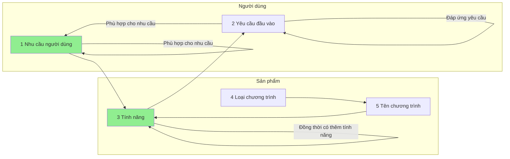

## Mối quan hệ giữa các khái niệm
- Nhu cầu người dùng sẽ đòi hỏi tính năng
- Tính năng sẽ đòi hỏi yêu cầu đầu vào 
- Yêu cầu đầu vào đòi hỏi nhu cầu người dùng
 
- Tính năng sẽ quyết định loại chương trình
- Chương trình đáp ứng một tổ hợp các nhu cầu của người dùng bằng một tổ hợp các tính năng 

## Danh mục
- \-: 
    - [Bất cập của các app quản lý tiền hiện có](./B%E1%BA%A5t%20c%E1%BA%ADp%20c%E1%BB%A7a%20c%C3%A1c%20app%20qu%E1%BA%A3n%20l%C3%BD%20ti%E1%BB%81n%20hi%E1%BB%87n%20c%C3%B3.md)
    - [Chương trình quản lý tiền](index.md)
    - [Kinh nghiệm dùng hledger](./Kinh%20nghi%E1%BB%87m%20d%C3%B9ng%20hledger.md)

- 1 Nhu cầu người dùng: 
    - [Chỉ cần ước lượng đại khái](./1%20Nhu%20c%E1%BA%A7u%20ng%C6%B0%E1%BB%9Di%20d%C3%B9ng/C%C3%A1ch%20l%C3%AAn%20k%E1%BA%BF%20ho%E1%BA%A1ch%20s%E1%BB%AD%20d%E1%BB%A5ng%20ti%E1%BB%81n/Ch%E1%BB%89%20c%E1%BA%A7n%20%C6%B0%E1%BB%9Bc%20l%C6%B0%E1%BB%A3ng%20%C4%91%E1%BA%A1i%20kh%C3%A1i.md)
    - [Cần lên kế hoạch từng tuần](./1%20Nhu%20c%E1%BA%A7u%20ng%C6%B0%E1%BB%9Di%20d%C3%B9ng/C%C3%A1ch%20l%C3%AAn%20k%E1%BA%BF%20ho%E1%BA%A1ch%20s%E1%BB%AD%20d%E1%BB%A5ng%20ti%E1%BB%81n/C%E1%BA%A7n%20l%C3%AAn%20k%E1%BA%BF%20ho%E1%BA%A1ch%20t%E1%BB%ABng%20tu%E1%BA%A7n.md)
    - [Việc phân loại thủ công không phải là vấn đề](./1%20Nhu%20c%E1%BA%A7u%20ng%C6%B0%E1%BB%9Di%20d%C3%B9ng/C%C3%A1ch%20ph%C3%A2n%20lo%E1%BA%A1i/Vi%E1%BB%87c%20ph%C3%A2n%20lo%E1%BA%A1i%20th%E1%BB%A7%20c%C3%B4ng%20kh%C3%B4ng%20ph%E1%BA%A3i%20l%C3%A0%20v%E1%BA%A5n%20%C4%91%E1%BB%81.md)
    - [Việc phân loại thủ công là vấn đề lớn](./1%20Nhu%20c%E1%BA%A7u%20ng%C6%B0%E1%BB%9Di%20d%C3%B9ng/C%C3%A1ch%20ph%C3%A2n%20lo%E1%BA%A1i/Vi%E1%BB%87c%20ph%C3%A2n%20lo%E1%BA%A1i%20th%E1%BB%A7%20c%C3%B4ng%20l%C3%A0%20v%E1%BA%A5n%20%C4%91%E1%BB%81%20l%E1%BB%9Bn.md)
    - [Cần nhập càng nhanh càng tốt](./1%20Nhu%20c%E1%BA%A7u%20ng%C6%B0%E1%BB%9Di%20d%C3%B9ng/C%E1%BA%A7n%20nh%E1%BA%ADp%20c%C3%A0ng%20nhanh%20c%C3%A0ng%20t%E1%BB%91t.md)
    - [Cần nhập lúc đi đường](./1%20Nhu%20c%E1%BA%A7u%20ng%C6%B0%E1%BB%9Di%20d%C3%B9ng/C%E1%BA%A7n%20nh%E1%BA%ADp%20l%C3%BAc%20%C4%91i%20%C4%91%C6%B0%E1%BB%9Dng.md)
    - [Cần xét cặn kẽ từng hạng mục](./1%20Nhu%20c%E1%BA%A7u%20ng%C6%B0%E1%BB%9Di%20d%C3%B9ng/H%E1%BB%87%20th%E1%BB%91ng%20ph%C3%A2n%20lo%E1%BA%A1i/C%E1%BA%A7n%20x%C3%A9t%20c%E1%BA%B7n%20k%E1%BA%BD%20t%E1%BB%ABng%20h%E1%BA%A1ng%20m%E1%BB%A5c.md)
    - [Chỉ cần xét những mục phổ biến](./1%20Nhu%20c%E1%BA%A7u%20ng%C6%B0%E1%BB%9Di%20d%C3%B9ng/H%E1%BB%87%20th%E1%BB%91ng%20ph%C3%A2n%20lo%E1%BA%A1i/Ch%E1%BB%89%20c%E1%BA%A7n%20x%C3%A9t%20nh%E1%BB%AFng%20m%E1%BB%A5c%20ph%E1%BB%95%20bi%E1%BA%BFn.md)
    - [Không đủ kiên nhẫn](./1%20Nhu%20c%E1%BA%A7u%20ng%C6%B0%E1%BB%9Di%20d%C3%B9ng/Kh%E1%BA%A3%20n%C4%83ng%20s%E1%BB%AD%20d%E1%BB%A5ng/Kh%C3%B4ng%20%C4%91%E1%BB%A7%20ki%C3%AAn%20nh%E1%BA%ABn.md)
    - [Cần tích hợp được với các chương trình khác](./1%20Nhu%20c%E1%BA%A7u%20ng%C6%B0%E1%BB%9Di%20d%C3%B9ng/Kh%E1%BA%A3%20n%C4%83ng%20t%C3%ADch%20h%E1%BB%A3p/C%E1%BA%A7n%20t%C3%ADch%20h%E1%BB%A3p%20%C4%91%C6%B0%E1%BB%A3c%20v%E1%BB%9Bi%20c%C3%A1c%20ch%C6%B0%C6%A1ng%20tr%C3%ACnh%20kh%C3%A1c.md)
    - [Không cần tích hợp](./1%20Nhu%20c%E1%BA%A7u%20ng%C6%B0%E1%BB%9Di%20d%C3%B9ng/Kh%E1%BA%A3%20n%C4%83ng%20t%C3%ADch%20h%E1%BB%A3p/Kh%C3%B4ng%20c%E1%BA%A7n%20t%C3%ADch%20h%E1%BB%A3p.md)

- 2 Yêu cầu đầu vào: 
    - [Có thể dành thời gian nghiên cứu](./2%20Y%C3%AAu%20c%E1%BA%A7u%20%C4%91%E1%BA%A7u%20v%C3%A0o/C%C3%B3%20th%E1%BB%83%20d%C3%A0nh%20th%E1%BB%9Di%20gian%20nghi%C3%AAn%20c%E1%BB%A9u.md)
    - [Dữ liệu có văn cảnh lớn](./2%20Y%C3%AAu%20c%E1%BA%A7u%20%C4%91%E1%BA%A7u%20v%C3%A0o/D%E1%BB%AF%20li%E1%BB%87u%20c%C3%B3%20v%C4%83n%20c%E1%BA%A3nh%20l%E1%BB%9Bn.md)
    - [Dữ liệu có văn cảnh nhỏ](./2%20Y%C3%AAu%20c%E1%BA%A7u%20%C4%91%E1%BA%A7u%20v%C3%A0o/D%E1%BB%AF%20li%E1%BB%87u%20c%C3%B3%20v%C4%83n%20c%E1%BA%A3nh%20nh%E1%BB%8F.md)
    - [Không cần dữ liệu huấn luyện](./2%20Y%C3%AAu%20c%E1%BA%A7u%20%C4%91%E1%BA%A7u%20v%C3%A0o/Kh%C3%B4ng%20c%E1%BA%A7n%20d%E1%BB%AF%20li%E1%BB%87u%20hu%E1%BA%A5n%20luy%E1%BB%87n.md)
    - [Không cần thiết lập cấu hình](./2%20Y%C3%AAu%20c%E1%BA%A7u%20%C4%91%E1%BA%A7u%20v%C3%A0o/Kh%C3%B4ng%20c%E1%BA%A7n%20thi%E1%BA%BFt%20l%E1%BA%ADp%20c%E1%BA%A5u%20h%C3%ACnh.md)
    - [Phải thiết lập cấu hình](./2%20Y%C3%AAu%20c%E1%BA%A7u%20%C4%91%E1%BA%A7u%20v%C3%A0o/Ph%E1%BA%A3i%20thi%E1%BA%BFt%20l%E1%BA%ADp%20c%E1%BA%A5u%20h%C3%ACnh.md)

- 3 Tính năng: 
    - [100k mỗi tháng](./3%20T%C3%ADnh%20n%C4%83ng/Ch%C3%ADnh%20s%C3%A1ch%20gi%C3%A1/100k%20m%E1%BB%97i%20th%C3%A1ng.md)
    - [Freemium](./3%20T%C3%ADnh%20n%C4%83ng/Ch%C3%ADnh%20s%C3%A1ch%20gi%C3%A1/Freemium.md)
    - [Miễn phí](./3%20T%C3%ADnh%20n%C4%83ng/Ch%C3%ADnh%20s%C3%A1ch%20gi%C3%A1/Mi%E1%BB%85n%20ph%C3%AD.md)
    - [Nhập liệu bằng giọng nói](./3%20T%C3%ADnh%20n%C4%83ng/C%C3%A1ch%20nh%E1%BA%ADp%20li%E1%BB%87u/Nh%E1%BA%ADp%20li%E1%BB%87u%20b%E1%BA%B1ng%20gi%E1%BB%8Dng%20n%C3%B3i.md)
    - [Nhập liệu được bằng file text](./3%20T%C3%ADnh%20n%C4%83ng/C%C3%A1ch%20nh%E1%BA%ADp%20li%E1%BB%87u/Nh%E1%BA%ADp%20li%E1%BB%87u%20%C4%91%C6%B0%E1%BB%A3c%20b%E1%BA%B1ng%20file%20text.md)
    - [Nhập liệu được trên Google Keep](./3%20T%C3%ADnh%20n%C4%83ng/C%C3%A1ch%20nh%E1%BA%ADp%20li%E1%BB%87u/Nh%E1%BA%ADp%20li%E1%BB%87u%20%C4%91%C6%B0%E1%BB%A3c%20tr%C3%AAn%20Google%20Keep.md)
    - [Nhập liệu được trên Telegram](./3%20T%C3%ADnh%20n%C4%83ng/C%C3%A1ch%20nh%E1%BA%ADp%20li%E1%BB%87u/Nh%E1%BA%ADp%20li%E1%BB%87u%20%C4%91%C6%B0%E1%BB%A3c%20tr%C3%AAn%20Telegram.md)
    - [Nhập được bằng tập tin bảng tính](./3%20T%C3%ADnh%20n%C4%83ng/C%C3%A1ch%20nh%E1%BA%ADp%20li%E1%BB%87u/Nh%E1%BA%ADp%20%C4%91%C6%B0%E1%BB%A3c%20b%E1%BA%B1ng%20t%E1%BA%ADp%20tin%20b%E1%BA%A3ng%20t%C3%ADnh.md)
    - [Nhập được trên máy tính](./3%20T%C3%ADnh%20n%C4%83ng/C%C3%A1ch%20nh%E1%BA%ADp%20li%E1%BB%87u/Nh%E1%BA%ADp%20%C4%91%C6%B0%E1%BB%A3c%20tr%C3%AAn%20m%C3%A1y%20t%C3%ADnh.md)
    - [Nhập được trên web](./3%20T%C3%ADnh%20n%C4%83ng/C%C3%A1ch%20nh%E1%BA%ADp%20li%E1%BB%87u/Nh%E1%BA%ADp%20%C4%91%C6%B0%E1%BB%A3c%20tr%C3%AAn%20web.md)
    - [Nhập được trên điện thoại](./3%20T%C3%ADnh%20n%C4%83ng/C%C3%A1ch%20nh%E1%BA%ADp%20li%E1%BB%87u/Nh%E1%BA%ADp%20%C4%91%C6%B0%E1%BB%A3c%20tr%C3%AAn%20%C4%91i%E1%BB%87n%20tho%E1%BA%A1i.md)
    - [Tự động lấy thông tin giao dịch ngay lúc quẹt mã](./3%20T%C3%ADnh%20n%C4%83ng/C%C3%A1ch%20nh%E1%BA%ADp%20li%E1%BB%87u/T%E1%BB%B1%20%C4%91%E1%BB%99ng%20l%E1%BA%A5y%20th%C3%B4ng%20tin%20giao%20d%E1%BB%8Bch%20ngay%20l%C3%BAc%20qu%E1%BA%B9t%20m%C3%A3.md)
    - [Điều khiển dễ dàng bằng bàn phím](./3%20T%C3%ADnh%20n%C4%83ng/C%C3%A1ch%20nh%E1%BA%ADp%20li%E1%BB%87u/%C4%90i%E1%BB%81u%20khi%E1%BB%83n%20d%E1%BB%85%20d%C3%A0ng%20b%E1%BA%B1ng%20b%C3%A0n%20ph%C3%ADm.md)
    - [Phân loại bằng tay](./3%20T%C3%ADnh%20n%C4%83ng/C%C3%A1ch%20ph%C3%A2n%20lo%E1%BA%A1i/Ph%C3%A2n%20lo%E1%BA%A1i%20b%E1%BA%B1ng%20tay.md)
    - [Phân loại tự động theo mô hình ngôn ngữ lớn](./3%20T%C3%ADnh%20n%C4%83ng/C%C3%A1ch%20ph%C3%A2n%20lo%E1%BA%A1i/Ph%C3%A2n%20lo%E1%BA%A1i%20t%E1%BB%B1%20%C4%91%E1%BB%99ng%20theo%20m%C3%B4%20h%C3%ACnh%20ng%C3%B4n%20ng%E1%BB%AF%20l%E1%BB%9Bn.md)
    - [Phân loại tự động theo quy luật](./3%20T%C3%ADnh%20n%C4%83ng/C%C3%A1ch%20ph%C3%A2n%20lo%E1%BA%A1i/Ph%C3%A2n%20lo%E1%BA%A1i%20t%E1%BB%B1%20%C4%91%E1%BB%99ng%20theo%20quy%20lu%E1%BA%ADt.md)
    - [Có GUI](./3%20T%C3%ADnh%20n%C4%83ng/Giao%20di%E1%BB%87n/C%C3%B3%20GUI.md)
    - [Dùng được trên CLI](./3%20T%C3%ADnh%20n%C4%83ng/Giao%20di%E1%BB%87n/D%C3%B9ng%20%C4%91%C6%B0%E1%BB%A3c%20tr%C3%AAn%20CLI.md)
    - [Game hoá](./3%20T%C3%ADnh%20n%C4%83ng/Kh%C3%A1c/Game%20ho%C3%A1.md)
    - [Có người hỗ trợ sâu](./3%20T%C3%ADnh%20n%C4%83ng/Kh%C3%A1c/C%C3%B3%20ng%C6%B0%E1%BB%9Di%20h%E1%BB%97%20tr%E1%BB%A3%20s%C3%A2u.md)
    - [Là phần mềm tự do](./3%20T%C3%ADnh%20n%C4%83ng/Kh%C3%A1c/L%C3%A0%20ph%E1%BA%A7n%20m%E1%BB%81m%20t%E1%BB%B1%20do.md)
    - [Sử dụng phương pháp chi tiêu phù hợp hoàn cảnh mỗi người](./3%20T%C3%ADnh%20n%C4%83ng/Kh%C3%A1c/S%E1%BB%AD%20d%E1%BB%A5ng%20ph%C6%B0%C6%A1ng%20ph%C3%A1p%20chi%20ti%C3%AAu%20ph%C3%B9%20h%E1%BB%A3p%20ho%C3%A0n%20c%E1%BA%A3nh%20m%E1%BB%97i%20ng%C6%B0%E1%BB%9Di.md)
    - [Trả tiền để làm phân loại](./3%20T%C3%ADnh%20n%C4%83ng/Kh%C3%A1c/Tr%E1%BA%A3%20ti%E1%BB%81n%20%C4%91%E1%BB%83%20l%C3%A0m%20ph%C3%A2n%20lo%E1%BA%A1i.md)
    - [Tạo query phức tạp được](./3%20T%C3%ADnh%20n%C4%83ng/Kh%C3%A1c/T%E1%BA%A1o%20query%20ph%E1%BB%A9c%20t%E1%BA%A1p%20%C4%91%C6%B0%E1%BB%A3c.md)
    - [Dễ dàng thiết lập việc tự động truyền dữ liệu sang các phần mềm khác](./3%20T%C3%ADnh%20n%C4%83ng/Kh%E1%BA%A3%20n%C4%83ng%20t%C3%ADch%20h%E1%BB%A3p/D%E1%BB%85%20d%C3%A0ng%20thi%E1%BA%BFt%20l%E1%BA%ADp%20vi%E1%BB%87c%20t%E1%BB%B1%20%C4%91%E1%BB%99ng%20truy%E1%BB%81n%20d%E1%BB%AF%20li%E1%BB%87u%20sang%20c%C3%A1c%20ph%E1%BA%A7n%20m%E1%BB%81m%20kh%C3%A1c.md)
    - [Dữ liệu chương trình lưu dưới dạng tập tin](./3%20T%C3%ADnh%20n%C4%83ng/Kh%E1%BA%A3%20n%C4%83ng%20t%C3%ADch%20h%E1%BB%A3p/D%E1%BB%AF%20li%E1%BB%87u%20ch%C6%B0%C6%A1ng%20tr%C3%ACnh%20l%C6%B0u%20d%C6%B0%E1%BB%9Bi%20d%E1%BA%A1ng%20t%E1%BA%ADp%20tin.md)
    - [Sao chép kết quả sang chương trình khác được](./3%20T%C3%ADnh%20n%C4%83ng/Kh%E1%BA%A3%20n%C4%83ng%20t%C3%ADch%20h%E1%BB%A3p/Sao%20ch%C3%A9p%20k%E1%BA%BFt%20qu%E1%BA%A3%20sang%20ch%C6%B0%C6%A1ng%20tr%C3%ACnh%20kh%C3%A1c%20%C4%91%C6%B0%E1%BB%A3c.md)
    - [Không sao chép được dễ dàng](./3%20T%C3%ADnh%20n%C4%83ng/Kh%E1%BA%A3%20n%C4%83ng%20t%C3%ADch%20h%E1%BB%A3p/Kh%C3%B4ng%20sao%20ch%C3%A9p%20%C4%91%C6%B0%E1%BB%A3c%20d%E1%BB%85%20d%C3%A0ng.md)
    - [Tích hợp được với ngân hàng](./3%20T%C3%ADnh%20n%C4%83ng/Kh%E1%BA%A3%20n%C4%83ng%20t%C3%ADch%20h%E1%BB%A3p/T%C3%ADch%20h%E1%BB%A3p%20%C4%91%C6%B0%E1%BB%A3c%20v%E1%BB%9Bi%20ng%C3%A2n%20h%C3%A0ng.md)
    - [Xuất được kết quả ra dạng bảng tính](./3%20T%C3%ADnh%20n%C4%83ng/Kh%E1%BA%A3%20n%C4%83ng%20t%C3%ADch%20h%E1%BB%A3p/Xu%E1%BA%A5t%20%C4%91%C6%B0%E1%BB%A3c%20k%E1%BA%BFt%20qu%E1%BA%A3%20ra%20d%E1%BA%A1ng%20b%E1%BA%A3ng%20t%C3%ADnh.md)
    - [Xuất được kết quả ra dạng văn bản thuần](./3%20T%C3%ADnh%20n%C4%83ng/Kh%E1%BA%A3%20n%C4%83ng%20t%C3%ADch%20h%E1%BB%A3p/Xu%E1%BA%A5t%20%C4%91%C6%B0%E1%BB%A3c%20k%E1%BA%BFt%20qu%E1%BA%A3%20ra%20d%E1%BA%A1ng%20v%C4%83n%20b%E1%BA%A3n%20thu%E1%BA%A7n.md)
    - [Nhận diện typo](./3%20T%C3%ADnh%20n%C4%83ng/Nh%E1%BA%ADn%20di%E1%BB%87n%20typo.md)
    - [Chỉ có vài trường cơ bản](./3%20T%C3%ADnh%20n%C4%83ng/S%E1%BB%91%20l%C6%B0%E1%BB%A3ng%20tr%C6%B0%E1%BB%9Dng%20ph%C3%A2n%20lo%E1%BA%A1i/Ch%E1%BB%89%20c%C3%B3%20v%C3%A0i%20tr%C6%B0%E1%BB%9Dng%20c%C6%A1%20b%E1%BA%A3n.md)
    - [Thêm được nhiều trường phân loại](./3%20T%C3%ADnh%20n%C4%83ng/S%E1%BB%91%20l%C6%B0%E1%BB%A3ng%20tr%C6%B0%E1%BB%9Dng%20ph%C3%A2n%20lo%E1%BA%A1i/Th%C3%AAm%20%C4%91%C6%B0%E1%BB%A3c%20nhi%E1%BB%81u%20tr%C6%B0%E1%BB%9Dng%20ph%C3%A2n%20lo%E1%BA%A1i.md)

- 4 Loại chương trình: 
    - [Chương trình ghi chép thu chi cá nhân](./4%20Lo%E1%BA%A1i%20ch%C6%B0%C6%A1ng%20tr%C3%ACnh/Ch%C6%B0%C6%A1ng%20tr%C3%ACnh%20ghi%20ch%C3%A9p%20thu%20chi%20c%C3%A1%20nh%C3%A2n.md)
    - [Chương trình kế toán](./4%20Lo%E1%BA%A1i%20ch%C6%B0%C6%A1ng%20tr%C3%ACnh/Ch%C6%B0%C6%A1ng%20tr%C3%ACnh%20k%E1%BA%BF%20to%C3%A1n.md)
    - [Chương trình quản lý quỹ chung](./4%20Lo%E1%BA%A1i%20ch%C6%B0%C6%A1ng%20tr%C3%ACnh/Ch%C6%B0%C6%A1ng%20tr%C3%ACnh%20qu%E1%BA%A3n%20l%C3%BD%20qu%E1%BB%B9%20chung.md)
    - [Chương trình phân loại dữ liệu tự động](./4%20Lo%E1%BA%A1i%20ch%C6%B0%C6%A1ng%20tr%C3%ACnh/Ch%C6%B0%C6%A1ng%20tr%C3%ACnh%20ph%C3%A2n%20lo%E1%BA%A1i%20d%E1%BB%AF%20li%E1%BB%87u%20t%E1%BB%B1%20%C4%91%E1%BB%99ng.md)
    - [Chương trình tài liệu động](./4%20Lo%E1%BA%A1i%20ch%C6%B0%C6%A1ng%20tr%C3%ACnh/Ch%C6%B0%C6%A1ng%20tr%C3%ACnh%20t%C3%A0i%20li%E1%BB%87u%20%C4%91%E1%BB%99ng.md)
    - [Plugin cho phần mềm khác](./4%20Lo%E1%BA%A1i%20ch%C6%B0%C6%A1ng%20tr%C3%ACnh/Plugin%20cho%20ph%E1%BA%A7n%20m%E1%BB%81m%20kh%C3%A1c.md)
    - [Template thu chi trên Excel](./4%20Lo%E1%BA%A1i%20ch%C6%B0%C6%A1ng%20tr%C3%ACnh/Template%20thu%20chi%20tr%C3%AAn%20Excel.md)

- 5 Tên chương trình: 
    - [Maybe finance](./5%20T%C3%AAn%20ch%C6%B0%C6%A1ng%20tr%C3%ACnh/App%20qu%E1%BA%A3n%20l%C3%BD%20chi%20ti%C3%AAu/Maybe%20finance.md)
    - [Chương trình quản lý chi tiêu cá nhân từ Trấn Kỳ](./5%20T%C3%AAn%20ch%C6%B0%C6%A1ng%20tr%C3%ACnh/App%20qu%E1%BA%A3n%20l%C3%BD%20chi%20ti%C3%AAu/Ch%C6%B0%C6%A1ng%20tr%C3%ACnh%20qu%E1%BA%A3n%20l%C3%BD%20chi%20ti%C3%AAu%20c%C3%A1%20nh%C3%A2n%20t%E1%BB%AB%20Tr%E1%BA%A5n%20K%E1%BB%B3.md)
    - [Momo](./5%20T%C3%AAn%20ch%C6%B0%C6%A1ng%20tr%C3%ACnh/App%20qu%E1%BA%A3n%20l%C3%BD%20chi%20ti%C3%AAu/Momo.md)
    - [MoneyLover](./5%20T%C3%AAn%20ch%C6%B0%C6%A1ng%20tr%C3%ACnh/App%20qu%E1%BA%A3n%20l%C3%BD%20chi%20ti%C3%AAu/MoneyLover.md)
    - [PiPu](./5%20T%C3%AAn%20ch%C6%B0%C6%A1ng%20tr%C3%ACnh/App%20qu%E1%BA%A3n%20l%C3%BD%20chi%20ti%C3%AAu/PiPu.md)
    - [figr](./5%20T%C3%AAn%20ch%C6%B0%C6%A1ng%20tr%C3%ACnh/figr.md)
    - [Beancount, hledger](./5%20T%C3%AAn%20ch%C6%B0%C6%A1ng%20tr%C3%ACnh/K%E1%BA%BF%20to%C3%A1n/Beancount,%20hledger.md)
    - [Misa](./5%20T%C3%AAn%20ch%C6%B0%C6%A1ng%20tr%C3%ACnh/K%E1%BA%BF%20to%C3%A1n/Misa.md)
    - [SaveDi](./5%20T%C3%AAn%20ch%C6%B0%C6%A1ng%20tr%C3%ACnh/SaveDi.md)
    - [Soulver](./5%20T%C3%AAn%20ch%C6%B0%C6%A1ng%20tr%C3%ACnh/Soulver.md)
    - [Trấn Kỳ (quang cảnh thị trường)](./5%20T%C3%AAn%20ch%C6%B0%C6%A1ng%20tr%C3%ACnh/Tr%E1%BA%A5n%20K%E1%BB%B3%20(quang%20c%E1%BA%A3nh%20th%E1%BB%8B%20tr%C6%B0%E1%BB%9Dng).md)

- Có những chương trình không biết nên phân loại thế nào. Tốt nhất là liệt kê tính năng của nó
- Khi một "nhu cầu" của người dùng thực ra là do không có nhu cầu thì nó nên là gì?
- Khi một "tính năng" của chương trình thực ra là do không có tính năng thì nó nên là gì?

[Gamification trong ngành tài chính: Phân tích ứng dụng tiết kiệm có gamification hiệu quả](https://www.gamehoa.org/p/gamification-trong-nganh-tai-chinh?utm_source=post-email-title&publication_id=174112&post_id=158754486&utm_campaign=email-post-title&isFreemail=true&r=o1jso&triedRedirect=true&utm_medium=email)

[The Flowchart - UKPersonalFinance Wiki](https://ukpersonal.finance/flowchart/)