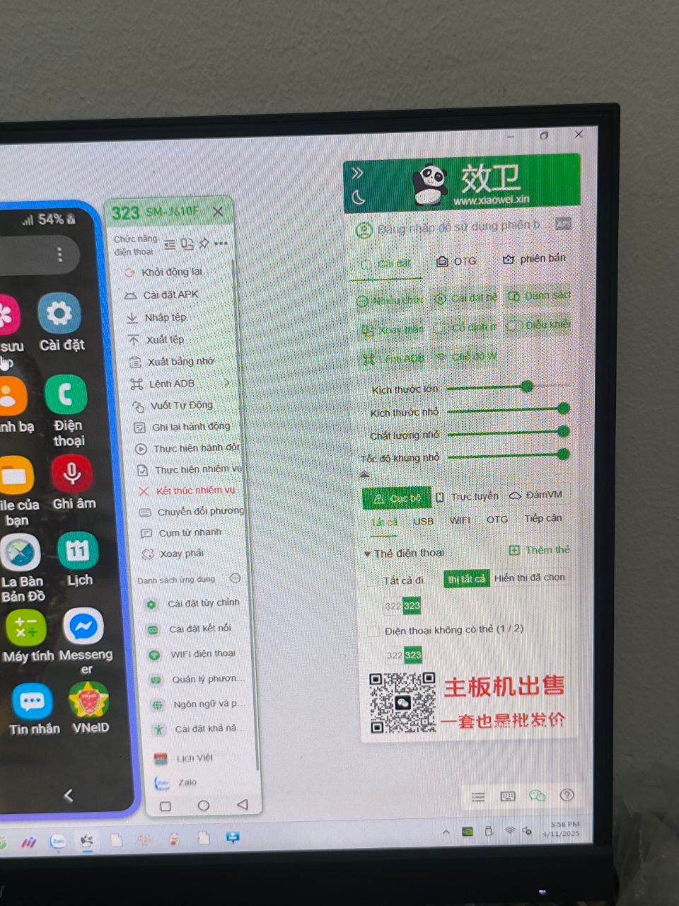

Số tiền kiếm được:: 5 tr/tháng + quà tặng rất thường xuyên
Mô tả công việc:: Quản lý phonefarm gồm 60 - 80 cái điện thoại 

## Mô tả chi tiết
Bạn sẽ được giao một cái phonefarm gồm 60 - 80 cái điện thoại, dùng phần mềm [xiaowei](https://www.xiaowei.xin/).

### Việc làm hằng ngày
- 8h45: báo cáo sáng cho 5 người
- 9h30: mở app quay thưởng, gom nhóm 1 đơn `Mẹ & Bé` tất cả điện thoại. Xem chi tiết ở bài [Gom nhóm](./Gom%20nh%C3%B3m.md).
- 15h45: báo cáo chiều

### Việc làm 3 ngày/lần (10 lần/tháng)
- Gom đơn lớn 5tr2, gom đơn `Mẹ & Bé` cho đến hết tiền tất cả điện thoại
- Bật tất cả điện thoại lên cùng một màn hình và dùng một điện thoại khác chụp lại. Các màn hình lần lượt là: (1) tên, (2) ví tiền, (3) my team, (4) GMC, (5) lịch sử 
- Copy dữ liệu vào Excel, thống kê số liệu 

Những cái này làm nhanh thì 1 tiếng là xong.

### Những việc đột xuất, lắt nhắt khác
- Khi thấy bài được chia sẻ sản phẩm trên nhóm Zalo chính thì chia sẻ lại cho tất cả nhóm `GM_chia sẻ sản phẩm` có trên tất cả điện thoại
- Đọc OTP đăng ký, rút tiền
- Những công việc không tên khác tùy vào hoàn cảnh và sự ứng biến

## Thông tin thêm
Quà tặng thường có: nồi chiên không dầu, quạt cầm tay, cân điện tử, thẻ điện thoại 20k, cáp sạc 3 trong 1, túi xách mini, sữa tắm, v.v.

> [!important] Nhìn toàn cảnh
> Công việc này là một phần của [Nhóm chạy chỉ tiêu cho nhân viên GM Mall](./index.md). Đọc bài đó để được giải đáp các thắc mắc như độ an toàn của công việc, cách vận hành nhóm, cách thức tham gia, v.v.