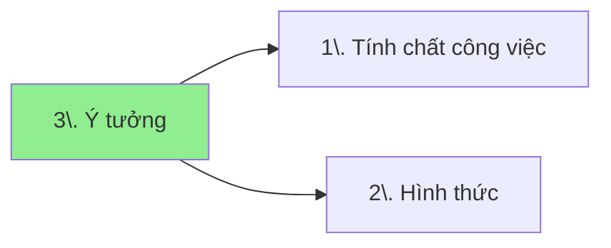

[So sánh các yêu cầu đầu vào của các ý tưởng kiếm tiền](./%C3%9D%20t%C6%B0%E1%BB%9Fng/index.md)
## Mối quan hệ giữa các khái niệm

## Danh mục
- \-: 
    - [Ý tưởng](./%C3%9D%20t%C6%B0%E1%BB%9Fng/index.md)
    - [Ý tưởng kiếm tiền](index.md)
    - [Không yêu cầu](./%C4%90%E1%BA%B7c%20%C4%91i%E1%BB%83m%20c%C3%B4ng%20vi%E1%BB%87c/Kh%C3%B4ng%20y%C3%AAu%20c%E1%BA%A7u.md)

- Đặc điểm khác: 
    - [Không cần nghe](./%C4%90%E1%BA%B7c%20%C4%91i%E1%BB%83m%20c%C3%B4ng%20vi%E1%BB%87c/%C4%90%E1%BA%B7c%20%C4%91i%E1%BB%83m%20kh%C3%A1c/Kh%C3%B4ng%20c%E1%BA%A7n%20nghe.md)
    - [Không cần nhìn](./%C4%90%E1%BA%B7c%20%C4%91i%E1%BB%83m%20c%C3%B4ng%20vi%E1%BB%87c/%C4%90%E1%BA%B7c%20%C4%91i%E1%BB%83m%20kh%C3%A1c/Kh%C3%B4ng%20c%E1%BA%A7n%20nh%C3%ACn.md)
    - [Không cần nói](./%C4%90%E1%BA%B7c%20%C4%91i%E1%BB%83m%20c%C3%B4ng%20vi%E1%BB%87c/%C4%90%E1%BA%B7c%20%C4%91i%E1%BB%83m%20kh%C3%A1c/Kh%C3%B4ng%20c%E1%BA%A7n%20n%C3%B3i.md)
    - [Không cần đi lại](./%C4%90%E1%BA%B7c%20%C4%91i%E1%BB%83m%20c%C3%B4ng%20vi%E1%BB%87c/%C4%90%E1%BA%B7c%20%C4%91i%E1%BB%83m%20kh%C3%A1c/Kh%C3%B4ng%20c%E1%BA%A7n%20%C4%91i%20l%E1%BA%A1i.md)
    - [Không cần độ tập trung cao](./%C4%90%E1%BA%B7c%20%C4%91i%E1%BB%83m%20c%C3%B4ng%20vi%E1%BB%87c/%C4%90%E1%BA%B7c%20%C4%91i%E1%BB%83m%20kh%C3%A1c/Kh%C3%B4ng%20c%E1%BA%A7n%20%C4%91%E1%BB%99%20t%E1%BA%ADp%20trung%20cao.md)
    - [Không tiếp xúc với con người](./%C4%90%E1%BA%B7c%20%C4%91i%E1%BB%83m%20c%C3%B4ng%20vi%E1%BB%87c/%C4%90%E1%BA%B7c%20%C4%91i%E1%BB%83m%20kh%C3%A1c/Kh%C3%B4ng%20ti%E1%BA%BFp%20x%C3%BAc%20v%E1%BB%9Bi%20con%20ng%C6%B0%E1%BB%9Di.md)

- Giới: 
    - [Chỉ nam](./%C4%90%E1%BA%B7c%20%C4%91i%E1%BB%83m%20c%C3%B4ng%20vi%E1%BB%87c/Gi%E1%BB%9Bi/Ch%E1%BB%89%20nam.md)
    - [Chỉ nữ](./%C4%90%E1%BA%B7c%20%C4%91i%E1%BB%83m%20c%C3%B4ng%20vi%E1%BB%87c/Gi%E1%BB%9Bi/Ch%E1%BB%89%20n%E1%BB%AF.md)

- Hình thức công việc: 
    - [Làm thuê cho người khác](./%C4%90%E1%BA%B7c%20%C4%91i%E1%BB%83m%20c%C3%B4ng%20vi%E1%BB%87c/H%C3%ACnh%20th%E1%BB%A9c%20c%C3%B4ng%20vi%E1%BB%87c/L%C3%A0m%20thu%C3%AA%20cho%20ng%C6%B0%E1%BB%9Di%20kh%C3%A1c.md)
    - [Tự kinh doanh, đầu tư](./%C4%90%E1%BA%B7c%20%C4%91i%E1%BB%83m%20c%C3%B4ng%20vi%E1%BB%87c/H%C3%ACnh%20th%E1%BB%A9c%20c%C3%B4ng%20vi%E1%BB%87c/T%E1%BB%B1%20kinh%20doanh,%20%C4%91%E1%BA%A7u%20t%C6%B0.md)
    - [Xin tài trợ](./%C4%90%E1%BA%B7c%20%C4%91i%E1%BB%83m%20c%C3%B4ng%20vi%E1%BB%87c/H%C3%ACnh%20th%E1%BB%A9c%20c%C3%B4ng%20vi%E1%BB%87c/Xin%20t%C3%A0i%20tr%E1%BB%A3.md)

- Kiếm tiền nhanh: 
    - [Chạy sự kiện, guider, chụp ảnh, hướng dẫn viên du lịch](./%C3%9D%20t%C6%B0%E1%BB%9Fng/Ki%E1%BA%BFm%20ti%E1%BB%81n%20nhanh/Ch%E1%BA%A1y%20s%E1%BB%B1%20ki%E1%BB%87n,%20guider,%20ch%E1%BB%A5p%20%E1%BA%A3nh,%20h%C6%B0%E1%BB%9Bng%20d%E1%BA%ABn%20vi%C3%AAn%20du%20l%E1%BB%8Bch.md)
    - [Kiếm tiền nhanh](./%C3%9D%20t%C6%B0%E1%BB%9Fng/Ki%E1%BA%BFm%20ti%E1%BB%81n%20nhanh/index.md)
    - [Học làm đại lý Bảo Việt](./%C3%9D%20t%C6%B0%E1%BB%9Fng/Ki%E1%BA%BFm%20ti%E1%BB%81n%20nhanh/H%E1%BB%8Dc%20l%C3%A0m%20%C4%91%E1%BA%A1i%20l%C3%BD%20B%E1%BA%A3o%20Vi%E1%BB%87t.md)
    - [Lừa đảo hội lừa đảo](./%C3%9D%20t%C6%B0%E1%BB%9Fng/Ki%E1%BA%BFm%20ti%E1%BB%81n%20nhanh/L%E1%BB%ABa%20%C4%91%E1%BA%A3o%20h%E1%BB%99i%20l%E1%BB%ABa%20%C4%91%E1%BA%A3o.md)
    - [Nhập liệu, dán nhãn dữ liệu, BPO](./%C3%9D%20t%C6%B0%E1%BB%9Fng/Ki%E1%BA%BFm%20ti%E1%BB%81n%20nhanh/Nh%E1%BA%ADp%20li%E1%BB%87u,%20d%C3%A1n%20nh%C3%A3n%20d%E1%BB%AF%20li%E1%BB%87u,%20BPO.md)
    - [Săn hàng giảm giá rồi bán lại với giá gốc](./%C3%9D%20t%C6%B0%E1%BB%9Fng/Ki%E1%BA%BFm%20ti%E1%BB%81n%20nhanh/S%C4%83n%20khuy%E1%BA%BFn%20m%C3%A3i,%20gi%E1%BA%A3m%20gi%C3%A1/S%C4%83n%20h%C3%A0ng%20gi%E1%BA%A3m%20gi%C3%A1%20r%E1%BB%93i%20b%C3%A1n%20l%E1%BA%A1i%20v%E1%BB%9Bi%20gi%C3%A1%20g%E1%BB%91c.md)
    - [Săn voucher](./%C3%9D%20t%C6%B0%E1%BB%9Fng/Ki%E1%BA%BFm%20ti%E1%BB%81n%20nhanh/S%C4%83n%20khuy%E1%BA%BFn%20m%C3%A3i,%20gi%E1%BA%A3m%20gi%C3%A1/S%C4%83n%20voucher.md)
    - [Săn điểm thưởng trên các sàn giao dịch](./%C3%9D%20t%C6%B0%E1%BB%9Fng/Ki%E1%BA%BFm%20ti%E1%BB%81n%20nhanh/S%C4%83n%20khuy%E1%BA%BFn%20m%C3%A3i,%20gi%E1%BA%A3m%20gi%C3%A1/S%C4%83n%20%C4%91i%E1%BB%83m%20th%C6%B0%E1%BB%9Fng%20tr%C3%AAn%20c%C3%A1c%20s%C3%A0n%20giao%20d%E1%BB%8Bch.md)
    - [Đăng ký tài khoản Binance](./%C3%9D%20t%C6%B0%E1%BB%9Fng/Ki%E1%BA%BFm%20ti%E1%BB%81n%20nhanh/S%C4%83n%20khuy%E1%BA%BFn%20m%C3%A3i,%20gi%E1%BA%A3m%20gi%C3%A1/%C4%90%C4%83ng%20k%C3%BD%20t%C3%A0i%20kho%E1%BA%A3n%20Binance.md)
    - [Đăng ký tài khoản hàng loạt](./%C3%9D%20t%C6%B0%E1%BB%9Fng/Ki%E1%BA%BFm%20ti%E1%BB%81n%20nhanh/S%C4%83n%20khuy%E1%BA%BFn%20m%C3%A3i,%20gi%E1%BA%A3m%20gi%C3%A1/%C4%90%C4%83ng%20k%C3%BD%20t%C3%A0i%20kho%E1%BA%A3n%20h%C3%A0ng%20lo%E1%BA%A1t.md)
    - [Thanh toán hóa đơn hộ](./%C3%9D%20t%C6%B0%E1%BB%9Fng/Ki%E1%BA%BFm%20ti%E1%BB%81n%20nhanh/Thanh%20to%C3%A1n%20h%C3%B3a%20%C4%91%C6%A1n%20h%E1%BB%99.md)
    - [Trả lời tin nhắn, tư vấn sản phẩm, dịch vụ](./%C3%9D%20t%C6%B0%E1%BB%9Fng/Ki%E1%BA%BFm%20ti%E1%BB%81n%20nhanh/Tr%E1%BA%A3%20l%E1%BB%9Di%20tin%20nh%E1%BA%AFn,%20t%C6%B0%20v%E1%BA%A5n%20s%E1%BA%A3n%20ph%E1%BA%A9m,%20d%E1%BB%8Bch%20v%E1%BB%A5.md)
    - [Tìm người, tuyển dụng](./%C3%9D%20t%C6%B0%E1%BB%9Fng/Ki%E1%BA%BFm%20ti%E1%BB%81n%20nhanh/T%C3%ACm%20ng%C6%B0%E1%BB%9Di,%20tuy%E1%BB%83n%20d%E1%BB%A5ng.md)
    - [Đánh giá độ chính xác và chất lượng truy vấn](./%C3%9D%20t%C6%B0%E1%BB%9Fng/Ki%E1%BA%BFm%20ti%E1%BB%81n%20nhanh/%C4%90%C3%A1nh%20gi%C3%A1%20%C4%91%E1%BB%99%20ch%C3%ADnh%20x%C3%A1c%20v%C3%A0%20ch%E1%BA%A5t%20l%C6%B0%E1%BB%A3ng%20truy%20v%E1%BA%A5n.md)

- Kiến thức, kỹ năng: 
    - [Cần tên tuổi, uy tín, chứng nhận](./%C4%90%E1%BA%B7c%20%C4%91i%E1%BB%83m%20c%C3%B4ng%20vi%E1%BB%87c/Ki%E1%BA%BFn%20th%E1%BB%A9c,%20k%E1%BB%B9%20n%C4%83ng/C%E1%BA%A7n%20t%C3%AAn%20tu%E1%BB%95i,%20uy%20t%C3%ADn,%20ch%E1%BB%A9ng%20nh%E1%BA%ADn.md)
    - [Cần khả năng ứng biến](./%C4%90%E1%BA%B7c%20%C4%91i%E1%BB%83m%20c%C3%B4ng%20vi%E1%BB%87c/Ki%E1%BA%BFn%20th%E1%BB%A9c,%20k%E1%BB%B9%20n%C4%83ng/C%E1%BA%A7n%20kh%E1%BA%A3%20n%C4%83ng%20%E1%BB%A9ng%20bi%E1%BA%BFn.md)
    - [Hiểu về hệ thống](./%C4%90%E1%BA%B7c%20%C4%91i%E1%BB%83m%20c%C3%B4ng%20vi%E1%BB%87c/Ki%E1%BA%BFn%20th%E1%BB%A9c,%20k%E1%BB%B9%20n%C4%83ng/Hi%E1%BB%83u%20v%E1%BB%81%20h%E1%BB%87%20th%E1%BB%91ng.md)
    - [Biết tiếng Anh](./%C4%90%E1%BA%B7c%20%C4%91i%E1%BB%83m%20c%C3%B4ng%20vi%E1%BB%87c/Ki%E1%BA%BFn%20th%E1%BB%A9c,%20k%E1%BB%B9%20n%C4%83ng/Bi%E1%BA%BFt%20ti%E1%BA%BFng%20Anh.md)

- Nguyên liệu, nguồn thông tin: 
    - [Cần có sẵn tài khoản ngân hàng](./%C4%90%E1%BA%B7c%20%C4%91i%E1%BB%83m%20c%C3%B4ng%20vi%E1%BB%87c/Nguy%C3%AAn%20li%E1%BB%87u,%20ngu%E1%BB%93n%20th%C3%B4ng%20tin/C%E1%BA%A7n%20c%C3%B3%20s%E1%BA%B5n%20t%C3%A0i%20kho%E1%BA%A3n%20ng%C3%A2n%20h%C3%A0ng.md)
    - [Cần có vốn](./%C4%90%E1%BA%B7c%20%C4%91i%E1%BB%83m%20c%C3%B4ng%20vi%E1%BB%87c/Nguy%C3%AAn%20li%E1%BB%87u,%20ngu%E1%BB%93n%20th%C3%B4ng%20tin/C%E1%BA%A7n%20c%C3%B3%20v%E1%BB%91n.md)
    - [Cần nguồn nguyên liệu lớn với giá rẻ](./%C4%90%E1%BA%B7c%20%C4%91i%E1%BB%83m%20c%C3%B4ng%20vi%E1%BB%87c/Nguy%C3%AAn%20li%E1%BB%87u,%20ngu%E1%BB%93n%20th%C3%B4ng%20tin/C%E1%BA%A7n%20ngu%E1%BB%93n%20nguy%C3%AAn%20li%E1%BB%87u%20l%E1%BB%9Bn%20v%E1%BB%9Bi%20gi%C3%A1%20r%E1%BA%BB.md)
    - [Cần nhiều tài khoản hoặc thẻ ngân hàng](./%C4%90%E1%BA%B7c%20%C4%91i%E1%BB%83m%20c%C3%B4ng%20vi%E1%BB%87c/Nguy%C3%AAn%20li%E1%BB%87u,%20ngu%E1%BB%93n%20th%C3%B4ng%20tin/C%E1%BA%A7n%20nhi%E1%BB%81u%20t%C3%A0i%20kho%E1%BA%A3n%20ho%E1%BA%B7c%20th%E1%BA%BB%20ng%C3%A2n%20h%C3%A0ng.md)
    - [Cần nắm được nhu cầu doanh nghiệp](./%C4%90%E1%BA%B7c%20%C4%91i%E1%BB%83m%20c%C3%B4ng%20vi%E1%BB%87c/Nguy%C3%AAn%20li%E1%BB%87u,%20ngu%E1%BB%93n%20th%C3%B4ng%20tin/C%E1%BA%A7n%20n%E1%BA%AFm%20%C4%91%C6%B0%E1%BB%A3c%20nhu%20c%E1%BA%A7u%20doanh%20nghi%E1%BB%87p.md)
    - [Không tốn diện tích](./%C4%90%E1%BA%B7c%20%C4%91i%E1%BB%83m%20c%C3%B4ng%20vi%E1%BB%87c/Nguy%C3%AAn%20li%E1%BB%87u,%20ngu%E1%BB%93n%20th%C3%B4ng%20tin/Kh%C3%B4ng%20t%E1%BB%91n%20di%E1%BB%87n%20t%C3%ADch.md)
    - [Mối quan hệ cá nhân](./%C4%90%E1%BA%B7c%20%C4%91i%E1%BB%83m%20c%C3%B4ng%20vi%E1%BB%87c/Nguy%C3%AAn%20li%E1%BB%87u,%20ngu%E1%BB%93n%20th%C3%B4ng%20tin/M%E1%BB%91i%20quan%20h%E1%BB%87%20c%C3%A1%20nh%C3%A2n.md)

- Nơi làm việc: 
    - [Hà Nội](./%C4%90%E1%BA%B7c%20%C4%91i%E1%BB%83m%20c%C3%B4ng%20vi%E1%BB%87c/N%C6%A1i%20l%C3%A0m%20vi%E1%BB%87c/H%C3%A0%20N%E1%BB%99i.md)
    - [Làm văn phòng](./%C4%90%E1%BA%B7c%20%C4%91i%E1%BB%83m%20c%C3%B4ng%20vi%E1%BB%87c/N%C6%A1i%20l%C3%A0m%20vi%E1%BB%87c/L%C3%A0m%20v%C4%83n%20ph%C3%B2ng.md)
    - [Làm qua mạng](./%C4%90%E1%BA%B7c%20%C4%91i%E1%BB%83m%20c%C3%B4ng%20vi%E1%BB%87c/N%C6%A1i%20l%C3%A0m%20vi%E1%BB%87c/L%C3%A0m%20qua%20m%E1%BA%A1ng.md)
    - [TP.HCM](./%C4%90%E1%BA%B7c%20%C4%91i%E1%BB%83m%20c%C3%B4ng%20vi%E1%BB%87c/N%C6%A1i%20l%C3%A0m%20vi%E1%BB%87c/TP.HCM.md)
    - [Trong văn phòng](./%C4%90%E1%BA%B7c%20%C4%91i%E1%BB%83m%20c%C3%B4ng%20vi%E1%BB%87c/N%C6%A1i%20l%C3%A0m%20vi%E1%BB%87c/Trong%20v%C4%83n%20ph%C3%B2ng.md)
    - [Đi ra ngoại thành hoặc tỉnh khác](./%C4%90%E1%BA%B7c%20%C4%91i%E1%BB%83m%20c%C3%B4ng%20vi%E1%BB%87c/N%C6%A1i%20l%C3%A0m%20vi%E1%BB%87c/%C4%90i%20ra%20ngo%E1%BA%A1i%20th%C3%A0nh%20ho%E1%BA%B7c%20t%E1%BB%89nh%20kh%C3%A1c.md)
    - [Làm ngoài đường](./%C4%90%E1%BA%B7c%20%C4%91i%E1%BB%83m%20c%C3%B4ng%20vi%E1%BB%87c/N%C6%A1i%20l%C3%A0m%20vi%E1%BB%87c/L%C3%A0m%20ngo%C3%A0i%20%C4%91%C6%B0%E1%BB%9Dng.md)

- Thời điểm trả tiền: 
    - [Trả ngay sau khi hoàn thành công việc](./%C4%90%E1%BA%B7c%20%C4%91i%E1%BB%83m%20c%C3%B4ng%20vi%E1%BB%87c/Th%E1%BB%9Di%20%C4%91i%E1%BB%83m%20tr%E1%BA%A3%20ti%E1%BB%81n/Tr%E1%BA%A3%20ngay%20sau%20khi%20ho%C3%A0n%20th%C3%A0nh%20c%C3%B4ng%20vi%E1%BB%87c.md)
    - [Trả theo giờ](./%C4%90%E1%BA%B7c%20%C4%91i%E1%BB%83m%20c%C3%B4ng%20vi%E1%BB%87c/Th%E1%BB%9Di%20%C4%91i%E1%BB%83m%20tr%E1%BA%A3%20ti%E1%BB%81n/Tr%E1%BA%A3%20theo%20gi%E1%BB%9D.md)
    - [Trả theo ngày](./%C4%90%E1%BA%B7c%20%C4%91i%E1%BB%83m%20c%C3%B4ng%20vi%E1%BB%87c/Th%E1%BB%9Di%20%C4%91i%E1%BB%83m%20tr%E1%BA%A3%20ti%E1%BB%81n/Tr%E1%BA%A3%20theo%20ng%C3%A0y.md)
    - [Trả theo tuần](./%C4%90%E1%BA%B7c%20%C4%91i%E1%BB%83m%20c%C3%B4ng%20vi%E1%BB%87c/Th%E1%BB%9Di%20%C4%91i%E1%BB%83m%20tr%E1%BA%A3%20ti%E1%BB%81n/Tr%E1%BA%A3%20theo%20tu%E1%BA%A7n.md)
    - [Trả theo tháng](./%C4%90%E1%BA%B7c%20%C4%91i%E1%BB%83m%20c%C3%B4ng%20vi%E1%BB%87c/Th%E1%BB%9Di%20%C4%91i%E1%BB%83m%20tr%E1%BA%A3%20ti%E1%BB%81n/Tr%E1%BA%A3%20theo%20th%C3%A1ng.md)
    - [Cuối ngày](./%C4%90%E1%BA%B7c%20%C4%91i%E1%BB%83m%20c%C3%B4ng%20vi%E1%BB%87c/Th%E1%BB%9Di%20%C4%91i%E1%BB%83m%20tr%E1%BA%A3%20ti%E1%BB%81n/Cu%E1%BB%91i%20ng%C3%A0y.md)

- Thời gian làm việc: 
    - [Mỗi tuần lên công ty một buổi](./%C4%90%E1%BA%B7c%20%C4%91i%E1%BB%83m%20c%C3%B4ng%20vi%E1%BB%87c/Th%E1%BB%9Di%20gian%20l%C3%A0m%20vi%E1%BB%87c/M%E1%BB%97i%20tu%E1%BA%A7n%20l%C3%AAn%20c%C3%B4ng%20ty%20m%E1%BB%99t%20bu%E1%BB%95i.md)
    - [Tùy vào lịch được cho sẵn](./%C4%90%E1%BA%B7c%20%C4%91i%E1%BB%83m%20c%C3%B4ng%20vi%E1%BB%87c/Th%E1%BB%9Di%20gian%20l%C3%A0m%20vi%E1%BB%87c/T%C3%B9y%20v%C3%A0o%20l%E1%BB%8Bch%20%C4%91%C6%B0%E1%BB%A3c%20cho%20s%E1%BA%B5n.md)
    - [Tự chủ động](./%C4%90%E1%BA%B7c%20%C4%91i%E1%BB%83m%20c%C3%B4ng%20vi%E1%BB%87c/Th%E1%BB%9Di%20gian%20l%C3%A0m%20vi%E1%BB%87c/T%E1%BB%B1%20ch%E1%BB%A7%20%C4%91%E1%BB%99ng.md)
    - [Được chọn ngày làm việc](./%C4%90%E1%BA%B7c%20%C4%91i%E1%BB%83m%20c%C3%B4ng%20vi%E1%BB%87c/Th%E1%BB%9Di%20gian%20l%C3%A0m%20vi%E1%BB%87c/%C4%90%C6%B0%E1%BB%A3c%20ch%E1%BB%8Dn%20ng%C3%A0y%20l%C3%A0m%20vi%E1%BB%87c.md)
    - [Được chọn thời gian làm trong ngày](./%C4%90%E1%BA%B7c%20%C4%91i%E1%BB%83m%20c%C3%B4ng%20vi%E1%BB%87c/Th%E1%BB%9Di%20gian%20l%C3%A0m%20vi%E1%BB%87c/%C4%90%C6%B0%E1%BB%A3c%20ch%E1%BB%8Dn%20th%E1%BB%9Di%20gian%20l%C3%A0m%20trong%20ng%C3%A0y.md)
    - [Không phải lúc nào cũng biết lịch trước được](./%C4%90%E1%BA%B7c%20%C4%91i%E1%BB%83m%20c%C3%B4ng%20vi%E1%BB%87c/Th%E1%BB%9Di%20gian%20l%C3%A0m%20vi%E1%BB%87c/Kh%C3%B4ng%20ph%E1%BA%A3i%20l%C3%BAc%20n%C3%A0o%20c%C5%A9ng%20bi%E1%BA%BFt%20l%E1%BB%8Bch%20tr%C6%B0%E1%BB%9Bc%20%C4%91%C6%B0%E1%BB%A3c.md)

- Tự kinh doanh, đầu tư: 
    - [Gia công giải pháp](./%C3%9D%20t%C6%B0%E1%BB%9Fng/T%E1%BB%B1%20kinh%20doanh,%20%C4%91%E1%BA%A7u%20t%C6%B0/Gia%20c%C3%B4ng%20gi%E1%BA%A3i%20ph%C3%A1p/index.md)
    - [Chuyển đổi số cho các dòng họ](./%C3%9D%20t%C6%B0%E1%BB%9Fng/T%E1%BB%B1%20kinh%20doanh,%20%C4%91%E1%BA%A7u%20t%C6%B0/Gia%20c%C3%B4ng%20gi%E1%BA%A3i%20ph%C3%A1p/Chuy%E1%BB%83n%20%C4%91%E1%BB%95i%20s%E1%BB%91%20cho%20c%C3%A1c%20d%C3%B2ng%20h%E1%BB%8D.md)
    - [Plugin giúp phân loại dữ liệu cho các chương trình kế toán](./%C3%9D%20t%C6%B0%E1%BB%9Fng/T%E1%BB%B1%20kinh%20doanh,%20%C4%91%E1%BA%A7u%20t%C6%B0/Gia%20c%C3%B4ng%20gi%E1%BA%A3i%20ph%C3%A1p/Plugin%20gi%C3%BAp%20ph%C3%A2n%20lo%E1%BA%A1i%20d%E1%BB%AF%20li%E1%BB%87u%20cho%20c%C3%A1c%20ch%C6%B0%C6%A1ng%20tr%C3%ACnh%20k%E1%BA%BF%20to%C3%A1n.md)
    - [Rút gọn liên kết cho các kho dữ liệu](./%C3%9D%20t%C6%B0%E1%BB%9Fng/T%E1%BB%B1%20kinh%20doanh,%20%C4%91%E1%BA%A7u%20t%C6%B0/Gia%20c%C3%B4ng%20gi%E1%BA%A3i%20ph%C3%A1p/R%C3%BAt%20g%E1%BB%8Dn%20li%C3%AAn%20k%E1%BA%BFt%20cho%20c%C3%A1c%20kho%20d%E1%BB%AF%20li%E1%BB%87u.md)
    - [Tổng hợp các sự kiện sắp xảy ra vào Google Calendar](./%C3%9D%20t%C6%B0%E1%BB%9Fng/T%E1%BB%B1%20kinh%20doanh,%20%C4%91%E1%BA%A7u%20t%C6%B0/Gia%20c%C3%B4ng%20gi%E1%BA%A3i%20ph%C3%A1p/T%E1%BB%95ng%20h%E1%BB%A3p%20c%C3%A1c%20s%E1%BB%B1%20ki%E1%BB%87n%20s%E1%BA%AFp%20x%E1%BA%A3y%20ra%20v%C3%A0o%20Google%20Calendar.md)
    - [Tổng hợp thông tin khách hàng FE](./%C3%9D%20t%C6%B0%E1%BB%9Fng/T%E1%BB%B1%20kinh%20doanh,%20%C4%91%E1%BA%A7u%20t%C6%B0/Gia%20c%C3%B4ng%20gi%E1%BA%A3i%20ph%C3%A1p/T%E1%BB%95ng%20h%E1%BB%A3p%20th%C3%B4ng%20tin%20kh%C3%A1ch%20h%C3%A0ng%20FE.md)
    - [Tạo báo cáo tiếp thị quản lý được theo từng cấp](./%C3%9D%20t%C6%B0%E1%BB%9Fng/T%E1%BB%B1%20kinh%20doanh,%20%C4%91%E1%BA%A7u%20t%C6%B0/Gia%20c%C3%B4ng%20gi%E1%BA%A3i%20ph%C3%A1p/T%E1%BA%A1o%20b%C3%A1o%20c%C3%A1o%20ti%E1%BA%BFp%20th%E1%BB%8B%20qu%E1%BA%A3n%20l%C3%BD%20%C4%91%C6%B0%E1%BB%A3c%20theo%20t%E1%BB%ABng%20c%E1%BA%A5p.md)
    - [Bộ sưu tập từ điển chuyên ngành](./%C3%9D%20t%C6%B0%E1%BB%9Fng/T%E1%BB%B1%20kinh%20doanh,%20%C4%91%E1%BA%A7u%20t%C6%B0/H%E1%BB%8Dc%20t%E1%BA%ADp,%20ph%C3%A1t%20tri%E1%BB%83n%20b%E1%BA%A3n%20th%C3%A2n/B%E1%BB%99%20s%C6%B0u%20t%E1%BA%ADp%20t%E1%BB%AB%20%C4%91i%E1%BB%83n%20chuy%C3%AAn%20ng%C3%A0nh.md)
    - [Bộ thẻ học từ vựng tiếng Anh nâng cao (GRE)](./%C3%9D%20t%C6%B0%E1%BB%9Fng/T%E1%BB%B1%20kinh%20doanh,%20%C4%91%E1%BA%A7u%20t%C6%B0/H%E1%BB%8Dc%20t%E1%BA%ADp,%20ph%C3%A1t%20tri%E1%BB%83n%20b%E1%BA%A3n%20th%C3%A2n/B%E1%BB%99%20th%E1%BA%BB%20h%E1%BB%8Dc%20t%E1%BB%AB%20v%E1%BB%B1ng%20ti%E1%BA%BFng%20Anh%20n%C3%A2ng%20cao%20(GRE).md)
    - [Phân loại chi tiêu](./%C3%9D%20t%C6%B0%E1%BB%9Fng/T%E1%BB%B1%20kinh%20doanh,%20%C4%91%E1%BA%A7u%20t%C6%B0/H%E1%BB%8Dc%20t%E1%BA%ADp,%20ph%C3%A1t%20tri%E1%BB%83n%20b%E1%BA%A3n%20th%C3%A2n/Ph%C3%A2n%20lo%E1%BA%A1i%20chi%20ti%C3%AAu.md)
    - [Tổ chức các buổi thảo luận, chia sẻ, lớp học ngắn, các buổi huấn luyện](./%C3%9D%20t%C6%B0%E1%BB%9Fng/T%E1%BB%B1%20kinh%20doanh,%20%C4%91%E1%BA%A7u%20t%C6%B0/H%E1%BB%8Dc%20t%E1%BA%ADp,%20ph%C3%A1t%20tri%E1%BB%83n%20b%E1%BA%A3n%20th%C3%A2n/T%E1%BB%95%20ch%E1%BB%A9c%20c%C3%A1c%20bu%E1%BB%95i%20th%E1%BA%A3o%20lu%E1%BA%ADn,%20chia%20s%E1%BA%BB,%20l%E1%BB%9Bp%20h%E1%BB%8Dc%20ng%E1%BA%AFn,%20c%C3%A1c%20bu%E1%BB%95i%20hu%E1%BA%A5n%20luy%E1%BB%87n.md)
    - [Xem tử vi tự động](./%C3%9D%20t%C6%B0%E1%BB%9Fng/T%E1%BB%B1%20kinh%20doanh,%20%C4%91%E1%BA%A7u%20t%C6%B0/H%E1%BB%8Dc%20t%E1%BA%ADp,%20ph%C3%A1t%20tri%E1%BB%83n%20b%E1%BA%A3n%20th%C3%A2n/Xem%20t%E1%BB%AD%20vi%20t%E1%BB%B1%20%C4%91%E1%BB%99ng.md)
    - [Kho địa điểm để chọn nơi gặp mặt](./%C3%9D%20t%C6%B0%E1%BB%9Fng/T%E1%BB%B1%20kinh%20doanh,%20%C4%91%E1%BA%A7u%20t%C6%B0/K%E1%BA%BFt%20n%E1%BB%91i%20nhu%20c%E1%BA%A7u/H%E1%BB%87%20th%E1%BB%91ng%20th%C3%B4ng%20tin/Kho%20%C4%91%E1%BB%8Ba%20%C4%91i%E1%BB%83m%20%C4%91%E1%BB%83%20ch%E1%BB%8Dn%20n%C6%A1i%20g%E1%BA%B7p%20m%E1%BA%B7t.md)
    - [Kết nối nhu cầu di chuyển của người khuyết tật](./%C3%9D%20t%C6%B0%E1%BB%9Fng/T%E1%BB%B1%20kinh%20doanh,%20%C4%91%E1%BA%A7u%20t%C6%B0/K%E1%BA%BFt%20n%E1%BB%91i%20nhu%20c%E1%BA%A7u/H%E1%BB%87%20th%E1%BB%91ng%20th%C3%B4ng%20tin/K%E1%BA%BFt%20n%E1%BB%91i%20nhu%20c%E1%BA%A7u%20di%20chuy%E1%BB%83n%20c%E1%BB%A7a%20ng%C6%B0%E1%BB%9Di%20khuy%E1%BA%BFt%20t%E1%BA%ADt.md)
    - [Mạng xã hội nơi mọi người hiểu rõ chính mình](./%C3%9D%20t%C6%B0%E1%BB%9Fng/T%E1%BB%B1%20kinh%20doanh,%20%C4%91%E1%BA%A7u%20t%C6%B0/K%E1%BA%BFt%20n%E1%BB%91i%20nhu%20c%E1%BA%A7u/H%E1%BB%87%20th%E1%BB%91ng%20th%C3%B4ng%20tin/M%E1%BA%A1ng%20x%C3%A3%20h%E1%BB%99i%20n%C6%A1i%20m%E1%BB%8Di%20ng%C6%B0%E1%BB%9Di%20hi%E1%BB%83u%20r%C3%B5%20ch%C3%ADnh%20m%C3%ACnh.md)
    - [Hợp tác xã nhân viên](./%C3%9D%20t%C6%B0%E1%BB%9Fng/T%E1%BB%B1%20kinh%20doanh,%20%C4%91%E1%BA%A7u%20t%C6%B0/K%E1%BA%BFt%20n%E1%BB%91i%20nhu%20c%E1%BA%A7u/Nh%C3%B3m/H%E1%BB%A3p%20t%C3%A1c%20x%C3%A3%20nh%C3%A2n%20vi%C3%AAn.md)
    - [Nhóm hỗ trợ người tự kinh doanh, đầu tư](./%C3%9D%20t%C6%B0%E1%BB%9Fng/T%E1%BB%B1%20kinh%20doanh,%20%C4%91%E1%BA%A7u%20t%C6%B0/K%E1%BA%BFt%20n%E1%BB%91i%20nhu%20c%E1%BA%A7u/Nh%C3%B3m/Nh%C3%B3m%20h%E1%BB%97%20tr%E1%BB%A3%20ng%C6%B0%E1%BB%9Di%20t%E1%BB%B1%20kinh%20doanh,%20%C4%91%E1%BA%A7u%20t%C6%B0.md)
    - [Nhóm mua chung, câu lạc bộ tiêu dùng](./%C3%9D%20t%C6%B0%E1%BB%9Fng/T%E1%BB%B1%20kinh%20doanh,%20%C4%91%E1%BA%A7u%20t%C6%B0/K%E1%BA%BFt%20n%E1%BB%91i%20nhu%20c%E1%BA%A7u/Nh%C3%B3m/Nh%C3%B3m%20mua%20chung,%20c%C3%A2u%20l%E1%BA%A1c%20b%E1%BB%99%20ti%C3%AAu%20d%C3%B9ng.md)
    - [Nhóm môi giới, đại lý](./%C3%9D%20t%C6%B0%E1%BB%9Fng/T%E1%BB%B1%20kinh%20doanh,%20%C4%91%E1%BA%A7u%20t%C6%B0/K%E1%BA%BFt%20n%E1%BB%91i%20nhu%20c%E1%BA%A7u/Nh%C3%B3m/Nh%C3%B3m%20m%C3%B4i%20gi%E1%BB%9Bi,%20%C4%91%E1%BA%A1i%20l%C3%BD.md)
    - [Quỹ tín dụng](./%C3%9D%20t%C6%B0%E1%BB%9Fng/T%E1%BB%B1%20kinh%20doanh,%20%C4%91%E1%BA%A7u%20t%C6%B0/K%E1%BA%BFt%20n%E1%BB%91i%20nhu%20c%E1%BA%A7u/T%C3%ADn%20d%E1%BB%A5ng/Qu%E1%BB%B9%20t%C3%ADn%20d%E1%BB%A5ng.md)
    - [Cho vay lấy lãi](./%C3%9D%20t%C6%B0%E1%BB%9Fng/T%E1%BB%B1%20kinh%20doanh,%20%C4%91%E1%BA%A7u%20t%C6%B0/K%E1%BA%BFt%20n%E1%BB%91i%20nhu%20c%E1%BA%A7u/T%C3%ADn%20d%E1%BB%A5ng/Cho%20vay%20l%E1%BA%A5y%20l%C3%A3i.md)
    - [Sàn cho vay ngang hàng](./%C3%9D%20t%C6%B0%E1%BB%9Fng/T%E1%BB%B1%20kinh%20doanh,%20%C4%91%E1%BA%A7u%20t%C6%B0/K%E1%BA%BFt%20n%E1%BB%91i%20nhu%20c%E1%BA%A7u/T%C3%ADn%20d%E1%BB%A5ng/S%C3%A0n%20cho%20vay%20ngang%20h%C3%A0ng.md)
    - [Tự kinh doanh, đầu tư](./%C3%9D%20t%C6%B0%E1%BB%9Fng/T%E1%BB%B1%20kinh%20doanh,%20%C4%91%E1%BA%A7u%20t%C6%B0/index.md)

- Việc chính thức trong công ty: 
    - [Làm nhân viên của nhiều công ty cho làm việc từ xa cùng lúc](./%C3%9D%20t%C6%B0%E1%BB%9Fng/Vi%E1%BB%87c%20ch%C3%ADnh%20th%E1%BB%A9c%20trong%20c%C3%B4ng%20ty/L%C3%A0m%20nh%C3%A2n%20vi%C3%AAn%20c%E1%BB%A7a%20nhi%E1%BB%81u%20c%C3%B4ng%20ty%20cho%20l%C3%A0m%20vi%E1%BB%87c%20t%E1%BB%AB%20xa%20c%C3%B9ng%20l%C3%BAc.md)
    - [Làm việc ở nước ngoài](./%C3%9D%20t%C6%B0%E1%BB%9Fng/Vi%E1%BB%87c%20ch%C3%ADnh%20th%E1%BB%A9c%20trong%20c%C3%B4ng%20ty/L%C3%A0m%20vi%E1%BB%87c%20%E1%BB%9F%20n%C6%B0%E1%BB%9Bc%20ngo%C3%A0i.md)

- Yêu cầu công nghệ: 
    - [Có điện thoại](./%C4%90%E1%BA%B7c%20%C4%91i%E1%BB%83m%20c%C3%B4ng%20vi%E1%BB%87c/Y%C3%AAu%20c%E1%BA%A7u%20c%C3%B4ng%20ngh%E1%BB%87/C%C3%B3%20%C4%91i%E1%BB%87n%20tho%E1%BA%A1i.md)
    - [Có laptop](./%C4%90%E1%BA%B7c%20%C4%91i%E1%BB%83m%20c%C3%B4ng%20vi%E1%BB%87c/Y%C3%AAu%20c%E1%BA%A7u%20c%C3%B4ng%20ngh%E1%BB%87/C%C3%B3%20laptop.md)
    - [Cần biết cách ẩn danh](./%C4%90%E1%BA%B7c%20%C4%91i%E1%BB%83m%20c%C3%B4ng%20vi%E1%BB%87c/Y%C3%AAu%20c%E1%BA%A7u%20c%C3%B4ng%20ngh%E1%BB%87/C%E1%BA%A7n%20bi%E1%BA%BFt%20c%C3%A1ch%20%E1%BA%A9n%20danh.md)
    - [Cần biết lập trình](./%C4%90%E1%BA%B7c%20%C4%91i%E1%BB%83m%20c%C3%B4ng%20vi%E1%BB%87c/Y%C3%AAu%20c%E1%BA%A7u%20c%C3%B4ng%20ngh%E1%BB%87/C%E1%BA%A7n%20bi%E1%BA%BFt%20l%E1%BA%ADp%20tr%C3%ACnh.md)
    - [Cần máy tính đủ mạnh](./%C4%90%E1%BA%B7c%20%C4%91i%E1%BB%83m%20c%C3%B4ng%20vi%E1%BB%87c/Y%C3%AAu%20c%E1%BA%A7u%20c%C3%B4ng%20ngh%E1%BB%87/C%E1%BA%A7n%20m%C3%A1y%20t%C3%ADnh%20%C4%91%E1%BB%A7%20m%E1%BA%A1nh.md)
    - [Không](./%C4%90%E1%BA%B7c%20%C4%91i%E1%BB%83m%20c%C3%B4ng%20vi%E1%BB%87c/Y%C3%AAu%20c%E1%BA%A7u%20c%C3%B4ng%20ngh%E1%BB%87/Kh%C3%B4ng.md)

## Mục tiêu
- Cung cấp thông tin chi tiết để hiểu rõ ngọn ngành về công việc
- Giới thiệu công việc đang có

Nhiều khi cần tách ra chứ không để chung được