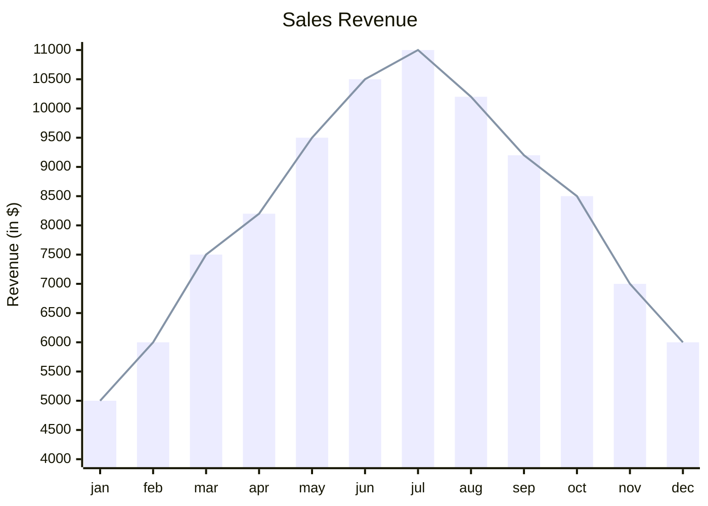

Tính chất công việc:: [Cần biết lập trình](../../../%C4%90%E1%BA%B7c%20%C4%91i%E1%BB%83m%20c%C3%B4ng%20vi%E1%BB%87c/Y%C3%AAu%20c%E1%BA%A7u%20c%C3%B4ng%20ngh%E1%BB%87/C%E1%BA%A7n%20bi%E1%BA%BFt%20l%E1%BA%ADp%20tr%C3%ACnh.md), [Làm qua mạng](../../../%C4%90%E1%BA%B7c%20%C4%91i%E1%BB%83m%20c%C3%B4ng%20vi%E1%BB%87c/N%C6%A1i%20l%C3%A0m%20vi%E1%BB%87c/L%C3%A0m%20qua%20m%E1%BA%A1ng.md)
Hình thức:: [Tự kinh doanh, đầu tư](../../../%C4%90%E1%BA%B7c%20%C4%91i%E1%BB%83m%20c%C3%B4ng%20vi%E1%BB%87c/H%C3%ACnh%20th%E1%BB%A9c%20c%C3%B4ng%20vi%E1%BB%87c/T%E1%BB%B1%20kinh%20doanh,%20%C4%91%E1%BA%A7u%20t%C6%B0.md)

[13-08-2024](13-08-2024.md) 28630 lượt tải, 3177 ngày, 9 lần tải/ngày

Bài chi tiết:: [Bộ thẻ học từ vựng tiếng Anh nâng cao (GRE) – Quả Cầu](https://quảcầu.cc/bo-the-hoc-tu-vung-tieng-anh-nang-cao?utm_source=Vault+B+Tồn+tại+trong+thế+giới+tư+bản+(Tài+nguyên)&utm_medium=Vault&utm_campaign=Tài+nguyên+khác%2Cngôn+ngữ%2Cnét+nghĩa+ẩn%2CHọc+tiếng+Anh%2Ckhoa+học+nhận+thức&utm_content=&utm_term= )
